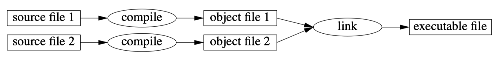

## Design of C++
- The C language was primarily designed with the idea that programming languages should close to machine and address it simply and efficiently.
- The C++ aims to the purpose that a language should close to the problems to be solved.
  - Function argument checking
  - `const`
  - classes
  - constructors and destructors
  - exception
  - templates
- The design of C++ focuses on dealing with fundamental notions such as memory, mutability, abstraction, resource management, expression of algorithms, error handling and modularity.
- C++ is a *general-purpose* programming language for developing and using elegant efficient abstractions.
- C++ supports systems programming which means it could **could call functions in the other languages without extra overhead or conversion of data structures**.
- C++ is a **compiled** language.
  
  - Source text has to be processed by a *compiler*, producing object files.
  - Source text are combined are combined by a *linker* yielding an executable program.
  - An executable program is **created for a specific hardware/system** combination; it is not portable.
  - Portability means C++ source code can be successfully compiled and run on a variety of systems.
- ISO C++ standard defines two kinds of entities.
  - Core language features: built-in type and loops
  - Standard-library components: containers, I/O operation
- Recommendations
  - Represent ideas (concepts) directly in code, for example, as a function, a class, or an enumeration
  - Aim for your code to be both elegant and efficient
  - Don’t overabstract.
  - Focus design on the provision of elegant and efficient abstractions, possibly presented as libraries
  - Represent relationships among ideas directly in code, for example, through parameterization or a class hierarchy
  - Represent independent ideas separately in code, for example, avoid mutual dependencies among classes
  - C++ is not just object-oriented
  - C++ is not just for generic programming
  - **Prefer solutions that can be statically checked**
  - **Make resources explicit** (represent them as class objects)
  - Express simple ideas simply
  - **Use libraries**, especially the standard library, rather than trying to build everything from scratch
  - Use a type-rich style of programming
  - Low-level code is not necessarily efficient; don’t avoid classes, templates, and standardlibrary components out of fear of performance problems.
  - If data has an invariant, encapsulate it.
  - **C++ is not just C with a few extensions**.

## Programming Style
- Don't look at an individual language feature as a solution, but as one building brick from a varied set which can be combined to express solutions.
- The C++ features support 4 programming styles
  1. Procedural programming: focuses on processing and the design of suitable data structures
      - C has supported the style.
      - C++ supports in the form of built-in types, operators, statements, functions, `struct`s, `union`s, etc.
  2. Data abstraction: focuses on the design of interface, hiding implementation details in general and representation in particular.
  3. Object-oriented programming: focuses on the design, implementation, and use of class hierarchies.
  4. Generic programming: focuses on the design, implementation, and use of general algorithms.
   
## Type checking
- The notion of **static types** and **compile-time type checking** is central to effective use of C++.
- The use of static types is key to expressiveness, maintainability, and performance.
- C++ type-checking and data-hiding features rely on compile-time analysis of programs to **prevent accidental corruption of data**. It C++ protects against accident, not against fraud (hacking).
- Type checking can be used freely **without incurring run-time or space overheads**.
- Except for the `new`, `delete`, `typeid`, `dynamic_cast`, and `throw` operators, and the `try`-block, individual C++ expressions and statements **need no run-time support**.
- In C++, using a more detailed type structure would *not* increase the size of the program source text or the generated code.
  
## C compatibility
- One hundred percent C/C++ compatibility was never a goal for C++
- C++ is now more compatible with C than it was originally
- The difference between C and C++ is primarily in the degree of emphasis on types and structure. 
  - C is expressive and permissive.
  - C++ is even more expressive without loss of performance.
- Explicit type conversion is less frequently needed in C++ than it is in C
- Macro substitution is almost never necessary in C++.
  - `const`, `constexpr`, `enum` or `enum class`: define manifest constants.
  - `inline`: avoid function-calling overhead
  - `templates`: specify families of functions and types
  - `namespaces` avoid name clashes.
- Don’t just replace `malloc()` and `free(`) with "naked" `new` and `delete`

## C++11: The 2011 Standard
- The overall aims for the C++11 effort were:
  - Make C++ a better language for systems programming and library building.
  - Make C++ easier to teach and learn.
- A major effort was made to make concurrent systems programming type-safe and portable.
- It involved **a memory model** and a set of facilities for **lock-free programming**.
- Language features
  - `=delete`, `=default`: control of defaults
  - `auto`: deduce the type of an object from its initializer
  - `constexpr`: Generalized constant expression evaluation
  - In-class member initializers
  - Inheriting constructors
  - Lambda expressions
  - Move semantics: transmit information without copying
  - `noexcept`: state that a function may not throw exceptions
  - A proper name for the null pointer
  - `for`: range statement
  - `final`, `override`: override controls.
  - Type aliases: a mechanism for providing an alias *for a type or a template*.
  - `enum class`: Typed and scoped enumerations
  - Universal and uniform initialization
  - Variadic templates: pass an arbitrary number of arguments of arbitrary types to a template
- Standard Library
  - `unordered_map`: Hashed containers
  - `thread`, `mutex`, and `lock`: basic concurrency library components
  - `future`, `promise`, and `async()`: asynchronous computation and returning results,
  - Garbage collection interface:
  - `regexp`: a regular expression library
  - random number library
  - `unique_ptr`: A pointer for simply and efficiently passing resources.
  - `shared_ptr`: A pointer for representing shared ownership
  - `tuple`
  - `bind()`
  - The `function` type for holding callable objects

## Miscellany
- **An argument passed by value is copied**, so that modifying an argument won't affect the caller’s copy.
- Overloaded operators is fixed by the language, so you can’t define a new unary.
- It is not possible to change the meaning of an operator for built-in types
- Stack: statically allocated memory. A variable would be recycled when it is out of the scope.
- Free store: one of the two dynamic memory areas, allocated/freed by `new`/`delete`. Free store objects can have memory allocated without being immediately initialized, and can be destroyed without the memory being immediately deallocated
- Heap: other dynamic memory area, allocated/freed by `malloc`/`free` and their variants. 