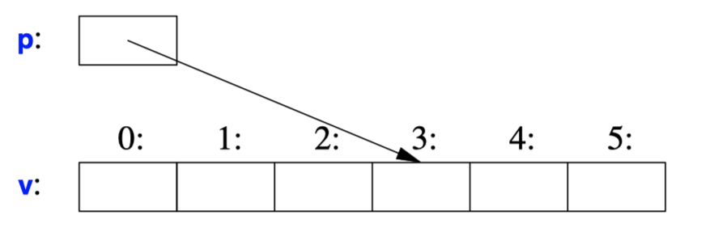

## Hello World
```C++
#include <iostream> 
int main() { // the minimal C++ program
    std::cout << "Hello, World!\n";
}
```
- Every C++ program must have exactly one global function named `main()`. **The program starts by executing that function**.
  - *Nonzero* value from main() indicates **failure**.
  - If **no value** is returned, the system will receive a value indicating **successful completion**.'
  - `#include <>` instructs the compiler to include the declarations of the standard library.
  - The operator `<<` ("put to") writes its second argument onto its first
  - The `std::` specifies that the name cout is to be found in the  namespace std.
  - `std::cout` is the standard output stream
  - You can add `using namespace std` to make names from std visible without std::.

## Types, Variables, and Arithmetic
- A declaration is a statement that introduces a name into the program.
  - A *type* defines a set of possible values and a set of operations (for an object).
  - An *object* is some memory that holds a value of some type.
  - A *value* is a set of bits interpreted according to a type.
  - A *variable* is a named object.
- C++ offers a variety of fundamental types
  - `bool`
  - Character Types
    - `char`: a natural size to hold a character on a given machine (8-bit)
    - `signed char`
    - `unsigned char`
    - `wchar_t`: hold characters of a larger character set such as Unicode
    - `char16_t`: holds 16-bit character sets, such as UTF-16.
    - `char32_t`: holds 32-bit character sets, such as UTF-32.
  - Integer Types
    - `int`
    - `unsigned int`
    - `long int`
    - `unsigned long int`
    - `long long int`
    - `unsigned long long int`
  - Floating-Point Types
    - `float`
    - `double`
    - `long double`
  - `void`
- The size of a type is implementation-defined (by machines) and can be obtained by the `sizeof` operator.
  - `sizeof(char) == 1`
  - `sizeof(int) == 4`
- Types built out of the built-in types using C++’s abstraction mechanisms are called *user-defined types*.
- Arithmetic operators
  - Combination
    - `x+y`
    - `+x`
    - `x−y`
    - `−x`
    - `x*y`
    - `x/y`
    - `x%y`
  - Comparison
    - `x==y`
    - `x!=y`
    - `x<y`
    - `x>y`
    - `x<=y`
    - `x>=y`
  - Assignment
    - `x+=y`
    - `++x`
    - `x−=y`
    - `−−x`
    - `x*=y`
    - `x/=y`
    - `x%=y`
  - C++ performs all meaningful **conversions between the basic types** so that they can be mixed freely
    ```
    void some_function() {
        double d = 2.2;
        int i = 7;
        d = d + i;
        i = d*i; // truncating the double d*i to an int
    }
    ```

## Initialization
```C++
double d1 = 2.3;
double d2 {2.3};

complex<double> z = 1;
complex<double> z2 {d1,d2};
complex<double> z3 = {1,2};

vector<int> v {1,2,3,4,5,6};

int i1 = 7.2; // i1 becomes 7 
int i2 {7.2}; // error: floating-point to integer conversion
int i3 = {7.2}; // error: floating-point to integer conversion
```
- `{}`: saves you from conversions that lose information
- A *constant* cannot be left uninitialized.
- User-defined types (such as `string`, `vector`, `Matrix`, `Motor_controller`) can be defined to be **implicitly initialized**.
```C++
auto b = true;
auto ch = 'x';
auto i = 123;
auto d = 1.2;
auto z = sqrt(y);
```
- You don’t actually need to state its type explicitly when it can be deduced from the initializer.
- Use `auto` where we don’t have a *specific reason*.
    - **In a large scope** where we want to make the type clearly visible to readers.
    - Explicit about a variable’s range or precision. (`float` or `double`)
    - This is especially **important in generic programming** where the exact type of an object can be hard for the programmer to know and the type names can be quite long

## Constant
- C++ supports two notions of immutability
  - `const`: means roughly "I promise not to change this value". his is used primarily to specify interfaces, so that **data can be passed to functions without fear of it being modified**.
  - `constexpr`: means roughly "to be evaluated at compile time". This is used primarily to specify constants, to **allow placement of data in memory where it is unlikely to be corrupted**, and for performance.
```C++
const int dmv = 17;
int var = 17;
constexpr double max1 = 1.4*square(dmv);
constexpr double max2 = 1.4*square(var); // error : var is not a constant expression
const double max3 = 1.4*square(var); // OK, may be evaluated at run time

double sum(const vector<double>&);
vector<double> v {1.2, 3.4, 4.5};
const double s1 = sum(v);
constexpr double s2 = sum(v); // // error : sum(v) not constant expression
```
- **Constant function**
    ```C++
    constexpr double square(double x) { return x*x; }
    ```
    - For a **function** to be usable in a *constant* expression, it must be defined `constexpr`.
    - To be `constexpr`, a function must be **rather simple**: just a return-statement computing a value
    - A constexpr function can be used for non-constant arguments, but the result is not a constant expression.
- In a few places, constant expressions are required by language rules.
  - array bounds
  - case labels
  - some template arguments
  - constants declared using `constexpr`
- `const` **can only be used** on fundamental types and function declaration.

## Array
```C++
char v[6]; // array of 6 characters
```
- `[]` means "array of"
- All arrays have `0` as their lower bound. So, `v` has six elements, `v[0]` to `v[5]`.
- **The size of an array must be a constant expression**.


## Condition
- `switch`
    ``` C++
    bool accept() {
        cout << "Do you want to proceed (y or n)?\n";
        char answer = 0;
        cin >> answer;

        switch (answer) {
        case 'y':
            return true;
        case 'n':
            return false;
        default:
            cout << "I'll take that for a no.\n";
            return false;
        }
    }
    ```
    - the `>>` operator ("get from") is used for input.
    - The type of the right-hand operand of `>>` determines what input is accepted.
    - A switch-statement tests a value against a set of constants.
    - The case constants must be distinct.
    - If no `default` is provided, no action is taken if the value doesn’t match any case constant.
- `while`
    ``` C++
    bool accept() {
        int tries = 1;
        while (tries<4) {
            cout << "Do you want to proceed (y or n)?\n";
            char answer = 0;
            cin >> answer;

            switch (answer) {
            case 'y':
                return true;
            case 'n':
                return false;
            default:
                cout << "Sorry, I don't understand that.\n";
                ++tries;
                return false;
            }
        }
        cout << "I'll take that for a no.\n";
        return false;
        
    }
    ```
    - The `while`-statement executes until its condition becomes `false`.
- `for`
    ```C++
    void copy_fct() {
        int v1[10] = {0,1,2,3,4,5,6,7,8,9};
        int v2[10];

        for (auto i=0; i!=10; ++i)
            v2[i]=v1[i];
        }
    }
    ```
    - This `for`-statement can be read as "set `i` to zero; while `i` is not `10`, copy the `i`th element and increment `i`."
    ```C++
    void print() {
        int v[] = {0,1,2,3,4,5,6,7,8,9};
        for (auto x : v)
            cout << x << '\n';
        for (auto x : {10,21,32,43,54,65})
            cout << x << '\n';
    }
    ```
    - C++ offers a simpler for-statement, called a **range-`for`-statement**,
    - The range-`for`-statement can be used for **any sequence of elements**.
    

## Pointer
```C++
char v[6];
char* p = &v[3]; // p points to v’s four th element 
char x = *p; // *p is the object that p points to
```
- `*` means "pointer to."
- prefix unary `*` means "contents of."
- prefix unary `&` means "address of."

```C++
    void increment() {
        int v[] = {0,1,2,3,4,5,6,7,8,9};
        for (auto& x : v) ++x; // ...
    }
```
- the unary suffix `&` means **"reference to."**
- A reference is **similar to a pointer,** except that you **don’t need to use a prefix `*` to access the value** referred to by the reference
- A reference **cannot be made to refer to a different object** after its initialization.
```C++
double* pd = nullptr;
Link<Record>* lst = nullptr;
int x = nullptr;
```
- `nullptr`: represent the notion of "no object available" (e.g. for an end of a list)
- There is **only one `nullptr` shared by all** pointer types
```C++
int count_x(char* p, char x) {
    if (p==nullptr) return 0;
    int count = 0;
    for (; *p!=0; ++p)
        if (*p==x)
            ++count;
    return count;
}
```
- It is often wise to check that a pointer argument that is supposed to point to something,
  - In older code, `0` or `NULL` is typically used instead of nullptr.
  - Using nullptr eliminates potential confusion between integers and pointers.
- We can move a pointer to point to the next element of an array using ++

## Structure
```C++
struct Vector {
    int sz; // number of elements
    double* elem; // pointer to elements
};

void vector_init(Vector& v, int s) {
    v.elem = new double[s]; // allocate an array of s doubles
    v.sz = s;
}

double read_and_sum(int s)  {
    Vector v;
    vector_init(v,s); // allocate s elements for v

    for (int i=0; i!=s; ++i)
        cin>>v.elem[i];

    double sum = 0;
    for (int i=0; i!=s; ++i)
        sum+=v.elem[i];
    return sum;
}
```
- The `&` in `Vector&` indicates that we pass v by non-const reference. Thus, `vector_init()` can modify the vector passed to it.
- The `new` operator allocates memory from an area called the *free store* (also known as *dynamic memory* and *heap*)
```C++
void f(Vector v, Vector& rv, Vector* pv) {
    int i1 = v.sz;
    int i2 = rv.sz;
    int i4 = pv−>sz;
}
```
- `.`: to access `struct` members through a **name** or a **reference**.
- `->`: to access `struct` members through a **pointer**.

## Class
- A class is defined to have a set of *members*, which can be *data*, *function*, or *type members*.
```C++
class Vector {
    public:
        Vector(int s) :elem{new double[s]}, sz{s} { }
        double& operator[](int i) { return elem[i]; }
        int size() { return sz; }
    private:
        double* elem;
        int sz;
};
```
- The interface is defined by the `public` members of a class, and `private` members are accessible only through that interface.
- A "function" with the **same name as its class** is called a *constructor*.
- A constructor is guaranteed to be used to initialize objects of its class
- `:elem{new double[s]}, sz{s}`
  - initialize elem with a pointer to s elements of type double obtained from the free store.
  - initialize sz to s.
- `operator[]`: Access by a subscript function

## Enumerations
```C++
enum class Color { red, blue, green };
enum class Traffic_light { green, yellow, red };

Traffic_light light = Traffic_light::red;

Color col = Color::red;
Color x = red; // error : which red?
Color y = Traffic_light::red; // error : that red is not a Color
int i = Color::red; // error : Color ::red is not an int
Color c = 2;  // error : 2 is not a Color
```
- *Enumerations* are used to represent small sets of integer values.
- The `class` after the `enum` specifies that an enumeration is **strongly typed** and that its **enumerators are scoped**.
- If you don’t want to explicitly qualify enumerator names and want enumerator values to be `int`s, you should use plain `enum` rather than `enum class`.
- By default, an `enum class` has only *assignment*, *initialization*, and *comparisons*.
```C++
Traffic_light& operator++(Traffic_light& t)
{
    switch (t) {
    case Traffic_light::green:
        return t=Traffic_light::yellow;
    case Traffic_light::yellow:
        return t=Traffic_light::red;
    case Traffic_light::red:
        return t=Traffic_light::green;
    }
}

Traffic_light next = ++light;
```
- An enumeration is a user-defined type so we can define operators for it.

## Separate Compilation
- C++ supports a notion of separate compilation where user code sees only declarations of types and functions used.
- Such separation can be used to **minimize compilation times** and to strictly **enforce separation of logically distinct parts** of a program.
- Using separate compilation isn’t a language issue; it is an issue of how best to take advantage of a particular language implementation.
```C++
// Vector.h:
public:
    Vector(int s);
    double& operator[](int i);
    int size();
private:
    double* elem;
    int sz;
```
- Typically, we place the declarations that specify the interface to a module in a file whose extension is `.h`.
```C++
// user.cpp:

#include "Vector.h"
#include <cmath>
using namespace std;

double sqrt_sum(Vector& v)
{
    double sum = 0;
    for (int i=0; i!=v.size(); ++i)
        sum+=sqrt(v[i]);
    return sum;
}
```
- Users will include that file, called a *header* file, to access that interface.
```C++
// Vector.cpp:

#include "Vector.h" // get the interface

Vector::Vector(int s) :elem{new double[s]}, sz{s}
{
}

double& Vector::operator[](int i)
{
    return elem[i];
}

int Vector::size()
{ 
    return sz;
}
```
- the `.cpp` file providing the implementation of `Vector` will also include the `.h` file providing its interface.

## Namespace
```C++
namespace My_code {
    class complex { /* ... */ };
    complex sqrt(complex); // ...
    int main();
}

int My_code::main()
{
    complex z {1,2};
    auto z2 = sqrt(z);
    std::cout << '{' << z2.real() << ',' << z2.imag() << "}\n"; // ...
};

int main()
{
    return My_code::main();
}
```
- Namespace is a mechanism for expressing that some declarations belong together and that their names shouldn’t clash with other names.
- The simplest way to access a name in another namespace is to qualify it with the namespace name (e.g., `std::cout` and `My_code::main`).
- To gain access to names in the standard-library namespace, we can use a using-directive. `using namespace std;`
- Namespaces are primarily used to organize larger program components, such as libraries.

## Exceptions
```C++
double& Vector::operator[](int i)
{
    if (i<0 || size()<=i) throw out_of_range{"Vector::operator[]"};
    return elem[i];
}
```
- The `throw` transfers control to a handler for exceptions of type `out_of_range`.
- `out_of_range` type is defined in the standard library.
```C++
void f(Vector& v)
{
    try {
        v[v.size()] = 7; // try to access beyond the end of v
    }
    catch (out_of_range) { 
    }
}
```
- We put code for which we are interested in handling exceptions into a try-block.
- `catch`-clause provides a handler for `out_of_range` will be entered.

## Invariants
- A statement of what is assumed to be **true for a class** is called a *class invariant*, or simply an *invariant*.
- It is the job of a *constructor* to establish the invariant for its class  and for the *member functions* to make sure that the invariant holds when they exit.
```C++
Vector::Vector(int s)
{
    if (s<0) throw length_error{};
    elem = new double[s];
    sz = s;
}

void test()
{
    try {
        Vector v(−27);
    }
    catch (std::length_error) {
    }
    catch (std::bad_alloc) {
    }

}
```
- If operator new can’t find memory to allocate, it throws a `std::bad_alloc`.
- Often, a function has no way of completing its assigned task after an exception is thrown. Then, **"handling" an exception simply means doing some minimal local cleanup and rethrowing the exception**.

## Static Assertions
- Exceptions report errors found at **run time**.
- We can also perform simple checks on other properties that are known at compile time and report failures as compiler error messages.
```C++
static_assert(4<=sizeof(int), "integers are too small"); // check integer size
```
- We call such statements of expectations assertions.
```C++
constexpr double C = 299792.458;

void f(double speed)
{
    const double local_max = 160.0/(60*60);
    static_assert(speed<C,"can't go that fast"); // error : speed must be a constant
    static_assert(local_max<C,"can't go that fast"); // OK
}
```
- The `static_assert` mechanism can be used for **anything that can be expressed in terms of constant** expressions
- The most important uses of 1 come when we **make assertions about types used as parameters in generic** programming.