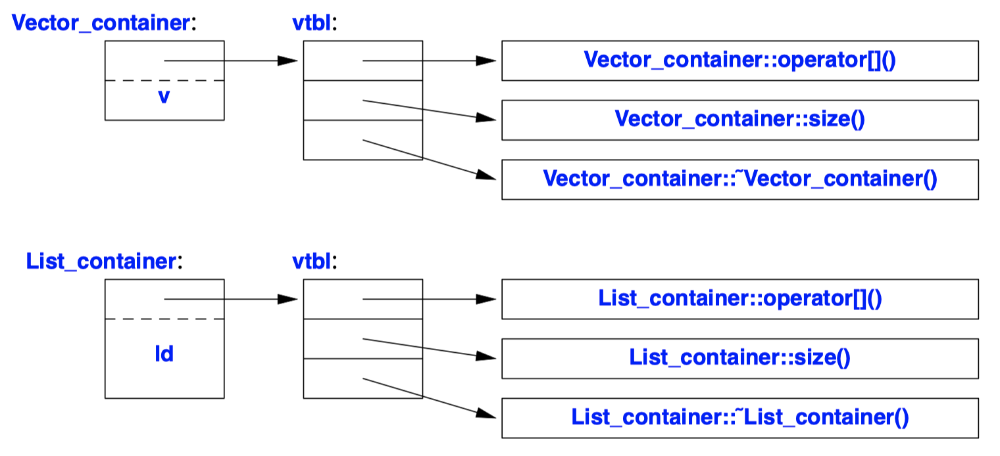
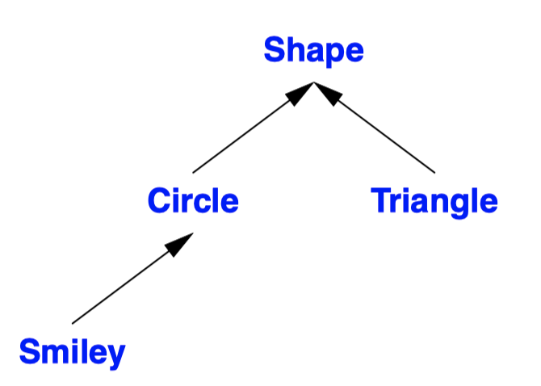
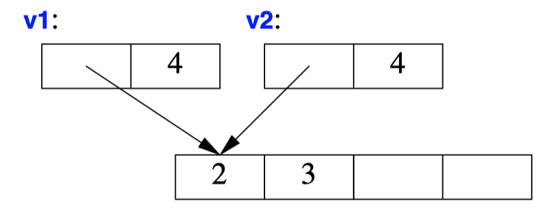
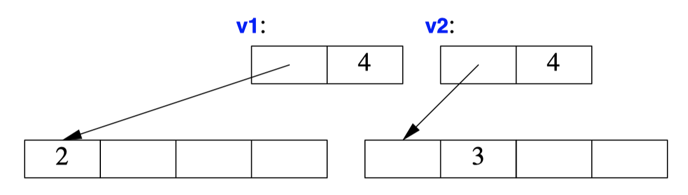

## Concrete Class
- Concrete classes is that they behave **just like built-in types.**
- Concrete type is that **its representation is part of its definition**.
  - In many important cases, such as a `vector`, that representation is only one or more pointers to more data stored elsewhere.
  - Place objects of concrete types on the **stack, in statically allocated memory.** (Recycled when out of scope)
  - Refer to objects directly (and not just through pointers or references).
  - Initialize objects immediately and completely.
  - Copy objects
- If the representation changes in any significant way, a user must **recompile**.
- To increase flexibility, a concrete type can keep major parts of its representation on the **free store (dynamic memory, heap)** and access them through the part stored in the class object itself.

```C++
class complex {
    double re, im; // representation: two doubles
    
    public:
    complex(double r, double i) :re{r}, im{i} {}
    complex(double r) :re{r}, im{0} {}
    complex() :re{0}, im{0} {} // default constructor

    double real() const { return re; }
    void real(double d) { re=d; }
    double imag() const { return im; }
    void imag(double d) { im=d; }

    complex& operator+=(complex z) { re+=z.re, im+=z.im; return *this; }
    complex& operator−=(complex z) { re−=z.re, im−=z.im; return *this; }
    complex& operator*=(complex); // defined out-of-class somewhere
    complex& operator/=(complex); // defined out-of-class somewhere
}
```
- The class definition itself contains only the operations requiring access to the representation.
- Functions defined in a class are **inlined by default.** (Function calls will not be generated machine code)
- A constructor **without an argument** is called a default constructor.
- By defining a default constructor you eliminate the possibility of uninitialized variables of that type.
```C++
complex operator+(complex a, complex b) { return a+=b; }
complex operator−(complex a, complex b) { return a−=b; }
complex operator−(complex a) { return {−a.real(), −a.imag()}; }
complex operator*(complex a, complex b) { return a*=b; }
complex operator/(complex a, complex b) { return a/=b; }

bool operator==(complex a, complex b)
{
    return a.real()==b.real() && a.imag()==b.imag();
}

bool operator!=(complex a, complex b)
{
    return !(a==b);
}

complex sqrt(complex);

void f(complex z) {
    complex a {2.3};
    complex b {1/a};
    complex c {a+z*complex{1,2.3}};
    if (c != b)
        c = −(b/a)+2*b;
}
```
- These operations do not require direct access to the representation of complex, so they can be defined separately from the class definition.
- **An argument passed by value is copied**, so that modifying an argument won't affect the caller's copy.
```C++
class Vector {
private:
    double* elem;
    int sz;
public:
    Vector(int s) :elem{new double[s]}, sz{s}
    {
        for (int i=0; i!=s; ++i) elem[i]=0;
    }

    ~Vector() { delete[] elem; }

    double& operator[](int i) { return elem[i]; }
    int size() { return sz; }
};
```
- A *container* is an object holding a collection of elements.
- `~class`: destructor of the class
- The constructor/destructor combination is the basis for most C++ general resource management techniques.
- You use constructor and destructor to **eliminate naked `new` and `delete`** operations.
```C++
class Vector {
public:
    Vector::Vector(std::initializer_list<double> lst) :elem{new double[lst.size()]}, sz{lst.size()}
    {
        copy(lst.begin(),lst.end(),elem);
    }
    // ...
    void push_back(double);
    // ...
};

Vector read(istream& is) {
    Vector v;
    for (double d; is>>d;) // read floating-point values into d
        v.push_back(d);
    return v;
}
```
- A container exists to hold elements, so obviously we need convenient ways of getting elements into a container.
- `initializer-list` constructor: Initialize with a list of elements.
- `push_back()`: Add a new element at the end (at the back of) the sequence.
- When we use a `{}`-list, such as` {1,2,3,4}`, the **compiler will create an object of type `initializer_list`** to give to the program.

## Abstract Class
- An abstract type is a type that completely **insulates a user from implementation details**.
- We decouple the interface from the representation and give up genuine local variables.
- We must allocate objects on the free store and **access them through references or pointers**.
```C++
class Container {
public:
    virtual double& operator[](int) = 0;
    virtual int size() const = 0;
    virtual ~Container() {}
};
```
- This class is a pure interface to specific containers defined later.
- `Container` can only serve as the interface to a class that implements its `operator[]()` and `size()` functions.
- `virtual` means may be redefined later in a class derived from this one.
- A function declared virtual is called a *virtual function*.
- `=0` syntax says the function is *pure virtual*; that is, some class derived from Container must define the function.
- A class with a **pure virtual function** is called an *abstract class*.
- As is common for abstract classes, `Container` does **not have a constructor**. On the other hand, `Container` does have a destructor and that destructor is `virtual`.
```C++
void use(Container& c)
{
    const int sz = c.size();
    for (int i=0; i!=sz; ++i)
        cout << c[i] << '\n';
}
```
- `use()` uses the `Container` interface in complete ignorance of implementation details
- A class that **provides the interface to a variety of other classes** is often called a *polymorphic type*.
- `use(Container&)` needn't be recompiled if the derived implementation changes or a brand-new class derived from Container is used.
- The **flip side** of this flexibility is that objects must be manipulated through **pointers or references**.
```C++
class Vector_container : public Container {
    Vector v;
public:
    Vector_container(int s) : v(s) { } 
    double& operator[](int i) { return v[i]; }
    int size() const { return v.size(); }
};

class List_container : public Container { 
    implements Container std::list<double> ld;

    List_container() { } // empty List
    List_container(initializer_list<double> il) : ld{il} { } ~List_container() {}

    double& operator[](int i);
    int size() const { return ld.size();
};

double& List_container::operator[](int i) {
    for (auto& x : ld) {
        if (i==0) return x;
        −−i;
    }
    throw out_of_range("List container");
}
```
- The `:public` can be read as "is derived from" or "is a subtype of."
- An alternative terminology calls `Vector_container` and `Container` *subclass* and *superclass*,
- Derived classes is commonly referred to as *inheritance*.
- `operator[]()`, `size()`, and destructor *override* the corresponding members in the base class Container

- A `Container` object must contain information to allow it to select the right function to call at run time.
- The compiler will convert the name of a virtual function into an index into a table, *virtual function table* or `vtbl`, of pointers to functions.
- A virtual class's space overhead is **one pointer to `vtbl` in each object** plus **one `vtbl` for each such class.** Same class shares the same `vtbl`.

## Class Hierarchies
- A class hierarchy is a set of classes ordered in a lattice created by derivation.
- We use **"is"-relationship** to decide whether to use.

- The arrows represent inheritance relationships.
```C++
class Shape {
public:
    // pure virtual
    virtual Point center() const =0; 
    virtual void move(Point to) =0;

    virtual void draw() const = 0; 
    virtual void rotate(int angle) = 0;

    virtual ~Shape() {}
};

void rotate_all(vector<Shape*>& v, int angle) {
    for (auto p : v)
        p−>rotate(angle);
}

class Circle : public Shape {
public:
    Circle(Point p, int rr);
    Point center() const { return x; }

    void move(Point to) { x=to; }
    void draw() const; void rotate(int) {}
    
private:
    Point x; // center
    int r; // radius
};

class Smiley : public Circle {
    Smiley(Point p, int r) : Circle{p,r}, mouth{nullptr} { }
    ~Smiley()
    {
        delete mouth;
        for (auto p : eyes) delete p;\
    }

    void move(Point to);
    void draw() const; void rotate(int);
    void add_eye(Shape* s) { eyes.push_back(s); }
    void set_mouth(Shape* s);
    virtual void wink(int i);
    // ...

private:
    vector<Shape*> eyes; // usually two eyes
    Shape* mouth;
}

void Smiley::draw()
{
    Circle::draw();
    for (auto p : eyes)
        p−>draw();
    mouth−>draw();
}
```
- A **virtual destructor is essential** for an abstract class because an object of a **derived class is usually manipulated through the interface** provided by its abstract base class.
- We can add data members, operations, or both as we define a new class by derivation.
- A class hierarchy offers two kinds of benefits:
  - Interface inheritance: An object of a derived class can be used wherever an object of a base class is required
  - Implementation inheritance: A base class provides functions or data that simplifies the implementation of derived classes.
```C++
enum class Kind { circle, triangle, smiley };

Shape* read_shape(istream& is) 
{
    // ... read shape header from is and find its Kind k

    switch (k) {
    case Kind::circle:
        return new Circle{p,r};
    case Kind::triangle:
        return new Triangle{p1,p2,p3};
    case Kind::smiley:
        Smiley* ps = new Smiley{p,r};
        ps−>add_eye(e1);
        ps−>add_eye(e2);
        ps−>set_mouth(m);
        return ps;
}

void user() {
    std::vector<Shape*> v;

    while (cin)
        v.push_back(read_shape(cin));
    draw_all(v); /
    rotate_all(v,45);
    for (auto p : v) delete p; // remember to delete elements
}
```
- Classes in class hierarchies are different: **we tend to allocate them on the free store using `new`**,
- `user()` is responsible for deallocation.
- `delete` invokes the destructor for the most derived class.
- Two obvious opportunities for mistakes:
  - A user might fail to `delete` the pointer returned by `read_shape()`.
  - The owner of a container of `Shape` pointers might not delete the objects pointed to.

```C++
unique_ptr<Shape> read_shape(istream& is)
{
    switch (k) {
    case Kind::circle:
        // return new Circle{p,r};
        return unique_ptr<Shape>{new Circle{p,r}};
    // ...
    }
}

void user() {
    vector<unique_ptr<Shape>> v;
    while (cin)
        v.push_back(read_shape(cin));
    draw_all(v);
    rotate_all(v,45);

    // for (auto p : v) delete p;
    // all Shapes implicitly destroyed
}
```
- **Functions returning a naked pointer** to an object allocated on the free store are **dangerous**.
- The object is owned by the `unique_ptr` which will **delete the object when it is no longer needed** (goes out of scope.)

## Copy and Move
```C++
void test(complex z1) {
    complex z2 {z1}; 
    complex z3;
    z3 = z2;
}
```
- By default, *user-defined types* and *built-in type* can be copied memberwisely.
- For some sophisticated concrete types and most of *abstract types*,  memberwise copy is not the right semantics for copy
```C++
void bad_copy(Vector v1) {
    Vector v2 = v1;
    v1[0] = 2; // v2[0] is now also 2!
    v2[1] = 3; // v1[1] is now also 3!
} 
```

- When a class is a *resource handle*, that is, it is **responsible for an object accessed through a pointer**, the default memberwise copy is typically a disaster.
```C++
class Vector {
private:
    double* elm;
    int sz;
public:
    Vector(int s);
    ~Vector() {delete[] elm };

    Vector(const Vector& a); // copy constructor
    Vector& operator=(const Vector& a); // copy assignment

    double& operator[](int i);
    const double& operator[](int i) const;

    int size() const;
}

Vector::Vector(const Vector& a)
    :elem{new double[sz]},
    sz{a.sz}
{
    for (int i=0; i!=sz; ++i)
        elem[i] = a.elem[i];
}

Vector& Vector::operator=(const Vector& a) {
    double* p = new double[a.sz];
    for (int i=0; i!=a.sz; ++i)
        p[i] = a.elem[i];
    delete[] elem; // delete old elements
    elem = p;
    sz = a.sz;
    return *this;
}
```

- Copying of an object of a class is defined by two members: a `copy constructor` and a `copy assignment`.
- The name `this` is predefined in a member function and **points to the object for which the member function is called**.
- A copy constructor and a copy assignment for a class X are typically declared to take an argument of type `const X&`
```C++
Vector operator+(const Vector& a, const Vector& b)
{
    if (a.size()!=b.size())
        throw Vector_size_mismatch{};

    Vector res(a.size());
    for (int i=0; i!=a.size(); ++i)
        res[i]=a[i]+b[i];
        
    return res;
}

void f(const Vector& x, const Vector& y, const Vector& z)
{
    Vector r;
    // ...
    r = x+y+z;
    // ...
}
```
- Copying can be costly for large containers.
- The most embarrassing part is that `res` in `operator+()` is never used again after the copy.
- We wanted to **move** a `Vector` rather than to **copy** it.
```C++
class Vector {
    // ...
    Vector(const Vector& a); // copy constructor
    Vector& operator=(const Vector& a); // copy assignment

    Vector(Vector&& a); // move constructor
    Vector& operator=(Vector&& a);  // move assignment
};

Vector::Vector(Vector&& a)
    :elem{a.elem}, // "grab the elements" from a
    sz{a.sz}
{
    a.elem = nullptr;
    a.sz = 0;
}

Vector f()
{
    Vector x(1000);
    Vector y(1000);
    Vector z(1000);
    // ...
    z = x; // we get a copy 
    y = std::move(x); // we get a move
    // ...
    return z; // we get a move
};
```
- `&&` means **"rvalue reference"** and is a reference to which we can bind an *rvalue*.
- **lvalue** roughly means "something that can appear on the left-hand side of an assignment".
- **rvalue** is – to a first approximation – a value that you can't assign to, such as an integer returned by a function call
- **rvalue reference** is a reference to something that nobody else can assign to.
- A move constructor does not take a `const` argument.
- After a move, a moved-from object should be in a state that allows a destructor to be run.
- The standard-library function `move()` returns an rvalue reference to its argument.
- **When z is destroyed, it too has been moved** from (by the return) so that, like x, it is empty.

```C++
class Shape {
public:

    Shape(const Shape&) =delete; // no copy operations
    Shape& operator=(const Shape&) =delete;

    Shape(Shape&&) =delete; // no move operations
    Shape& operator=(Shape&&) =delete;

    ~Shape(); // ...
};
```
- Using the default copy or move for a class in a hierarchy is typically a disaster, and thus the best thing to do is usually to **delete the default copy and move operations**.
- `=delete` can be used to suppress any operation.
- An attempt to copy a `Shape` will be caught by the compiler.
- If you need to copy an object in a class hierarchy, write some kind of *clone function*.
- A move operation is **not** implicitly generated for a class **where a destructor is explicitly declared**.

## Template
```C++
template<typename T>
class Vector {
private:
    T* elem; // elem points to an array of sz elements of type T
    int sz;
public:
    Vector(int s);
    ~Vector() { delete[] elem; } // destructor: release resources

    // ... copy and move operations ...

    T& operator[](int i);
    const T& operator[](int i) const;
    int size() const { return sz; }
};

template<typename T>
Vector<T>::Vector(int s)
{
    if (s<0) throw Negative_size{};
    elem = new T[s];
    sz = s;
}

template<typename T>
const T& Vector<T>::operator[](int i) const {
    if (i<0 || size()<=i)
        throw out_of_range{"Vector::operator[]"};
    return elem[i];
}

void main() {
    Vector<char> vc(200);
    Vector<string> vs(17);
    Vector<list<int>> vli(45);
}

void write(const Vector<string>& vs) {
    for (int i = 0; i!=vs.size(); ++i)
        cout << vs[i] << '\n';
}
```
- A *template* is a class or a function that we parameterize with a set of types or values.
- Templates are a **compile-time mechanism**, so their use incurs no run-time overhead.
- The `template<typename T>` prefix makes `T` a parameter of the declaration it prefixes.
```C++
template<typename T>
T* begin(Vector<T>& x)
{
    return &x[0]; // pointer to first element
}

template<typename T>
T* end(Vector<T>& x)
{
    return x.begin()+x.size(); // pointer to one-past-last element
}

void f2(const Vector<string>& vs)
{
    for (auto& s : vs)
        cout << s << '\n'; }
```
- To support the range-`for` loop for our `Vector`, we must define suitable `begin()` and `end()` functions.
```C++
template<typename Container, typename Value>
Value sum(const Container& c, Value v)
{
    for (auto x : c)
        v+=x;
    return v;
}

void user(Vector<int>& vi, std::list<double>& ld, std::vector<complex<double>>& vc)
{
    int x = sum(vi,0);
    double d = sum(vi,0.0);
    double dd = sum(ld,0.0);
    auto z = sum(vc,complex<double>{}); // the sum of a vector of complex<double>
}
```
- Templates can also be used on function.
- This `sum()` is a simplified version of the standard-library `accumulate()`.
```C++
template<typename T>
class Less_than {
    const T val; // value to compare against
public:
    Less_than(const T& v) :val(v) { }
    bool operator()(const T& x) const { return x<val; } // call operator
};

Less_than<int> lti {42};
Less_than<string> lts {"Backus"}; 

void fct(int n, const string & s)
{
    bool b1 = lti(n); // true if n<42
    bool b2 = lts(s); // true if s<"Backus"
}
```
- A **function object** (sometimes called a functor) is used to define **objects that can be called like functions**.
- One particularly useful kind of template is the function object.
- The function called `operator()`,
```C++
template<typename C, typename P>
int count(const C& c, P pred)
{
    int cnt = 0;
    for (const auto& x : c)
        if (pred(x))
            ++cnt;
    return cnt;
}

void f(const Vector<int>& vec, const list<string>& lst, int x, const string& s)
{
    cout << "number of values less than "
        << x
        << ": " << count(vec,Less_than<int>{x}) << '\n';
    cout << "number of values less than "
        << s
        << ": " << count(lst,Less_than<string>{s}) << '\n';

    cout << "number of values less than "
        << x
        << ": " << count(vec,[&](int a){ return a<x; }) << '\n';

    cout << "number of values less than "
        << s
        << ": " << count(lst,[&](const string& a){ return a<s; }) << '\n';
}
``` 
- `pred` (predicate) is something that we can invoke to return `true` or `false`.
- For a simple function object like `Less_than` inlining is simple, so that a call of `Less_than` is far more efficient than an indirect function call.
- Function objects used to specify the meaning of key operations of a general algorithm are often referred to as *policy objects.*
```C++
void f(const Vector<int>& vec, const list<string>& lst, int x, const string& s)
{
    cout << "number of values less than "
        << x
        << ": " << count(vec,[&](int a){ return a<x; }) << '\n';

    cout << "number of values less than "
        << s
        << ": " << count(lst,[&](const string& a){ return a<s; }) << '\n';
}

template<class C, class Oper>
void for_all(C& c, Oper op)
{
    for (auto& x : c)
        op(*x); // pass op() a reference to each element pointed to
}

void user() {
    vector<unique_ptr<Shape>> v;
    while (cin)
        v.push_back(read_shape(cin));
    
    for_all(v,[](Shape& s){ s.draw(); });
    for_all(v,[](Shape& s){ s.rotate(45); });
}
```
- The notation `[&](int a){ return a<x; }` is called a *lambda expression*.
- The `[&]` is a **capture list** specifying that local names used (such as x) will be **passed by reference**. Had we wanted to "capture" only x, we could have said so: `[&x]`.
- Had we wanted to give the generated object a copy of x, we could have said so: `[=x]`.
- Capture nothing is `[]`.
- **Capture all local** names used by reference is `[&]`.
- Capture all local names used by value is `[=]`.
- Using lambdas can be convenient and terse, but also obscure.

```C++
template<typename T, typename... Tail>
void f(T head, Tail... tail)
{
    g(head); // do something to head
    f(tail...); // try again with tail
}

void f() { } // do nothing

template<typename T>
void g(T x)
{
    cout << x << " ";
}

int main() {
    cout << "first: ";
    f(1,2.2,"hello");

    cout << "\nsecond: ";
    f(0.2,'c',"yuck!",0,1,2);
    cout << "\n";
}
```
- A template can be defined to accept an arbitrary number of arguments of arbitrary types, which is called a *variadic template*.
- The ellipsis, `...`, is used to indicate "the rest" of a list.
- The weakness of variadic template is that the type checking of the interface is a possibly elaborate template program..

```C++
template<typename T>
class Vector {
public:
    using value_type = T;
    // ...
};
```
- `using value_type = T` is to declare `value_type` is an alias of `T`.
- Having the *alias* allows the programmer to write portable code.
```C++
template<typename C>
using Element_type = typename C::value_type;

template<typename Container>
void algo(Container& c)
{
    Vector<Element_type<Container>> vec; // keep results here
    // ...
}
``` 
- In fact, every standard-library container provides `value_type` as the name of its value type
- This allows us to write code that will work for every container that follows the convention.
```C++
template<typename Key, typename Value>
class Map {
    // ...
};

template<typename Value>
using String_map = Map<string,Value>;

String_map<int> m; // m is a Map<string,int>
```
- The aliasing mechanism can be used to define a new template by **binding some or all template arguments**.