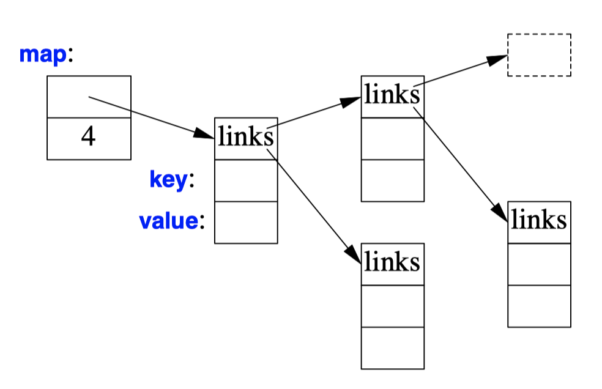
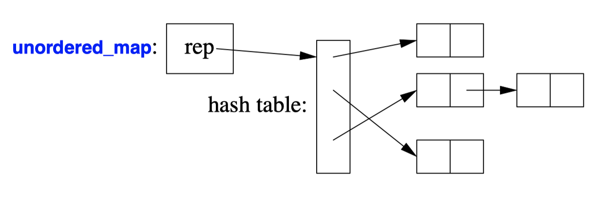
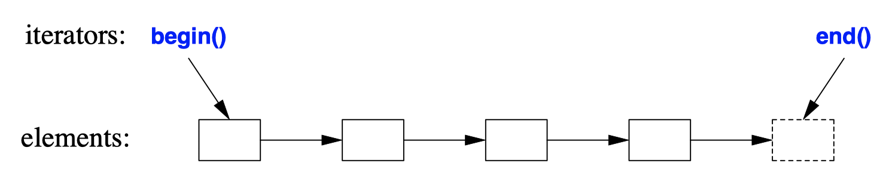
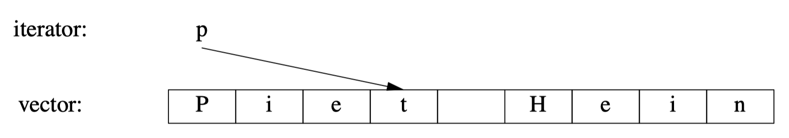
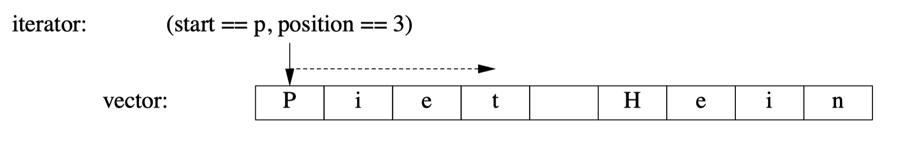
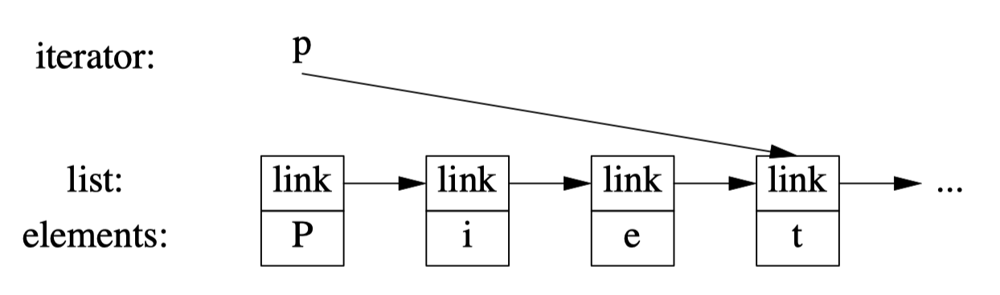

## Standard Library
```C++
#include<string>
#include<list>

std::string s {"Four legs Good; two legs Baaad!"};
std::list<std::string> slogans {"War is peace", "Freedom is Slavery", "Ignorance is Strength"};
```
- Every standard-library facility is provided through some standard header.
- The standard library is defined in **a namespace called `std`**.
- To use standard library facilities, the `std::` prefix can be used.
- Use `using namespace std;` to make std names available without `std::` prefix.
  
- `Strings`
    ```C++
    string compose(const string& name, const string& domain)
    {
        return name + '@' + domain;
    }
    auto addr = compose("dmr","bell−labs.com");

    void m2(string& s1, string& s2) {
        s1 = s1 + '\n';
        s2 += '\n';
    }
    ```
  - The `string` type provides a variety of useful string operations, such as concatenation.
  - The standard `string` has a *move constructor* so returning even long strings by value is efficient
  - A `string` is mutable.
  ```C++
  string name = "Niels Stroustrup";
  void m3()
  {
      string s = name.substr(6,10); // s="Stroustrup"
      name.replace(0, 5, "nicholas"); // name becomes "nicholas Stroustrup"
      name[0] = toupper(name[0]); // name becomes "Nicholas Stroustrup"
  }
  ``` 
  - Subscripting (using `[]`) and substring operations are supported
  - `substr()` returns a string that is **a copy** of the substring indicated by its arguments. The first argument is an index into the string (a position), and the second is the length.
  - `replace()` : replaces a substring with a value. The replacement string need not be the same size as the substring that it is replacing.
    ```C++
    string incantation;
    void respond(const string& answer) 
    {
        if (answer == incantation) {
            // perform magic
        }
        else if (answer == "yes") {
            // ...
        }
        //...
    }
    ```
- Stream I/O
    ```C++
    void f() {
      cout << 10;
    }

    void g()
    {
        int i {10};
        cout << i;
    }

    void h(int i)
    {
        cout << "the value of i is ";
        cout << i;
        cout << '\n';
    }

    void h2(int i) 
    {
        cout << "the value of i is " << i << '\n';
    }
    ``` 
    - The operator `<<` ("put to") is used as an output operator on objects of type `ostream`;
    - `cout` is the standard output stream.
    - `cerr` is the standard stream for reporting errors.
    - By default, values written to cout are **converted to a sequence of characters**.
    - `cout << 10` places the **character 1** followed by the **character 0** on the standard output stream.
    - The result of an output expression can itself be used for further output. (``cout << a << b << c`)
    ```C++
    void k()
    {
        int b = 'b'; // note: char implicitly converted to int
        char c = 'c';
        cout << 'a' << b << c; // output a98c
    }
    ``` 
    - A character is output as a character rather than as a numerical value.
    - The integer value of the character `'b'` is `98`.
    ```C++
    void f()
    {
        int i;
        cin >> i; // read an integer into i

        double d;
        cin >> d; // read a double-precision floating-point number into d
    }

    void hello()
    {
        cout << "Please enter your name\n";
        string str;
        cin >> str;
        cout << "Hello, " << str << "!\n";
    }

    void hello_line()
    {
        cout << "Please enter your name\n";
        string str;
        getline(cin,str);
        cout << "Hello, " << str << "!\n";
    }
    ```
    - The standard library offers `istreams` for input.
    - The operator `>>` ("get from") is used as an input operator.
    - `cin` is the standard input stream
    - The type of the right-hand operand of `>>` determines what input is accepted and what is the target of the input operation.
    - **By default, a whitespace character, such as a space, terminates the read**.
    - You can read a whole line (including the terminating newline character) using the `getline()` function.
    ```C++
    struct Entry {
        string name;
        int number;
    };

    ostream& operator<<(ostream& os, const Entry& e)
    {
        return os << "{\"" << e.name << "\", " << e.number << "}";
    }

    // read { "name" , number } pair. Note: formatted with { " " , and }
    istream& operator>>(istream& is, Entry& e)
    {
        char c, c2;
        if (is>>c && c=='{' && is>>c2 && c2=='"') { // start with a { "
            string name; // the default value of a string is the empty string: ""
            while (is.get(c) && c!='"') // anything before a " is part of the name
                name+=c;
            
            if (is>>c && c==',') {
                int number = 0;
                if (is>>number>>c && c=='}') { 
                    e = {name,number};
                    return is;
                }
            }
        }

        is.setf(ios_base::failbit); // register the failure in the stream
        return is;
    }

    void main {
        for (Entry ee; cin>>ee;)
            cout << ee << '\n';
    }
    ``` 
    - `iostream` library allows programmers to define I/O for their own types.
    - A user-defined output operator takes its output stream (by reference) as its first argument and returns it as its result.
    - The `is>>c` skips whitespace by default, but `is.get(c)` does not.
    - An input operation returns a reference to its istream which can be used to test if the operation succeeded.
- Containers
  - `vector`
    ```C++
    vector<Entry> phone_book = {
        {"David Hume",123456},
        {"Karl Popper",234567},
        {"Bertrand Arthur William Russell",345678}
    };

    void print_book(const vector<Entry>& book)
    {
        for (int i = 0; i!=book.size(); ++i)
            cout << book[i] << '\n';
        for (const auto& x : book)
            cout << x << '\n';
    }
    ``` 
    - We can initialize a vector with a set of values of its element type
    - Elements can be accessed through subscripting.
    - As usual, indexing starts at 0.
    - The elements of a vector constitute a range, so we can use a range-`for` loop
    ```C++
    vector<int> v1 = {1, 2, 3, 4}; // size is 4
    vector<string> v2; // size is 0
    vector<Shape∗> v3(23); // size is 23; initial element values: nullptr
    vector<double> v4(32,9.9); // size is 32; initial element values: 9.9
    ``` 
    - we give a vector its initial size.
    - By default the elements are initialized to the element type’s default value. (`nullptr` for pointers and `0` for numbers)
    - If you don’t want the default value, you can specify one as a second argument.
    ```C++
    void input()
    {
        for (Entry e; cin>>e;)
        phone_book.push_back(e);
    }
    ``` 
    - `push_back()`: adds a new element at the end of a vector, increasing its size by one.
    - The standard-library `vector` is implemented so that growing a `vector` by repeated `push_back()`s
    - When you insert a new element, **its value is copied** into the container. Thus, the element is not a reference or a pointer to the original object.
    ```C++
    vector<Entry> book2 = phone_book;
    ```
    - Copying and moving of vectors are implemented by constructors and assignment operators
    - After the initialization of `book2`, `book2` and `phone_book` **hold separate copies of every Entry**.
    - Where copying is **undesirable**, references or pointers or move operations should be used.
    ```C++
    void silly(vector<Entry>& book) {
        int i = book[ph.size()].number;  // book.size() is out of range
        // ...
    }

    template<typename T>
    class Vec : public std::vector<T> { 
    public:
        using vector<T>::vector;

        T& operator[](int i) { return vector<T>::at(i); } // range check
        const T& operator[](int i) const { return vector<T>::at(i); } // range check const objects;
    };

    void checked(Vec<Entry>& book) {
        try {
            book[book.size()] = {"Joe",999999};
        } catch (out_of_range) {
            cout << "range error\n";
        }
    }
    ```
    - That initialization is likely to place some **random value** in i, which is out of range, **rather than giving an error**.
    - The `at()` operation is a `vector` subscript operation that throws an exception of type `out_of_range` if its argument is out of the `vector`’s range
  - `list`
    ```C++
    list<Entry> phone_book = {
        {"David Hume",123456},
        {"Karl Popper",234567},
        {"Bertrand Arthur William Russell",345678}
    };
    ```
    - `list` is a **doubly-linked list**.
    - We use a list for sequences where we want to **insert and delete elements without moving other elements**.
    - Unless you have a reason, **use a `vector`**. A vector performs better for traversal and for sorting and searching
    ```C++
    int get_number(const string& s)
    {
        for (const auto& x : phone_book)
            if (x.name==s)
                return x.number;
        return 0; 
    }
    ``` 
    - When we use a linked list, we tend *not to access elements using subscripting.* Instead, we might **search the list** looking for an element with a given value.
    ```C++
    int get_number(const string& s) {
        for (auto p = phone_book.begin(); p!=phone_book.end(); ++p)
            if (p−>name==s)
                return p−>number;
        return 0; // use 0 to represent "number not found"
    }
    ```
    - Every standard-library container provides the functions `begin()` and `end()`, which **return an iterator** to the first and to one-past-the-last element.
    - A `list` iterator identifies an element of a `list` and can be used to iterate through a `list`.
    - In fact, **this is roughly the way the terser and less error-prone range-for loop**.
    - Given an iterator `p`, `∗p` is the element to which it refers, and `p−>m` is equivalent to `(∗p).m`.
    ```C++
    void f(const Entry& ee, list<Entry>::iterator p, list<Entry>::iterator q) {
        phone_book.insert(p,ee); // add ee before the element referred to by p
        phone_book.erase(q); // remove the element referred to by q
    }
    ``` 
    - `insert()`: add a element to a iterator of a list.
    - `erase()`: add the element at the iterator.

  - `map`
   
    - Linear search is inefficient for all but the shortest lists.
    - map is a container of pairs of values **optimized for lookup**.
    - `map` is known as an **associative array** or a **dictionary**.
    - `map` is implemented as a balanced binary tree (red-black tree).
    - The cost of a `map` lookup is `O(log(n))`.
    ```C++
    map<string,int> phone_book {
        {"David Hume",123456},
        {"Karl Popper",234567},
        {"Bertrand Arthur William Russell",345678}
    };

    int get_number(const string& s)
    {
        return phone_book[s];
    }
    ``` 
    - We can use the same initializer as for `vector` and `list`.
    - When indexed by a value of its first type (called the key), a map returns the corresponding value of the second type.
    - **If a key isn’t found**, it is entered into the map with a **default value** for its value.
    - To avoid entering invalid key, we could **use `find()` and `insert()`** instead of `[]`.
  - `unordered_map`
    
    - `unordered_map` is implemented as a hash table.
    - The cost of a `unordered_map` lookup is `O(1)`.
    ```C++
    unordered_map<string,int> phone_book {
        {"David Hume",123456},
        {"Karl Popper",234567},
        {"Bertrand Arthur William Russell",345678}
    };

    int get_number(const string& s)
    {
        return phone_book[s];
    }
    ```
    - The standard-library `unordered_map` provides a default hash function for strings. If necessary, you can provide your own.
  - Overview
    - Summary
      - `vector`
      - `list`
      - `forward_list<T>`: a singly-linked list.
      - `stack`: a stack.
      - `queue<T>`: a queue.
      - `deque<T>`: A double-ended **queue**.
      - `priority_queue<T>`: priority queue.
      - `set<T>`: a set.
      - `multiset<T>`: a set in which a value can occur many times
      - `unordered_set<T>`: a set using a hashed lookup.
      - `unordered_multiset<T>`: a multiset using a hashed lookup.
      - `map`
      - `unordered_map`
      - `multimap<K,V>`: a map in which a key can occur many times
      - `unordered_multimap<K,V>`: a multimap using a hashed lookup
    - Common basic operations
      - `begin()` and `end()`: first element and the one *beyond-the-last* element:
       
      - `push_back()`
      - `size()` returns the number of elements.
    - Each container has strengths and weaknesses.
    - Note that a `vector` is usually more efficient than a list for short sequences of small elements (even for `insert()` and `erase()`).

## Algorithm
- A data structure, such as a list or a vector, is not very useful on its own.
- **The standard library provides the most common algorithms for containers** in addition to providing the most common container types.
```C++
bool operator<(const Entry& x, const Entry& y)
{
    return x.name<y.name; 
}

void f(vector<Entry>& vec, list<Entry>& lst) {
    sort(vec.begin(),vec.end()); // use < for order
    unique_copy(vec.begin(),vec.end(),lst.begin()); // don’t copy adjacent equal elements
}
``` 
- `sort()` sorts the sequence defined by the pair of iterators `vec.begin()` and `vec.end()`.
- `f` sorts a vector and places a copy of each **unique** vector element on a list.
- For writing (output), you need only to specify the first element to be written.
```C++
list<Entry> f(vector<Entry>& vec)
{
    list<Entry> res;
    sort(vec.begin(),vec.end());
    unique_copy(vec.begin(),vec.end(),back_inserter(res)); // append to res
    return res;
}
``` 
- A back_inserter() adds elements at the end of a container.
- The standard containers plus `back_inserter()`s eliminate the need to use errorprone, explicit C-style memory management using `realloc()`.
- `list` has a move constructor that makes returning res by value efficient.
```C++
bool has_c(const string& s, char c)
{
    auto p = find(s.begin(),s.end(),c);
    if (p!=s.end())
        return true;
    else
        return false;
}

bool has_c2(const string& s, char c)
{
    return find(s.begin(),s.end(),c)!=s.end();
}
``` 
- Many algorithms return iterators.
- The standard algorithm `find` looks for a value in a sequence and **returns an iterator to the element found**.
- Like many standard-library search algorithms, **`find` returns `end()` to indicate "not found."**
```C++
vector<string::iterator> find_all(string& s, char c)
{
    vector<string::iterator> res;
    for (auto p = s.begin(); p!=s.end(); ++p)
        if (∗p==c)
            res.push_back(p);
    return res;
}

void test()
{
    string m {"Mary had a little lamb"};
    for (auto p : find_all(m,'a'))
        if (∗p!='a')
            cerr << "a bug!\n"; 
}
``` 
- Returning a vector is efficient because of vector provides move semantics.
```C++
template<typename C, typename V> vector<typename C::iterator>
find_all(C& c, V v)
{
    vector<typename C::iterator> res;
    for (auto p = c.begin(); p!=c.end(); ++p)
        if (∗p==v)
            res.push_back(p);
    return res;
}
``` 
- The `typename` is needed to inform the compiler that `C`’s iterator is supposed to be **a type and not a value of some type**.
```C++
template<typename T>
using Iterator<T> = typename T::iterator;

template<typename C, typename V> vector<typename C::iterator>
find_all(C& c, V v)
{
    vector<<Iterator<C>> res;
    for (auto p = c.begin(); p!=c.end(); ++p)
        if (∗p==v)
            res.push_back(p);
    return res;
}

void test()
{
    string m {"Mary had a little lamb"};
    for (auto p : find_all(m,'a'))
        if (∗p!='a')
            cerr << "string bug!\n";

    list<double> ld {1.1, 2.2, 3.3, 1.1};
    for (auto p : find_all(ld,1.1))
        if (∗p!=1.1)
            cerr << "list bug!\n";

    vector<string> vs { "red", "blue", "green", "green", "orange", "green" };
    for (auto p : find_all(vs,"green"))
        if (∗p!="green")
            cerr << "vector bug!\n";

    for (auto p : find_all(vs,"green"))
        ∗p = "vert";
}
```
- We can hide this implementation detail by introducing a *type alias* for Iterator.
- Iterator Types
  - Any particular iterator is an object of some type.
  - Iterator types can be as different as the containers and the specialized needs they serve.
  
  - A vector’s iterator could be an ordinary pointer, referring to an element of a vector
  
  - A vector iterator could be implemented as a pointer to the vector plus an index. Using such an iterator would allow range checking.
  
  - A list iterator might be a pointer to a link
  - What is common for all iterators is their semantics and the naming of their operations
    - `++` to any iterator yields an iterator that refers to the next element.
    - `∗` yields the element to which the iterator refers.
  - Users rarely need to know the type of a specific iterator
- Stream Iterators
  - Containers are not the only place where we find sequences of elements.
  ```C++
  ostream_iterator<string> oo {cout}; // write strings to cout

  int main() {
    ∗oo = "Hello, "; // meaning cout<<"Hello, "
    ++oo;
    ∗oo = "world!\n"; // meaning cout<<"world!\n"
  }
  ``` 
  - To make an `ostream_iterator`, we need to **specify which stream will be used** and the **type of objects written** to it.
  - The effect of assigning to ∗oo is to write the assigned value to cout.
  ```C++
  int main() {
    string from, to;
    cin >> from >> to; // get source and target file names

    ifstream is {from}; // input stream for file "from"
    istream_iterator<string> ii {is}; // input iterator for stream
    istream_iterator<string> eos {}; // input sentinel

    ofstream os{to}; // output stream for file "to"
    ostream_iterator<string> oo {os,"\n"}; // output iterator for stream

    vector<string> b {ii,eos}; // b is a vector initialized from input [ii:eos)
    sort(b.begin(),b.end()); // sor t the buffer

    unique_copy(b.begin(), b.end(), oo); // copy buffer to output, discard replicated values

    return !is.eof() || !os;
  }
  ``` 
  - An `istream_iterator` is something that allows us to treat an input stream as a read-only container.
  - `istream_iterator<string> eos {};`: default `istream_iterator` indicate the end of input.
  - Typically, `istream_iterator`s and `ostream_iterator`s are not used directly. Instead, they are provided as arguments to algorithms.
  - An `ifstream` is an `istream` that can be attached to a file.
  - An `ofstream` is an `ostream` that can be attached to a file.
  - `ostream_iterator`’s second argument is used to delimit output values.
  ```C++
  int main() {
    string from, to;
    cin >> from >> to;

    ifstream is {from};
    ofstream os {to};

    set<string> b {
        istream_iterator<string>{is},
        istream_iterator<string>{}
    }; // read input
    copy(b.begin(),b.end(),ostream_iterator<string>{os,"\n"}); // copy to output

    return !is.eof() || !os;
  }
  ``` 
  - A more elegant solution is not to store duplicates at all. This can be done by keeping the `string`s in a `set`,
  - We used the names `ii`, `eos`, and `oo` only once, so we could further reduce the size of the program
- **Predicates**
  - predicate: A more general variant looks for an **element that fulfills a specified requirement**.
  ```C++
  void f(map<string,int>& m) {
    auto p = find_if(m.begin(),m.end(),Greater_than{42});
    // ...
  }

  struct Greater_than {
    int val;
    Greater_than(int v) : val{v} { }
    bool operator()(const pair<string,int>& r) { return r.second>val; }
  };
  ``` 
  - `Greater_than` is a function object
  ```C++
  int cxx = count_if(
      m.begin(),
      m.end(),
      [](const pair<string,int>& r) { return r.second>42; }
  );
  ``` 
  - Alternatively, we could use a lambda expression.
```C++
namespace Estd {
    using namespace std;

    template<class C>
    void sort(C& c)
    {
        sort(c.begin(),c.end());
    }

    template<class C, class Pred>
    void sort(C& c, Pred p)
    {
        sort(c.begin(),c.end(),p);
    }
}
```
- We avoid using `sort(v.begin(),v.end())` for a specific container.
- We put the container versions of `sort()` into their own namespace `Estd` ("Extend std") to avoid interfering with other programmers’ uses of namespace std.

- In the context of the C++ standard library, an algorithm is a function template operating on sequences of elements.
- The algorithms are defined in namespace `std` and presented in the `<algorithm>`header.
- Selected Standard Algorithms
  - `p=find(b,e,x)`: `p` is the first `p` in [`b`:`e`) so that `∗p==x`
  - `p=find_if(b,e,f)`: `p` is the first p in [`b`:`e`) so that `f(∗p)==true`
  - `n=count(b,e,x)`: `n` is the number of elements `∗q` in [`b`:`e`) so that `∗q==x`
  - `n=count_if(b,e,f)`: `n` is the number of elements `∗q` in [`b`:`e`) so that `f(∗q,x)`
  - `replace(b,e,v,v2)`: Replace elements `∗q` in [`b`:`e`) so that `∗q==v` by `v2`
  - `replace_if(b,e,f,v2)`: Replace elements `∗q` in [`b`:`e`) so that `f(∗q)` by `v2`
  - `p=copy(b,e,out)`: Copy [`b`:`e`) to [`out`:`p`)
  - `p=copy_if(b,e,out,f)`: Copy elements `∗q` from [`b`:`e`) so that `f(∗q)` to [`out`:`p`)
  - `p=unique_copy(b,e,out)`: Copy [`b`:`e`) to [`out`:`p`); don’t copy adjacent duplicates
  - `sort(b,e)`: Sort elements of [`b`:`e`) using `<` as the sorting criterion
  - `sort(b,e,f)`: Sort elements of [`b`:`e`) using `f` as the sorting criterion
  - `(p1,p2)=equal_range(b,e,v)`: [`p1`:`p2`) is the subsequence of the sorted sequence [`b`:`e`) with the value `v`; basically a binary search for `v`.
  - `p=merge(b,e,b2,e2,out)`: Merge two sorted sequences [`b`:`e`) and [`b2`:`e2`) into [`out`:`p`)