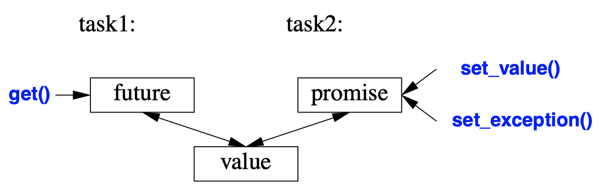

## Resource Management
- A resource is something that must be acquired and later (explicitly or implicitly) released.
- Examples are *memory*, *locks*, *sockets*, *thread handles*, and *file handles*.
- Failing to release a resource in a timely manner ("a **leak**") can cause serious performance degradation and possibly even a miserable crash.
- C++ standard libraries rely on the basic language support for resource management using `constructor/destructor` pairs t
```C++
mutex m; // used to protect access to shared data // ...

void f()
{
    unique_lock<mutex> lck {m}; // acquire the mutex m
    // ... manipulate shared data ...
}
``` 
- A thread will not proceed until `lck`’s constructor has acquired its `mutex`, `m`.
- `unique_lock`’s `destructor` releases the `mutex` when the thread of control leaves `f()` (through a return or through an exception throw).
- This is an application of the **"Resource Acquisition Is Initialization" (RAII)** technique 
*** 
- Memory
  - In `<memory>`, the standard library provides two **"smart pointers"** to help manage objects **on the free store**:
    1. `unique_ptr` to represent unique ownership. (**move**)
    2. `shared_ptr` to represent shared ownership. (**copy**)
  - "smart pointers" are still conceptually pointers and therefore only the **second choice for resource management**.
  - We use "smart pointers" when we need pointer semantics.
    1. **When we share an object**, we need pointers (or references) to refer to the shared object, so a `shared_ptr` becomes the obvious choice.
    2. When we refer to a **polymorphic object**, we need a pointer (or a reference) **because we don’t know the exact type of the object**, so a `unique_ptr` becomes the obvious choice.
    3. A shared polymorphic object typically requires `shared_ptr`s.
  - **We do not need to use a pointer to return a collection of objects** from a function; a container that is a resource handle will do that simply and efficiently  
  ```C++
  // X* vs. unique_ptr<X>
  void f(int i, int j) {
    X* p = new X;
    unique_ptr<X> sp {new X};
    f (i<99) throw Z{};
    if (j<77) return;
    p−>do_something();
    sp−>do_something();
    // ...
    delete p;
  ``` 
  - The most basic use of these is to prevent memory leaks caused by careless programming.
  - We "forgot" to delete `p` if `i<99` or if `j<77`.
  ```C++
  void f(int i, int j) {
    // use a local variable
    X x;
    // ...
  }
  ```
  - We could have solved the problem simply by not using a pointer and not using `new`.
  - Unfortunately, overuse of new (and of pointers and references) seems to be an increasing problem.
  ```C++
  unique_ptr<X> make_X(int i) // make an X and immediately give it to a unique_ptr
  {
    // ... check i, etc. ...
    return unique_ptr<X>{new X{i}};
  }
  ``` 
  - When you really need the semantics of pointers, `unique_ptr` is a very lightweight mechanism with no space or time overhead.
  - Its further uses include **passing free-store allocated objects in and out of functions**.
  ```C++
  void f(shared_ptr<fstream>);
  void g(shared_ptr<fstream>);

  void user(const string& name, ios_base::openmode mode)
  {
    shared_ptr<fstream> fp {new fstream(name,mode)};
    if (!*fp) throw No_file{}; // make sure the file was properly opened
    
    f(fp);
    g(fp);
    // ...
  }
  ``` 
  - The `shared_ptr` is similar to `unique_ptr` except that **`shared_ptr`s are copied rather than moved**.
  - The `shared_ptr`s for an object is destroyed when the last of its `shared_ptr`s is destroyed
  - The file opened by `fp`’s constructor will be closed by the last function to destroy a copy of `fp`.
  - `f()` or `g()` may spawn a task holding a copy of `fp` or in some other way store a copy that outlives `user()`.
  - This is **neither cost free nor exorbitantly expensive**, but does make the lifetime of the shared object hard to predict.
  - **Use `shared_ptr` only if you actually need shared ownership.**

## Concurrency
- Concurrency: the execution of several tasks simultaneously.
- C++ standard-library support is aimed at systems-level concurrency rather than higher-level concurrency models.
- The standard library directly supports concurrent execution of multiple threads in a single address space.
- To allow that, C++ provides a suitable *memory model* and a set of *atomic operations*
- A computation that can potentially be executed concurrently with other computations is called a *task*.
- A *thread* is the **system-level representation** of a task in a program.
- Threads differ from processes, which generally do not directly share data.
- Since threads share an address space, they can communicate through shared objects
*** 
- **Task and thread**
    ```C++
    void f();
    struct F { void operator()(); };

    void user() {
    thread t1 {f}; // f() executes in separate thread
    thread t2 {F()}; // F()() executes in separate thread

    t1.join(); // wait for t1
    t2.join(); // wait for t2
    }
    ``` 
    - A task is launched by constructing a `std::thread` (found in `<thread>`) with the task as its argument.
    - `join()`s ensure that we don’t exit user() until the threads have completed. To "join" means to "wait for the thread to terminate."
    ```C++
    // race
    void f() { cout << "Hello "; }
    struct F { void operator()() { cout << "Parallel World!\n"; } };
    ``` 
    - `f` and `F()` each use the object `cout` without any form of synchronization. **The resulting output would be unpredictable**. The program may produce "odd" output, such as `PaHerallllel o World!`.
***
- Passing Arguments
    ```C++
    void f(vector<double>& v);

    struct F {
        vector<double>& v;
        F(vector<double>& vv) :v{vv} { }
        void operator()();
    };

    int main() {
    vector<double> some_vec {1,2,3,4,5,6,7,8,9};
    vector<double> vec2 {10,11,12,13,14};

    thread t1 {f,some_vec};
    thread t2 {F{vec2}}; // F(vec2)() executes in a separate thread

    t1.join();
    t2.join();
    }
    ``` 
    - `F{vec2}` saves a reference to the argument vector in `F`.
    - Passing vec2 by value would eliminate risk of data racing.
    - The initialization with `{f,some_vec}` uses a **thread variadic template constructor** that can accept an arbitrary sequence of arguments.
***
- Return
    ```C++
    void f(const vector<double>& v, double* res); // take input from v; place result in *res

    class F {
    public:
    F(const vector<double>& vv, double* p) :v{vv}, res{p} { }
    void operator()(); // place result in *res
    private:
    const vector<double>& v; // source of input
    double* res;  // target for output
    };

    int main() {
    vector<double> some_vec;
    vector<double> vec2; // ...

    double res1;
    double res2;

    thread t1 {f,some_vec,&res1}; 
    thread t2 {F{vec2,&res2}}; 

    t1.join();
    t2.join();

    cout << res1 << ' ' << res2 << '\n';
    }
    ``` 
    - To return result, we pass the input data by `const` reference and to pass the location of a place to deposit the result as a separate argument.
    - BETTER (ch6)
***
- Shared data
    ```C++
    mutex m; // controlling mutex
    int sh; // shared data

    void f()
    {
      unique_lock<mutex> lck {m}; // acquire mutex
      sh += 7; // manipulate shared data

    } // release mutex implicitly
    ``` 
    - Sometimes tasks need to share data. In that case, the access has to be synchronized so that at most one task at a time has access.
    - `mutex`: mutual exclusion object.
    - A thread acquires a mutex using a `lock()` operation
    - The `unique_lock`’s constructor acquires the `mutex` (through a call `m.lock()`).
    - **If another thread has already acquired the mutex, the thread waits** ("blocks") until the other thread completes its access
    - Once a thread has completed its access to the shared data, the `unique_lock` releases the `mutex` (with a call `m.unlock()`).
    - The programmer has to know which mutex is supposed to correspond to which data, which is error-prone.
    ```C++
    class Record {
    public:
      mutex rm;
      // ...
    };
    ```
    - It doesn’t take a genius to guess that for a `Record` called `rec`, `rec.rm` is a `mutex` that you are supposed to acquire before accessing the other data of `rec`.
    ```C++
    void f() {
      // ...
      unique_lock<mutex> lck1 {m1,defer_lock}; // defer_lock: don’t yet try to acquire the mutex
      unique_lock<mutex> lck2 {m2,defer_lock};
      unique_lock<mutex> lck3 {m3,defer_lock};
      // ...
      lock(lck1,lck2,lck3); // acquire all three locks
      // ... manipulate shared data ...
    } // implicitly release all mutexes
    ``` 
    - If `thread1` acquires `mutex1` and then tries to acquire `mutex2` while `thread2` acquires `mutex2` and then tries to acquire `mutex1`, this can lead to *deadlock*.
    - The standard library offers help in the form of an operation for **acquiring several locks simultaneously**.
    - This `lock()` will only proceed after acquiring all its mutex arguments and will never block ("go to sleep") while holding a mutex.
    - Communicating through shared data is pretty low level.
    - **Locking and unlocking are relatively expensive operations**. On the other hand, **modern machines are very good at copying data**, especially compact data, such as vector elements.
***
- **Waiting for Events**
    ```C++
    using namespace std::chrono;

    auto t0 = high_resolution_clock::now();
    this_thread::sleep_for(milliseconds{20});
    auto t1 = high_resolution_clock::now();
    cout << duration_cast<nanoseconds>(t1−t0).count() << " nanoseconds passed\n";
    ```
    - The time facilities are found in `<chrono>`.
    - By default, `this_thread` refers to the one and only thread.
    - `duration_cast`: adjust the clock’s units to the nanoseconds
    ```C++
    class Message { // object to be communicated
      // ...
    };
    
    queue<Message> mqueue;
    condition_variable mcond; // the variable communicating event
    mutex mmutex;

    void consumer()
    {
      while(true) {
        unique_lock<mutex> lck{mmutex};
        while (mcond.wait(lck)); // release lck and wait;
        // re-acquire lck upon wakeup

        auto m = mqueue.front();
        mqueue.pop();
        lck.unlock();
        // // ... process m ...
      }

    }

    void producer()
    {
      while(true) {
        Message m;
        // ... fill the message ...
        unique_lock<mutex> lck {mmutex}; // protect operations
        mqueue.push(m);
        mcond.notify_one(); // notify
      } // release lock (at end of scope)
    }
    ``` 
    - The basic support for communicating using external events is provided by `condition_variables` found in `<condition_variable>`.
    - A `condition_variable` is a mechanism **allowing one thread to wait for some condition (often called an event)**.
    - Waiting on condition_variable releases its lock argument until the wait is over (so that the queue is non-empty) and then reacquires it.
***
- Communicating Tasks
    - These facilities are found in `<future>`.
    - `future` and `promise`
      
      - They enable a **transfer of a value** between two tasks **without explicit use of a lock**.
      - `future` is a **special object that can operate on multiple threads**. It will automate lock-and-release procedure for the developer, so they don’t have to write synchronization code themselves.
      - When a task wants to pass a value to another, it puts the value into a `promise`
      - The implementation makes that value appear in the corresponding `future`, from which it can be read (typically by the launcher of the task).
      ```C++ 
      void f(promise<X>& px) {
        // ...
        try {
          X res;
          // ... compute a value for res ...
          px.set_value(res);
        } catch (...) { // oops: couldn’t compute res
          // pass the exception to the future’s thread:
          px.set_exception(current_exception()); 
        }
      }

      void g(future<X>& fx) {
        // ...
        try {
          X v = fx.get(); // if necessary, wait for the value to get computed
          // ... use v ...
        } catch (...) { // oops: someone couldn’t compute v
          // ... handle error ...
        }
      }
      ```
      - If we have a `future<X>` called `fx`, we can `get()` a value of type `X`.
      - If the future's value isn’t there yet, our thread is blocked until it arrives.
      - The main purpose of a `promise` is to provide simple "put" operations (called `set_value()` and `set_exception()`).
      - To **deal with an exception** transmitted through a `future`, the caller of `get()` must be prepared to catch it somewhere.
    - `packaged_task`
      ```C++
      double accum(double* beg, double * end, double init)
      {
        return accumulate(beg,end,init); // compute the sum of [beg:end) starting with the initial value init
      }
      
      double comp2(vector<double>& v)
      { 
        using Task_type = double(double*,double*,double); // type of task
        packaged_task<Task_type> pt0 {accum}; // package the task (i.e., accum)
        packaged_task<Task_type> pt1 {accum};

        future<double> f0 {pt0.get_future()}; // get hold of pt0’s future
        future<double> f1 {pt1.get_future()}; // get hold of pt1’s future

        double* first = &v[0];
        thread t1 {move(pt0),first,first+v.size()/2,0}; // star t a thread for pt0 
        thread t2 {move(pt1),first+v.size()/2,first+v.size(),0}; // star t a thread for pt1
        // ...
        return f0.get()+f1.get(); // get the results
      }
      ``` 
      - The `packaged_task` simplifies setting up tasks **connected with futures and promises** to be **run on `thread`s**.
      - A `packaged_task` provides wrapper code to put the return value or exception from the task into a promise
      - If you call `get_future`, a packaged_task will give you the `future` corresponding to its `promise`.
      - We set up two tasks to each add half of the elements of a `vector<double>` using the standard-library `accumulate()`.
      - The `move()` operations are needed because a `packaged_task` cannot be copied
    - `async`
      - Async treat a task as a function that may happen to run concurrently with other tasks.
      ```C++
      double comp4(vector<double>& v) // spawn many tasks if v is large enough
      {
        if (v.size()<10000) return accum(v.begin(),v.end(),0.0);

        auto v0 = &v[0];
        auto sz = v.size();

        auto f0 = async(accum,v0,v0+sz/4,0.0);  // first quarter 
        auto f1 = async(accum,v0+sz/4,v0+sz/2,0.0); // second quarter 
        auto f2 = async(accum,v0+sz/2,v0+sz*3/4,0.0); // third quarter
        auto f3 = async(accum,v0+sz*3/4,v0+sz,0.0);  // four th quart

        return f0.get()+f1.get()+f2.get()+f3.get(); // collect and combine the results
      }
      ``` 
      - Basically, `async()` separates the "call part" of a function call from the "get the result part".
      - Using async(), you don’t have to think about `threads` and `locks`.
      - There is an obvious limitation: **Don’t even think of using `async()` for tasks that share resources needing locking.**
      - `async` can also be used to spawn a task for getting information from a user, leaving the "main program" active with something else.

## Small Utility Components
- Time
    - The standard-library facilities for dealing with time are found in the subnamespace `std::chrono` in `<chrono>`.
    ```C++
    using namespace std::chrono;

    auto t0 = high_resolution_clock::now();
    do_work();
    auto t1 = high_resolution_clock::now();
    cout << duration_cast<milliseconds>(t1−t0).count() << "msec\n";
    ``` 
    - The clock returns a `time_point`.
    - Subtracting two `time_point`s gives a `duration`.
    - Various clocks give their results in various units of time, so we convert a duration into a known unit.
- Type Functions
    - A *type function* is a function that is evaluated at compile-time **given a type as its argument or returning a type**.
    - Use of such features is often called `metaprogramming` or template metaprogramming.
    ```C++
    constexpr float min = numeric_limits<float>::min();
    constexpr int szi = sizeof(int); // the number of bytes in an int
    ```
    - `numeric_limits` from `<limits>` presents a variety of useful information.
    - The functions in `<limits>` are `constexpr` so that they can be used without run-time overhead.
    - Such type functions are part of C++’s mechanisms for **compile-time computation**.
    ```C++
    void test(vector<string>& v, forward_list<int>& lst)
    {
      sort(v); // sor t the vector
      sort(lst); // sor t the singly-linked list
    }
    ``` 
    - `sort()` takes a pair of iterators supposed to define a sequence.
    - Ｔhose iterators must offer random access to that sequence, that is, they must be **random-access iterators**.
    - `forward_list` do not offer *random-access iterators*, but offers **forward iterators** that can be used to traverse the sequence by algorithms and `for`-statements.
    ```C++
    template<typename Ran> // for random-access iterators
    void sort_helper(Ran beg, Ran end, random_access_iterator_tag)
    {
      sort(beg,end); // just sort it
    }

    template<typename For> // for forward iterators
    void sort_helper(For beg, For end, forward_iterator_tag)
    {
      vector<decltype(*beg)> v {beg,end}; // initialize a vector from [beg:end)
      sort(v.begin(),v.end());
      copy(v.begin(),v.end(),beg); // copy the elements back
    }

    template<typname C> 
    void sort(C& c)
    {
      using Iter = Iterator_type<C>;
      sort_helper(c.begin(),c.end(),Iterator_category<Iter>{});
    }
    ``` 
    - Two helper functions that take an **extra argument indicating whether they are to be used for random-access iterators or forward iterators**.
    - `decltype()` is a built-in type function that **returns the declared type of its argument**.
    - `Iterator_type<C>` returns the iterator type of `C` (`C::iterator`).
    - `Iterator_category<Iter>{}` constructs a "tag" value indicating the kind of iterator provided
      - `std::random_access_iterator_tag` if C’s iterator supports random access
      - `std::forward_iterator_tag` if C’s iterator supports forward iteration.
    - This technique, **called tag dispatch**, is one of several used in the standard library and elsewhere to improve flexibility and performance.
    ```C++
    template<typename C>
    using Iterator_type = typename C::iterator;
    
    template<typename Iter>
    using Iterator_category = typename std::iterator_traits<Iter>::iterator_category; // Iter’s categor y
    ``` 
    - The standard-library support for techniques for using iterators comes from `<iterator>`.
    - `iterator_traits` that allows us to check which kind of iterator is supported.
- Type Predicates
  - Type predicate is a simple type function that **answers a fundamental question about types**.
  - These predicates are found in `<type_traits>`.
  ```c++
  template<typename T>
  const expr bool Is_arithmetic() {
    return std::is_arithmetic<T>::value;
  }

  bool b1 = Is_arithmetic<int>();
  bool b2 = Is_arithmetic<string>();

  template<typename Scalar>
  class complex {
    Scalar re, im;
  public:
    static_assert(
      Is_arithmetic<Scalar>(),
      "Sorry, I only support complex of arithmetic types"
    );
  };
  ``` 
  - Older programs use `::value` directly instead of `()`, but it exposes implementation details and is ugly.
  - They are most useful when we write templates.
  - `static_assert`
  - Other examples are `is_class`, `is_pod`, `is_literal_type`, `has_virtual_destructor`, and `is_base_of`.
- `pair` and `tuple`
  - Often, we need some data that is just **a collection of values**, rather than an object of a class
  ```c++
  template<typename Forward_iterator, typename T, typename Compare>
  pair<Forward_iterator,Forward_iterator>
  equal_range(Forward_iterator first, Forward_iterator last, const T& val, Compare cmp);

  void f(const vector<Record>& v)
  {
    auto er = equal_range(v.begin(),v.end(),Record{"Reg"},rec_eq);
    for (auto p = er.first; p!=er.second; ++p)
      cout << *p;
  }
  ``` 
  - Given a sorted sequence, `equal_range()` will return the `pair` representing the subsequence that matches the predicate `cmp`.
  - The first member of a pair is called `first` and the second member is called `second`.
  - The standard-library pair (from `<utility>)` is quite frequently used in the standard library.
  - A pair provides operators, such as `=,` `==,` and `<`, if its elements do.
  ```c++
  void f(vector<string>& v)
  {
    auto pp = make_pair(v.begin(), 2); // pp is a pair<vector<string>::iterator,int>
  }
  ``` 
  - The make_pair() function makes it easy to create a pair without explicitly mentioning its type
  ```C++
  tuple<string,int,double> t2("Sild",123, 3.14); // the type is explicitly specified
  
  auto t = make_tuple(string("Herring"),10, 1.23);
  string s = get<0>(t); // get first element of tuple
  int x = get<1>(t);
  double d = get<2>(t);
  ``` 
  - If you **need more than two elements (or less)**, you can use `tuple` (from `<utility>`).
  - The elements of a `tuple` are numbered (starting with zero).
  - **To get compile-time selection of elements**, I must unfortunately use the ugly `get<1>(t)`, rather than `get(t,1)` or `t[1]`.
  - Like `pair`s, `tuple`s can be assigned and compared if their elements can be.

- Regular Expressions
  - In `<regex>,` the standard library provides support for regular expressions in the form of the `std::regex` class and its supporting functions.
  ```C++
  regex pat (R"(\w{2}\s*\d{5}(−\d{4})?)"); // // ZIP code pattern: XXddddd-dddd and variants
  cout << "pattern: " << pat << '\n';

  int lineno = 0;
  for (string line; getline(cin,line);) {
    ++lineno;
    smatch matches; // matched strings go here
    if (regex_search(line,matches,pat)) // search for pat in line
      cout << lineno << ": " << matches[0] << '\n'
  }
  
  ``` 
  - `\w{2}\s*\d{5}(−\d{4})?` specifies a pattern starting with two letters `\w{2}` optionally followed by some space `\s*` followed by five digits `\d{5}` and optionally followed by a dash and four digits `−\d{4}`.
  - To express the pattern, I use a *raw string literal* starting with `R"(` and terminated by `)"`. This **allows backslashes and quotes to be used directly in the string**
  - `regex_search(line,matches,pat)`: searches the line for anything that matches the regular expression `pat` and if it finds any matches, it stores them in `matches`.
  - If no match was found, `regex_search(line,matches,pat)` returns `false`.
  - `smatch`: The "s" stands for "sub" and an smatch is a vector of sub-matches.
- Math
  - In `<cmath>`, we find the "usual mathematical functions," such as sqrt(), log(), and sin()
  - Complex number versions of these functions are found in `<complex>`.
  - In <numeric>, we find a small set of generalized numerical algorithms, such as accumulate().
  ```c++
  template<typename Scalar>
  class complex {
  public:
    complex(const Scalar& re ={}, const Scalar& im ={});
    // ...
  };
  
  void f(complex<float> fl, complex<double> db) {
    complex<long double> ld {fl+sqrt(db)};
    db += fl*3;
    fl = pow(1/fl,2);
    // ...
  }
  ```
  - The standard library `complex` is a template.
- Random
  ```C++
  using my_engine = default_random_engine; // type of engine
  using my_distribution = uniform_int_distribution<>; // type of distribution
  my_engine re {}; 
  my_distribution one_to_six {1,6}; // distribution that maps to the ints 1..6
  auto die = bind(one_to_six,re); // make a generator
  // auto die = bind(uniform_int_distribution<>{1,6}, default_random_engine{});

  int x = die(); // roll the die: x becomes a value in [1:6]
  ```
  - Random number generators is provided by the standard library in `<random>`.
  - A random number generator consists of two parts:
      1. an *engine* that produces a sequence of random or pseudo-random values.
      2. a *distribution* that maps those values into a mathematical distribution in a range. (`uniform_int_distribution`, `normal_distribution`, `exponential_distribution`)
  - The standard-library function `bind()` makes a function object that will invoke its first argument given its second argument. Thus a call `die()` is equivalent to a call `one_to_six(re)`.
  ```C++
  Rand_int rnd {1,10};
  int x = rnd();

  class Rand_int {
  public:
    Rand_int(int low, int high) :dist{low,high} { }
    int operator()() { return dist(re); } // draw an int
  private:
    default_random_engine re;
    uniform_int_distribution<> dist;
  };

  int main() {
    Rand_int rnd {0,4};
    vector<int> histogram(5); // make a vector of size 5
    for (int i=0; i!=200; ++i)
      ++histogram[rnd()]; // fill histogram with the frequencies of numbers [0:4]

    for (int i = 0; i!=mn.size(); ++i) { // write out a bar graph
      cout << i << '\t';
      for (int j=0; j!=mn[i]; ++j) cout << '*';
        cout << endl;
  }
  ```
  - Use of `Rand_int()` is manageable in the first week of a C++ course for novices 
  - There is no standard graphics library for C++, so we use "ASCII graphics."

- Vector
  - `vector` does not support mathematical vector operations.
  - the standard library provides (in `<valarray>`) a `vector`-like template, called `valarray`, that is for numerical computation.
  ```C++
  template<typename T>
  class valarray {
    // ...
  };

  void f(valarray<double>& a1, valarray<double>& a2) {
    valarray<double> a = a1*3.14+a2/a1;
    a2 += a1*3.14;
    a = abs(a);
    double d = a2[7];
  }
  ``` 
  - In particular, valarray offers stride access to help implement multidimensional computations.

- Numeric Limits
  - In `<limits>`, the standard library provides classes that describe the properties of built-in types, such as the maximum exponent of a float or the number of bytes in an int.
  ```c++
  static_assert(numeric_limits<char>::is_signed, "unsigned characters!");
  static_assert(100000 < numeric_limits<int>::max(), "small ints!");
  ``` 
  - Note that the second assert (only) works because `numeric_limits<int>::max()` is a `constexpr` function
  - If you need a specific size of integer, `#include` the standard header `<cstdint>`
  - `<cstddef>` defines an alias that is very widely used, like `size_t`
