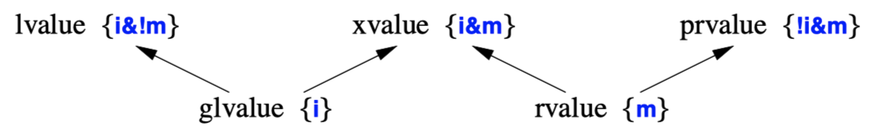

## Standard
- The C++ language and standard library are defined by their ISO standard: ISO/IEC 14882:2011.
- The standard doesn’t say whether a piece of code is good or bad; it simply says what a programmer can and cannot rely on from an implementation.
```c++
unsigned char c1 = 64; // well defined: a char has at least 8 bits and can always hold 64
unsigned char c2 = 1256; // implementation-defined: truncation if a char has only 8 bits
``` 
- Many important things are deemed **implementation-defined** by the standard.
- The initialization of `c1` is well defined because a char must be at least 8 bits.
- the initialization of `c2` is implementation-defined because the number of bits in a char is implementation-defined.
- Most implementation-defined features relate to differences in the hardware
- To maximize portability, it is wise to be explicit about what implementation-defined features we rely on and to isolate
  - Present all dependencies on hardware sizes in the form of constants and type definitions in some header file.
  - Use `numeric_limits`
  - Use `static_assert`
```C++
const int size = 4*1024;
char page[size];

void f()
{
    page[size+size] = 7; // undefined
}
```
- A construct is deemed *undefined* by the standard if **no reasonable behavior is required by an implementation**.
- Where powerful optimizers are used, the actual effects of undefined behavior can become quite unpredictable.
- It is worth spending considerable time and effort to ensure that a program does not use something deemed unspecified or undefined by the standard. In many cases, tools exist to help do this.
***
- Implementations
  - C++ implementation can be either *hosted* or *freestanding*.
    - A hosted implementation includes all the standard-library facilities as described in the standard
    - Freestanding implementations are meant for code running with only the most minimal operating system support.
  - Freestanding Implementation Headers
    - Types: `<cstddef>`
    - Implementation properties: `<cfloat>`, `<limits>`, `<climits>`
    - Integer types: `<cstdint>`
    - Start and termination:  `<cstdlib>`
    - Dynamic memory management:  `<new> `
    - Type identification: `<typeinfo>`
    - Exception handling:  `<exception>`
    - Initializer lists: `<initializer_list>`
    - Other run-time support: `<cstdalign>`, `<cstdarg>`, `<cstdbool>`
    - Type traits: `<type_traits>`
    - Atomics: `<atomic>`

## Types
- Every name (identifier) in a C++ program has a type associated with it.
```c++
float x;
int y = 7;
float f(int);
```
***
- Fundamental types:
  - C++ has the following fundamental types
    - A Boolean type (`bool`)
    - Character types 
    - Integer types
    - Floating-point types 
    - `void`
    - Pointer types 
    - Array types
    - Reference types
    <!-- - Data structures and classes -->
    <!-- - Enumeration types -->
  - The Boolean, character, and integer types are collectively called **integral types**.
  - The integral and floating-point types are collectively called *arithmetic types*.
  - Fundamental types, pointers, and references are collectively referred to as *built-in types*.
  - Enumerations and classes are called *user-defined types*.
*** 
- Booleans
    ```C++
    void f(int a, int b) {
        bool b1 {a==b};
        // ...
    }
    
    bool is_open(File*);
    bool greater(int a, int b) { return a>b; }
    ```
    - `bool` can have one of the two values `true` or `false`.
    - A Boolean is used to express the results of logical operations.
    ```C++
        bool b1 = 7; // 7!=0, so b becomes true
        bool b2 {7}; // error: narrowing

        int i1 = true; // i1 becomes 1
        int i2 {true}; // i2 becomes 1
    }
    ``` 
    - By definition, `true` has the value `1` when converted to an integer and `false` has the value `0`.
    - Integers can be implicitly converted to `bool` values: **nonzero integers convert to `true`** and 0 converts to `false`.
    ```C++
    bool a = true;
    bool b = true;

    bool x = a+b; // a+b is 2, so x becomes true
    bool y = a||b; // a||b is 1, so y becomes true ("||" means "or")
    bool z = a−b; // a-b is 0, so z becomes false
    ``` 
    - In arithmetic and logical expressions, `bool`s are converted to `int`s;
    - If the result needs to be converted back to `bool`, a `0` is converted to false and a nonzero value is converted to true.
    ```C++
    void g(int* p) {
        bool b = p; // narrows to true or false
        bool b2 {p!=nullptr}; // explicit test against nullptr

        if (p) {
        }
    }
    ``` 
    - A pointer can be implicitly converted to a bool.
    - A **non-null pointer converts to `true`**; pointers with the value `nullptr` convert to `false`.
    - Prefer `if (p)` over `if (p!=nullptr)` because it more directly expresses the notion "if p is valid". **The shorter form leaves fewer opportunities for mistakes.**
***
- Character Types
    - C++ provides 6 distinct character types
      - `char`: the **default** character type, used for program text. Usually 8 bits.
      - `signed char`: Like `char`, but guaranteed to be signed
      - `unsigned char`: Like `char`, but guaranteed to be unsigned.
      - `wchar_t`: Provided to hold characters of a larger character set such as **Unicode**. The size of `wchar_t` is implementation-defined.
      - `char16_t`: a type for holding 16-bit character sets, such as UTF-16.
      - `char32_t`: a type for holding 32-bit character sets, such as UTF-32.
    - A `char` variable can hold **a character** of the implementation’s character set. `char ch = 'a';`
    - Almost universally, a `char` has **8 bits** so that it can hold one of **256 different values**.
      - May include
        - the decimal digits
        - the 26 alphabetic characters of English
        - some of the basic punctuation characters
      - May not include
        - More than 127 characters (but some sets provide 255 characters).
        - More alphabetic characters than English provides
        - The alphabetic characters are contiguous
        - Every character used to write C++ is available (some national character sets do not provide `{`, `}`, `[`, `]`, `|`, and `\`)
        - A char fits in 1 byte (There are embedded processors without byte accessing hardware for which a `char` is 4 bytes.)
    ```c++
    void intval() {
        for (char c; cin >> c; )
            cout << "the value of '" << c << "' is " << int{c} << '\n';
    }

    void digits()
    {
        for (int i=0; i!=10; ++i)
            cout << static_cast<char>('0'+i);
    }
    ```
    - Each character has an integer value in the character set used by the implementation 
      - Arithmetic and bitwise logical operations also apply.
    - The notation `int{c}` gives the integer value for a character `c`.
      - The choice of **signed or unsigned** for a plain char is implementation-defined.
      - the most common characters are within `0` to `127` range. (the rest could be `128-255` or `-127-0`)
      - **Values outside that range stored in a plain char can lead to subtle portability problems**.
    ```C++
    void f(char c, signed char sc, unsigned char uc) {
        char* pc = &uc; // error : no pointer conversion
        signed char* psc = pc; // error : no pointer conversion
        unsigned char* puc = pc; // error : no pointer conversion
        psc = puc; // error : no pointer conversion
    }

    void g(char c, signed char sc, unsigned char uc) {
        c = 255; // implementation-defined if plain chars are signed and have 8 bits
        c = sc; // OK
        c = uc; // implementation-defined if plain chars are signed and if uc’s value is too large
        sc = uc; // implementation-defined if uc’s value is too large
        uc = sc; // OK: conversion to unsigned
        sc = c; // implementation-defined if plain chars are unsigned and if c’s value is too large
        uc = c; // OK: conversion to unsigned
    }
    ``` 
    - A `char` must behave identically to either a `signed char` or an `unsigned char`.
    - The three char types are distinct, so you can’t mix pointers to different `char` types.
    - Variables of the three `char` types can be freely assigned to each other.
    - Assigning a too large value to a `signed char` is still undefined.

    - Character Literals
      - A *character literal* is a **single** character enclosed in **single quotes** (`''`)
      - It is possible to enclose more than one character in a character literal, but it is implementation-dependent and best avoided.
      - **Wide character literals** are of the form `L'ab'` and are of type `wchar_t`.
      - Literals of Unicode are presented as sequences of four or eight hexadecimal digits preceded by a `U` or a `u`.
        - The shorter notation `u'\uXXXX'` is equivalent to `U'\U0000XXXX'` for any hexadecimal digit `X`.
      - The type of a character literal is `char`.
      - A few characters have standard names that use the backslash (`\`)
        - Newline: `\n`
        - Horizontal tab: `\t`
        - Vertical tab: `\v`
        - Backspace: `\b`
        - Carriage return: `\r`
        - Form feed: `\f`
        - Alert: `\a`
        - Backslash: `\\`
        - Question mark: `\?`
        - Single quote: `\'`
        - Double quote: `\"`
        - Octal number: `\ooo`
        - Hexadecimal number: `\xHHH...`
      - A sequence of octal or hexadecimal digits is terminated by the first character that is not an octal digit or a hexadecimal digit
        ```C++
        char v1[] = "a\xah\129"; // 6 chars: 'a' '\xa' 'h' '\12' '9' '\0'
        char v2[] = "a\xah\127"; // 5 chars: 'a' '\xa' 'h' '\127' '\0'
        char v3[] = "a\xad\127"; // 4 chars: 'a' '\xad' '\127' '\0'
        char v4[] = "a\xad\0127"; // 5 chars: 'a' '\xad' '\012' '7' '\0'
        ``` 
      - Use three digits for a octal numeric constant in a string. For hexadecimal constants, use two digits.
***
- Integer Types
    - Each integer type comes in three forms: `int`, `signed (int)`, and `unsigned (int)`.
    - Integers come in 4 sizes: `short (int)`, `int`, `long (int)`, and `long long (int)`.
    - The unsigned integer types are ideal for uses that **treat storage as a bit array**.
    - Plain `int`s are always signed rather than implementation-defined as `char`.
    - If you need more detailed control over integer sizes, you can use aliases from `<cstdint>`
      - `int64_t`: signed integer with exactly 64 bits)
      - `uint_fast16_t`: unsigned integer with **exactly 8 bits**, supposedly the fastest such integer.
      - `int_least32_t`: signed integer with at least 32 bits, just like plain `int`.
    - Integer Literals
      - Integer literals come in three guises: *decimal*, *octal*, and *hexadecimal*.
      - The compiler ought to warn about literals that are too long to represent, but an error is only guaranteed for `{}` initializers
      - `100000` is of type int on a machine with 32-bit `int`s but of type `long int` on a machine with 16-bit ints
      ```C++
      cout << 0xF0UL << ' ' << 0LU << '\n';
      ``` 
      - A literal starting with `0x` or `0X` is a hexadecimal number.
      - A literal starting with `x` or `X` is an octal.
      - Using these notations to express genuine numbers can lead to errors.
      - The **suffix** `U` or `u` can be used to write explicitly **unsigned literals**.
      - the **suffix** `L` or `l` can be used to write explicitly **`long` literals**.
      - If it is decimal and is suffixed by `ll` or `LL`, its type is `long long int`.
***
- Floating-Point Types
    - There are 3 floating-point types: `float` (single-precision), `double` (double-precision), and `long double` (extended-precision).
      - The exact meaning of single-, double-, and extended-precision is implementation-defined.
    - Floating-Point Literals
      `1.23 .23 0.23 1. 1.0 1.2e10 1.23e−15` 
      - By default, a floating-point literal is of type `double`.
      - A compiler ought to warn about floating-point literals that are too large to be represented.
      - A space cannot occur in the middle of a floating-point literal (`65.43 e−21` is a syntax error)
      - If you want a floating-point literal of type `float`, you can define one using the suffix `f` or `F`.   
      - If you want a floating-point literal of type long double, you can define one using the suffix `l` or `L`.

| Notation | *fix   | Meaning          | Example |
|----------|--------|------------------|---------|
| 0        | prefix | octal            | 0776    |
| 0x 0X    | prefix | hexadecimal      | 0xff    |
| u U      | suffix | `unsigned`       | 10U     |
| l L      | suffix | `long`           | 20000L  |
| ll LL    | suffix | `long long`      | 20000LL |
| f F      | suffix | `float`          | 10f     |
| e E      | infix  | floating-point   | 10e-4   |
| .        | infix  | floating-point   | 12.3    |
| '        | prefix | `char`           | 'c'     |
| u'       | prefix | `char16_t`       | u'c'    |
| U'       | prefix | `char32_t`       | U'c'    |
| L'       | prefix | `wchar_t`        | L'c'    |
| "        | prefix | string           | "mess"  |
| R"       | prefix | raw string       | R"(\b)" |
| u8" u8R" | prefix | UTF-8 string     | u8"foo" |
| u"       | prefix | UTF-16 string    | u"foo"  |
| U"       | prefix | UTF-32 string    | U"foo"  |
| L"       | prefix | `wchar_t` string | L"foo"  |
- **A user can define new suffixes for user-defined types.**
- Suffixes not starting with `_` are reserved for the standard library.
***
- `void`
    ```C++
    void x; // error: there are no void objects
    void& r; // error: there are no references to void 
    void f(); // function f does not return a value
    void* pv; // pointer to object of unknown type
    ```
    - There are no objects of type void.
    - `void` is used either to specify that a function does not return a value or as the base type for pointers.
***
- Sizes
  - Sizes of C++ objects are expressed in terms of multiples of the size of a `char`.
  - The size of a `char` is `1`.
  - The size of an object or type can be obtained using the `sizeof` operator.
    - `1` ≡ `sizeof(char)` ≤ `sizeof(short)` ≤ `sizeof(int)` ≤ `sizeof(long)` ≤ `sizeof(long long)`
    - `1` ≤ `sizeof(bool)` ≤ `sizeof(long)`
    - `sizeof(char)` ≤ `sizeof(wchar_t)` ≤ `sizeof(long)`
    - `sizeof(float)` ≤ `sizeof(double)` ≤ `sizeof(long double)`
    - `sizeof(N)` ≡ `sizeof(signed N)` ≡ `sizeof(unsigned N)` (N can be `char`, `short`, `int`, `long`, or `long long`.)
  - A `char` has at least 8 bits.
  - A `short` has at least 16 bits.
  - A `long` has at least 32 bits.
  - The `int` type is supposed to be chosen to be the most suitable, typically 4 bytes (32 bits)
  - Many machines ("64-bit architectures") have **pointers** that are larger than integers.
***
- Alignment
  - Proper alignment makes hardware to access the bytes efficiently.
  - Alignment most often becomes visible is in object layouts: sometimes `struct`s contain "holes" to improve alignment
  ```C++
  auto ac = alignof('c');
  auto ai = alignof(1);
  auto ad = alignof(2.0);

  int a[20];
  auto aa = alignof(a);
  ``` 
  - The `alignof()` operator returns the alignment of its argument expression
  ```C++
  void user(const vector<X>& vx) 
  {
    constexpr int bufmax = 1024; 
    alignas(X) buffer[bufmax]; // uninitialized

    const int max = min(vx.size(),bufmax/sizeof(X));
    uninitialized_copy(vx.begin(),vx.begin()+max,buffer);
    // ...
  }
  ``` 
  - To use alignment in a declaration, we can use the type specifier `alignas`: `alignas(T)` means "align just like a T."

## Declarations
```c++
char ch;
string s;
auto count = 1;
const double pi {3.1415926535897};
extern int error_number;

const char* name = "Njal";
const char* season[] = { "spring", "summer", "fall", "winter" };
vector<string> people { name, "Skarphedin", "Gunnar" };

struct Date { int d, m, y; };
int day(Date* p) { return p−>d; }
double sqrt(double);
template<class T> T abs(T a) { return a<0 ? −a : a; } 

constexpr int fac(int n) { return (n<2)?1:n*fac(n−1); } // possible compile-time evaluation
constexpr double zz { ii*fac(7) }; // compile-time initialization

using Cmplx = std::complex<double>; // type alias
struct User; // type name
enum class Beer { Carlsberg, Tuborg, Thor };
namespace NS { int a; }
``` 
- Before a name (identifier) can be used, it must be declared.
- Most of these declarations are also *definitions*.
  - Of the declarations above, only three are not also definitions: `double sqrt(double);` `extern int error_number;` `struct User;`
  - That is, if used, the entity they refer to must be defined elsewhere.
- A **definition** is a declaration that **supplies all that is needed in a program for the use** of an entity.
- A different terminology deems **declarations parts of an interface** and **definitions parts of an implementation**.
  - we try to compose interfaces out of declarations that can be replicated in separate files
- A (*static*) variable defined without an initializer **in the global or a namespace scope** is initialized by default. 
- Outside a class body, **an entity must be declared before it is used**.
```C++
int count;
int count; // error: redefinition

extern int error_number;
extern short error_number; // error : type mismatch

extern int error_number;
extern int error_number; // OK: redeclaration
```
- There must always be **exactly one definition for each name**.
- All declarations of an entity must agree on its type.
```c++
void f()
{
  int count {1};
  const char* name {"Bjarne"};
  count = 2;
  name = "Marian";
}
```
- For types, aliases, templates, functions, and constants, the "value" is permanent.
- For non-const data types, the initial value may be changed later.
***
- The Structure of Declarations
  - We can consider a declaration as having five parts
    - **Optional prefix** specifiers (e.g., `static` or `virtual`)
    - A base type (e.g., `vector<double>` or `const int`)
    - A declarator optionally including a name (e.g., `p[7]`, `n`, or `*(*)[]`)
    - **Optional suffix** function specifiers (e.g., `const` or `noexcept`)
    - An optional initializer or function body (e.g., `={7,5,3}` or `{return x;}`)
  - A declaration is terminated by a semicolon **except for function and namespace**.
  - **Specifier**
    - `virtual`
    - `static`
    - `extern`
    - `const`
    - `constexpr`
  - **Declarator operators**
    |         |           |                                    |
    |---------|-----------|------------------------------------|
    | prefix   | *         | pointer                            |
    | prefix   | *const    | const pointer                      |
    | prefix   | *volatile | volatile pointer                   |
    | prefix   | &         | lvalue reference                   |
    | prefix   | &         | rvalue reference                   |
    | prefix   | auto      | function (using suffix return type) |
    | postfix | []        | array                              |
    | postfix | ()        | function                           |
    | postfix | ->        | returns from function              |
    - Postfix declarator operators bind tighter than the prefix ones.
      - `char*kings[]`: an array of pointers to char,
      - `char(*kings)[]` is a pointer to an array of char.
  ```C++
  int x, y; // int x; int y;
  int* p, y; // int* p; int y;
  int x, *q; // int x; int* q;
  int v[10], *pv; // int v[10]; int* pv;
  ``` 
  - It is possible to declare several names, separated by `,`, in a single declaration. But it make a program harder to read and **should be avoided**.
  - **Operators apply to individual names only** and not to any subsequent names.
***
- Naming
  - A name (identifier) consists of a sequence of letters and digits. `_` is considered a letter.
  - The first character must be a letter.
  - A C++ keyword, such as `new` or `int`, cannot be used as a name of a user-defined entity.
  - Nonlocal names starting with an underscore are reserved for special facilities.
  - Uppercase and lowercase letters are distinct, so `Count` and `count` are different.
  - `l0`, `lO`, `l1`, `ll`, and `I1l` are poor choices for identifier names.
  - Names from a **large scope** ought to have relatively **long and reasonably obvious names**, such as `vector`, `Window_with_border`, and `Department_number`.
  - It is often useful to **keep frequently used names relatively short** and reserve really long names for infrequently used entities.
  - Do not encode type information in a name 
    - e.g., `pcname` for a name that’s a `char*` or `icount` for a count that’s an `int`
    - This is sometimes done in languages with dynamic or weak type systems.
    - The compiler is better at keeping track of types than you are.
    - If you want to change the type of a name, you’ll have to change its every use.
  - Be consistent in your use of abbreviations and acronyms.
  - Keywords
    - `export` is reserved for future use.
   
    |                    |               |  C++ Keywords  |             |            |             |
    |--------------------|---------------|----------------|-------------|------------|-------------|
    | `alignas`          | `alignof`     | `and`          | `and_eq`    | `asm`      | `auto`      |
    | `bitand`           | `bitor`       | `bool`         | `break`     | `case`     | `catch`     |
    | `char`             | `char16_t`    | `char32_t`     | `class`     | `compl`    | `const`     |
    | `constexpr`        | `const_cast`  | `continue`     | `decltype`  | `default`  | `delete`    |
    | `do`               | `double`      | `dynamic_cast` | `else`      | `enum`     | `explicit`  |
    | `extern`           | `false`       | `float`         | `for`       | `friend`   | `goto`      |
    | `if`               | `inline`      | `int`          | `long`      | `mutable`  | `namespace` |
    | `new`              | `noexcept`    | `not`          | `not_eq`    | `nullptr`  | `operator`  |
    | `or`               | `or_eq`       | `private`      | `protected` | `public`   | `register`  |
    | `reinterpret_cast` | `return`      | `short`        | `signed`    | `sizeof`   | `static`    |
    | `static_assert`    | `static_cast` | `struct`       | `switch`    | `template` | `this`      |
    | `thread_local`     | `throw`       | `true`         | `try`       | `typedef`  | `typeid`    |
    | `typename`         | `union`       | `unsigned`     | `using`     | `virtual`  | `void`      |
    | `volatile`         | `wchar_t`     | `while`        | `xor`       | `xor_eq`   | `export`    |
***
- Scope
  - Scope 
    - *Local Scope*: A name declared in a function or lambda is called a local name.
    - *Class Scope*: A name is called a *member name* (or a *class member name*) if it is defined in a class
    - *Namespace scope*: A name is called a *namespace member name* if it is defined in a namespace
    - *Global scope*: A name is called a global name if it is defined outside any function. class, or namespace.
      - The scope of a global name extends from the point of declaration to the end of the file
      - A global name may also be accessible from other translation units
      - Technically, the global namespace is considered a namespace.
    - *Statement scope*: A name is in a statement scope if it is defined within the `()` part of a `for`-, `while`-, `if`-, or `switch`-statement
    - *Function scope*
  ```C++
  int x; // global x
  void f()
  {
    int x; // local x hides global x 
    x = 1; // assign to local x
    {
      int x; // hides first local x
      x = 2; // assign to second local x
    }
    x = 3; // assign to first local x
  }

  int* p = &x; // take address of global x
  ``` 
  - A declaration of a name in a block can hide a declaration in an enclosing block or a global name.
  - After exit from the block, the name resumes its previous meaning.
  - **Name hiding should be minimized** since a human reader can easily fail to notice the fact.
  ```c++
  int x;
  void f2() {
    int x = 1; // hide global x
    ::x = 2; // assign to global x 
    x = 2; // assign to local x
  }
  ``` 
  - A hidden global name can be referred to using the scope resolution operator, `::`.
  ```C++
  int x = 97;

  void f3()
  {
    int x = x; // perverse: initialize x with its own (uninitialized) value
  }
  ```
  - **A name can be used even to specify its own initial value.**
  - A good compiler warns if a variable is used before it has been initialized.
  ```C++
  void f(vector<string>& v, list<int>& lst) {
    for (const auto& x : v) cout << x << '\n';
    for (auto x : lst) cout << x << '\n';

    for (int i = 0, i!=v.size(), ++i) cout << v[i] << '\n';
    for (auto i : {1, 2, 3, 4, 5, 6, 7}) cout << i << '\n';
  }
  ```
  - Names introduced in a `for`-statement are local to that statement.
  - This allows us to use conventional names for loop variables without name clashes.
***
- Initialization
  - Initializer determines the initial value of an object.
  - An initializer can use one of four syntactic styles:
    - `X a1 {v};`: only this can be used in every context. (strongly recommended)
    - `X a2 = {v};`
    - `X a3 = v;`
    - `X a4(v);`
  ```C++
  vector<int> v1 {99}; // v1 is a vector of 1 element with the value 99
  vector<int> v2(99);  // v2 is a vector of 99 elements each with the default value 0

  vector<string> v1{"hello!"}; // v1 is a vector of 1 element with the value "hello!"
  vector<string> v2("hello!"); // error : no vector constructor takes a string literal
  ``` 
  - Initialization using `{}`, *list initialization*, does not allow narrowing
    - An integer cannot be converted to another integer that cannot hold its value. For example, `char` to `int` is allowed, but not `int` to `char`.
    - A floating-point value cannot be converted to another floating-point type that cannot hold its value.
    - A floating-point value cannot be converted to an integer type.
    - An integer value cannot be converted to a floating-point type.
  - Prefer `=` when using `auto`. When using `auto`, `{}` initializer will be deduced as `initializer_list` type.
  ```c++
  int x4 {}; // x4 becomes 0
  double d4 {}; // d4 becomes 0.0
  char* p {}; // p becomes nullptr
  vector<int> v4{}; // v4 becomes the empty vector
  string s4 {}; // s4 becomes ""
  ``` 
  - The **empty** initializer list, `{}`, is used to indicate that **a default value is desired**.
  - For user-defined types, the default value (if any) is determined by the type’s constructors.
  - For user-defined types, there can be a distinction between **direct initialization** and **copy initialization**.
  ```C++
  int a; // means "int a{};" so that a becomes 0 
  double d; // means "double d{};" so that d becomes 0.0

  void f()
  {

    int x; // x does not have a well-defined value 
    char buf[1024]; // buf[i] does not have a well-defined value

    int* p {new int};  // *p does not have a well-defined value
    char* q {new char[1024]}; // q[i] does not have a well-defined value

    string s; // s=="" because of string’s default constructor
    vector<char> v; // v=={} because of vector’s default constructor
  
    string* ps {new string};  // *ps is "" because of string’s default constructor

    // ...
  }
  ```
  - If no initializer is specified, a global , namespace , local static , or static member is initialized to `{}`.
  - **Local variables and objects created on the free store are not initialized** by default unless they are of user-defined types with a default constructor.
  - A member of an array or a class is default initialized if the array or structure is.
  ```c++
  constexpr int max = 1024*1024;
  char buf[max];
  some_stream.get(buf,max); // read at most max characters into buf
  ``` 
  - The only really good case for an uninitialized variable is a large input buffer.
  ```C++
  int a[] = { 1, 2 };
  struct S { int x, string s };
  S s = { 1, "Helios" };
  complex<double> z = { 0, pi };
  vector<double> v = { 0.0, 1.1, 2.2, 3.3 }; // use list constructor
  ``` 
  - In the cases above, the `=` is redundant. However, some prefer to add it to emphasize that a set of values are used.
***
- Deducing a Type
  - The language provides two mechanisms
    - `auto`: deduce a type of an object from its initializer.
    - `decltype(expr)`: deduce the type of something that is **not a simple initializer**, such as the return type for a function or the type of a class member.
  - `auto`
    ```C++
    int a1 = 123;
    char a2 = 123;
    auto a3 = 123; // the type of a3 is "int"

    template<class T> void f1(vector<T>& arg)
    {
      for (vector<T>::iterator p = arg.begin(); p!=arg.end(); ++p)
        *p = 7;

      for (auto p = arg.begin(); p!=arg.end(); ++p)
        *p = 7;
    }
    ``` 
    - The harder the type is to write and the harder the type is to know, the more useful `auto` becomes.
    - The loop using `auto` is the more convenient to write and the easier to read.
    ```C++
    void f(double d)
    {
      constexpr auto max = d+7;
      int a[max]; // error: array bound not an integer
      // ...
    }
    ``` 
    - **If a scope is large, mentioning a type explicitly can help localize errors.**
    - If `auto` causes surprises, the best cure is typically to make functions smaller.
    ```C++
    void f(vector<int>& v)
    {
      for (const auto& x : v) { // x is a const int&
        // ...
      }
    } 

    void g(int& v)
    {
      auto x = v; // x is an int (not an int&)
      auto& y = v; // y is an int&
    }
    ``` 
    - We can decorate a deduced type with specifiers and modifiers
    ```C++
    auto v1 {12345}; // v1 is a list of int 
    auto v2 {'c'}; // v2 is a list of char 
    auto v3 {f()}; // v3 is a list of some appropriate type

    auto v4 = 12345; // v1 is an int
    auto v5 = 'c'; // v2 is a char 
    auto v6 = f(); // v3 is of some appropriate type
    ```
    - It can be an advantage to use the `=` syntax with `auto`.
    - The type of a homogeneous list of elements of type `T` is taken to be of type `initializer_list<T>`.

  - `decltype()`
    - Sometimes, we want to have a type deduced **without defining an initialized variable**.
    - This is mostly useful in generic programming.
    ```C++
    template<class T, class U>
    auto operator+(const Matrix<T>& a, const Matrix<U>& b) −> Matrix<decltype(T{}+U{})>
    {
      Matrix<decltype(T{}+U{})> res;
      for (int i=0; i!=a.rows(); ++i)
        for (int j=0; j!=a.cols(); ++j)
          res(i,j) += a(i,j) + b(i,j);
      return res;
    }
    ``` 
    - It use the **suffix return type syntax** to be able to express the return type in terms of the arguments: `Matrix<decltype(T{}+U{})>`.

## Objects
- An object is a contiguous region of storage.
- **lvalue**: an expression that refers to an object.
- **rvalue**: a value that is not an lvalue, such as a temporary value (e.g., the value returned by a function).
- There are two properties that matter for an object when it comes to addressing, copying, and moving:
  - Has identity (i)
  - Movable (m)

  - a classical lvalue is something that has identity and cannot be moved.
  - a classical rvalue is anything that we are allowed to move from.
  - prvalue: pure rvalue
  - glvalue: generalized lvalue
  - xvalue: "x" for "extraordinary" or "expert only"
    ```C++
    void f(vector<string>& vs)
    {
      vector<string>& v2 = std::move(vs); // move vs to v2
      // ...
    }
    ``` 
    - `std::move(vs)` is an xvalue.
- **Every expression is either an lvalue or an rvalue, but not both**.
*** 
- Lifetimes
  - **Automatic**: created when its definition is encountered and destroyed when its name goes out of scope.
  - **Static**: created and initialized once (only) and "live" until the program terminates
    - Declared in global or namespace scope
    - `static`s declared in functions or classes
    - Static objects typically **require locking** to avoid data races.
  - **Free store**: Using the `new` and `delete` operators, we can create objects whose lifetimes are controlled directly
  - *Temporary objects*: typically, temporary objects are automatic.
  - *Thread-local objects*: objects declared `thread_local`. Such objects are created when their thread is and destroyed when their thread is.
***
- Type Aliases
  - We need a new name for a type because
    - The original name is too long, complicated, or ugly.
    - Requires different types to have the same name in a context.
    - Simplify maintenance.
  ```C++
  using Pchar = char*; // pointer to character 
  using PF = int(*)(double); // pointer to function taking a double and returning an int

  template<class T>
  class vector {
    using value_type = T; // every container has a value_type
    // ...
  };

  template<class T>
  class list {
    using value_type = T; // every container has a value_type
    // ...
  };

  template<typename T>
  using Vector = std::vector<T, My_allocator<T>>;

  using Char = char;
  using Uchar = unsigned Char; // error 
  using Uchar = unsigned char; // OK
  ``` 
  - The `using` keyword can also be used to introduce a `template` alias
  - **We cannot apply type specifiers, such as unsigned, to an alias**
  - Type aliases are synonyms for other types rather than distinct types.
  - People who would like to have distinct types with identical semantics or identical representation should look at enumerations and classes.
  ```c++
  typedef int int32_t; // equivalent to "using int32_t = int;"
  typedef short int16_t; // equivalent to "using int16_t=short;"
  typedef void(*PtoF)(int); // equivalent to "usingPtoF=void(*)(int);"
  ```
  - An older syntax using the keyword `typedef`.
  - The `_t` suffix is conventional for aliases ("typedefs").