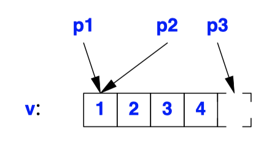

## Pointers
```C++
char c = 'a';
char* p = &c; // p holds the address of c; & is the address-of operator
char c2 = *p; // c2 == ’a’; * is the dereference operator
```
- For a type `T`, `T*` is the type "pointer to `T`.". `T*` can hold **the address of an object** of type T.
- Dereference operator (prefix *), also called *indirection*, that is, refers to the object pointed to by the pointer.
- Few machines can directly address an individual bit. Consequently, the **smallest object that can be independently allocated and pointed is `char`**.
- A bool occupies at least as much space as a char (
```C++
int* pi; // pointer to int 
char** ppc; // pointer to pointer to char
int* ap[15];  // array of 15 pointers to ints
int (*fp)(char*); // pointer to function taking a char* argument; returns an int
int* f(char*); // function taking a char* argument;
```
- **Pointers to functions** can be useful.
- We can perform some arithmetic operations on pointers to array elements.
***
- `void*`
    ```C++
    void f(int* pi)
    {
        void* pv = pi; // ok: implicit conversion of int* to void*
        *pv; // error: can’t dereference void*
        ++pv; // error: can’t increment void* (the size of the object pointed to is unknown)

        int* pi2 = static_cast<int*>(pv); // explicit conversion back to int*

        double* pd1 = pv; // error
        double* pd2 = pi; // error 
        double* pd3 = static_cast<double*>(pv); // unsafe
    s}
    ```
    - A pointer to **any type** of object can be assigned to `void*`, except a pointer to function or a pointer to member.
    - A `void*` can be **explicitly converted** to another type. However, other operations result in compile-time errors.
    - In general, it is not safe to use a pointer that has been converted ("cast") to a type that differs from the type of the object pointed to.
    - Functions using void* pointers typically exist at the very lowest level of the system, where real hardware resources are manipulated.
***
- `nullptr`
    ```C++
    int* pi = nullptr;
    double* pd = nullptr;
    int i = nullptr; // error: i is not a pointer
    ```
    - `nullptr` represents the null pointer. It can be assigned to any pointer type.
    - Before `nullptr` was introduced, zero (`0`) was used. `int* x = 0; //`
    - The *standard conversions* allow `0` to be used as a constant of pointer or pointer-to-member type.
- `const`
    ```C++
    void g(const X* p)
    {
        // can’t modify *p here
    }

    void h()
    {
        X val; // val can be modified here
        g(&val);
        // ... 
    }
    ```
    - `const` modifies a type; it restricts the ways in which an object can be used.
    - **A declaration of a pointer with `const` makes the object**, but not the pointer, a constant.
    ```C++
    void f1(char* p)]
    {

        char s[] = "Gorm";

        const char* pc = s; // pointer to constant  
        pc[3] = 'g'; // error : pc points to constant
        pc = p; // OK

        char *const cp = s; // constant pointer constant
        cp[3] = 'a'; // OK
        cp = p;  // error : cp is 

        const char *const cpc = s; // const pointer to const 
        cpc[3] = 'a'; // error : cpc points to constant 
        cpc = p; // error : cpc is constant
    }
    ``` 
    - To declare a constant pointer, we use the declarator operator `*const`.
    ```C++
    char *const cp; // const pointer to char
    char const* pc;  // pointer to const char 
    const char* pc2;  // pointer to const char 
    ``` 
    - There is no `const*`, and const appearing before the * is taken to be part of the base type.
    - You can assign the address of a non-const variable to a pointer to constant.
***
- Ownership
    - There is nothing in the type system that distinguishes a pointer that owns a resource (to recycle) from one that does not.
    ```C++
    void confused(int* p)
    {
      // delete p?
    }

    int global {7};

    void f()
    {
      X* pn = new int{7};
      int i {7};
      int q = &i;

      confused(pn);
      confused(q);
      confused(&global);
    }
    ``` 
  - The last two `confused()` will seriously misbehave because we may not delete objects not allocated by new.
  - In this case, obviously `f()` must manage the lifetime of the object it creates on the free store.

## Arrays
```C++
float v[3]; // an array of three floats: v[0], v[1], v[2]
char* a[32]; // an array of 32 pointers to char: a[0] .. a[31]

void f()
{
    int aa[10];
    aa[6] = 9;
    int x = aa[99]; // undefined behavior
}
```
- For a type `T`, `T[size]` is the type "array of size elements of type `T`."
- You can access an array using the subscript operator, [], or through a pointer deference.
- Access out of the range of an array is undefined.
- The number of elements of the array, the array bound, must be a constant expression. If you need variable bounds, use a `vector`.
```C++
int a1[10]; // 10 ints in static storage

void f()
{
    int a2 [20]; // 20 ints on the stack
    int* p = new int[40];  // 40 ints on the free store
    // ...
}
``` 
- An array can be allocated statically, on the stack, or on the free store.
- If you allocate an array on the free store, be sure to `delete[] `its pointer once only and only after its last use
***
- Array Initializers
    ```C++
    int v1[] = { 1, 2, 3, 4 };
    char v2[] = { 'a', 'b', 'c', 0 };
    char v3[2] = { 'a', 'b', 0 }; // error : too many initializers
    char v4[3] = { 'a', 'b', 0 };  // OK

    int v5[8] = { 1, 2, 3, 4 /*, 0, 0, 0, 0*/ };
    ``` 
    - When an array is declared without a specific size, but with an initializer list, the size is decided by the initializer list.
    - If a size is explicitly specified, it is an error to give surplus elements
    - If the initializer supplies too few elements for an array, default value of the type is used for the rest.
    ```c++
    int v6[8] = v5; // error: can’t copy an array (cannot assign an int* to an array)
    v6 = v5; // error: no array assignment
    ``` 
    - **There is no built-in copy operation for arrays**, neither is array assignment.
    - When you need assignment to a collection of objects, use a `vector`, `array`, or `valarray`.
***
- String Literals
    ```C++
    sizeof("Bohr")==5
    ```
    - A string literal contains one more character than it appears to have; it is terminated by the **null character**, `'\0'`, with the value 0.
    - It is possible to have the null character in a string, but most programs will not suspect that there are characters after it.
    ```C++
    void f() {
        char p[] = "Zeno"; // p is an array of 5 char
        p[0] = 'R'; // OK
    }

    void f()
    {
        char* p = "Plato"; // error, but accepted in pre-C++11-standard code
        p[4] = 'e'; // error: assignment to const
    }
    ``` 
    - The type of a string literal is "array of the appropriate number of **`const`** characters".
    - If we want a string that we are guaranteed to be able to modify, we must place the characters in a non-`const` array
    ```C++
    const char* error_message(int i) {
        // ...
        return "range error";
    }
    ```
    - A string literal is **statically allocated** so that it is safe to return one from a function.
    ```C++
    char alpha[] = "abcdefghijklmnopqrstuvwxyz" 
                    "ABCDEFGHIJKLMNOPQRSTUVWXYZ";

    char concat[] = "abc" "def";
    ```
    - **Long strings can be broken by whitespace** to make the program text neater. 
    ```C++
    string s = "\\w\\\\w";
    string s = R"(\w\\w)";

    R"("quoted string")"; // the string is "quoted string"
    R"***("quoted string containing the usual terminator ("))")***" // "quoted string containing the usual terminator ("))"
    ```
    - To represent a backslash (`\`) or a double quote (`) in a string literal, we have to precede it with a backslash.
    - A backslash is an escape character becomes a notable source of errors.
    - C++ provides *raw string literals* which is a string literal where a backslash is just a backslash and a double quote is just a double quote.
    - Raw string literals use the `R"(ccc)"` notation for a sequence of characters `ccc`.
    - `"(` and `)"` is only the default delimiter pair.
    - The character sequence after the` )` identical to the sequence before the `(` can be treated as delimiters.
    ```C++
    string counts {R"(1
    22
    333)"};
    string x {"1\n22\n333"};
    ``` 
    - In contrast to nonraw string literals, **a raw string literal can contain a newline**.
    ```C++
    "folder\\file"; // implementation character set string
    R"(folder\file)"; // implementation character raw set string
    u8"folder\\file"; // UTF-8 string
    u8R"(folder\file)";  // UTF-8 raw string
    u"folder\\file";  // UTF-16 string
    uR"(folder\file)"; // UTF-16 raw string
    U"folder\\file"; // UTF-32 string
    UR"(folder\file)"; // UTF-32 raw string
    L"(folder\file)"; // wchar_t string

    u8"The official vowels in Danish are: a, e, i, o, u, \u00E6, \u00F8, \u00E5 and y." // The official vowels in Danish are: a, e, i, o, u, æ, ø, å and y.
    ``` 
    - A string with the prefix `L`, such as `L"angst"`, is a string of wide characters.
    - There are three major encodings of Unicode: UTF-8, UTF-16, and UTF-32.
    - UTF-8 is a **variable-width encoding**
      - common characters fit into 1 byte
      - less frequently used characters into 2 bytes
      - rarer characters into 3 or 4 bytes.
    - The hexadecimal number after the `\u` is a **Unicode code point**
***
- Multidimensional Arrays
    ```C++
    void fp(char v[], int size)
    {
        for (int i=0; i!=size; ++i)
            use(v[i]); // hope that v has at least size elements
        for (int x : v)
            use(x); // error : range-for does not work for pointers

        const int N = 7;
        char v2[N];
        for (int i=0; i!=N; ++i)
            use(v2[i]);
        for (int x : v2) use(x); // range-for works for arrays of known size
    }
    ```
    - **The number of elements of an array is not guaranteed to be stored with the array**.
    - Most advantages of the built-in array and few of the disadvantages can be obtained through the use of the **standard-library container** `array`.
    ```C++
    int ma[3][5];

    void init_ma()
    {
        for (int i = 0; i!=3; i++)
            for (int j = 0; j!=5; j++)
                ma[i][j] = 10*i+j;
    }

    void print_ma()
    {
        for (int i = 0; i!=3; i++) {
            for (int j = 0; j!=5; j++)
                cout << ma[i][j] << '\t'; cout << '\n';
    }
    ```
    - The array ma is simply 15 ints.
    - The dimensions **3 and 5 exist in the compiler source only**. **It is our job to supply the dimensions where needed**.
*** 
- `array`
    ```C++
    struct Point { int x,y };
    using Array = array<Point,3>; // array of 3 Points

    Array points {{1,2},{3,4},{5,6}};
    int x2 = points[2].x;
    int y2 = points[2].y;

    Array shift(Array a, Point p)
    {
        for (int i=0; i!=a.size(); ++i) {
            a[i].x += p.x;
            a[i].y += p.y;
        }
        return a;
    }

    Array ax = shift(points,{10,20});
    ``` 
    - The standard library provides `std::array` as a more complete and elegant development of the idea of **a fixed-size array**.
    - This array is a template to allow arbitrary numbers of elements of arbitrary types.
    - The main advantages of `std::array` over a built-in array are that it is a proper object type, and **does not implicitly convert to a pointer** to an individual element.
    ```C++
    Point point1[] = {{1,2},{3,4},{5,6}}; // 3 elements
    array<Point,3> point2 = {{1,2},{3,4},{5,6}};  // 3 elements
    array<Point> point3 = {{1,2},{3,4},{5,6}}; // error : number of elements not given
    ```
    - The disadvantage of `std::array` compared to a built-in array is that we can’t deduce the number of elements from the length of the initializer.

## Pointers into Arrays
```C++
int v[] = { 1, 2, 3, 4 };
int* p1 = v; // pointer to initial element (implicit conversion)
int* p2 = &v[0];  // pointer to initial element 
int* p3 = v+4; // pointer to one-beyond-last element

int* p4 = v−1; // before the beginning, undefined: don’t do it
int* p5 = v+7; // beyond the end, undefined: don’t do it
```

- The name of an array can be used as a pointer to its **initial element**.
- Taking a pointer to the element **one beyond the end** of an array is guaranteed to work.
- Taking the address of the element before the initial element or beyond one-past-the-last element is undefined.
```C++
extern "C" int strlen(const char*); // from <string.h>

void f()
{
    char v[] = "Annemarie";
    char* p = v; // implicit conversion of char[] to char*

    strlen(p); 
    strlen(v); // implicit conversion of char[] to char* 

    v = p; // error: cannot assign to array
}
``` 
- The size of the array is lost when it is converted to pointer.
- **There is no implicit or explicit conversion from a pointer to an array**.
- `strlen()` relies on zero to indicate end-of-string;
```C++
void fi(char v[])
{
    for (int i = 0; v[i]!=0; ++i)
        use(v[i]);
}

void fp(char v[])
{
    for (char* p = v; *p!=0; ++p)
        use(*p);
}
```
- Access can be achieved either through **a pointer plus an index** or through a pointer to an element.
- There is no inherent reason why one version should be faster than the other.
- `*p!=0;` is used to stop loop for a pointer to `char[]`.
- `a[j] == *(&a[0]+j) == *(a+j) == *(j+a) == j[a]`.
- It usually surprises people to find that **`a[j]==j[a]`**. For example, `3["Texas"]=="Texas"[3]=='a'`.
```C++
template<typename T>
int byte_diff(T* p, T* q)
{
    return reinterpret_cast<char*>(q)−reinterpret_cast<char*>(p);
}

void diff_test()
{
    int vi[10];
    short vs[10];

    // 0x7fffaef0 0x7fffaef4 1 4 
    cout << vi << ' ' << &vi[1] << ' ' << &vi[1]−&vi[0] << ' ' << byte_diff(&vi[0],&vi[1]) << '\n';
    // 0x7fffaedc 0x7fffaede 1 2
    cout << vs << ' ' << &vs[1] << ' ' << &vs[1]−&vs[0] << ' ' << byte_diff(&vs[0],&vs[1]) << '\n';
}

void f() {

    int v1[10];
    int v2[10];

    int i1 = &v1[5]−&v1[3]; // i1 = 2
    int i2 = &v1[5]−&v2[3]; // result undefined

    int* p1 = v2+2; // p1 = &v1[2]
    int* p2 = v2−2; // *p2 undefined
}
``` 
- The pointer values (addresses) hexadecimal notation.
- When subtracting a pointer `p` from another pointer `q`, `q−p`, the result is the number of array elements in the sequence [`p`:`q`)
- If that value does not point to an element of the same array as the original pointer or one beyond, the result is undefined.
- **Complicated pointer arithmetic is usually unnecessary and best avoided.**
- Passing Arrays
    - Arrays cannot directly be passed by value. Instead, **an array is passed as a pointer** to its first element.
    ```C++
    void comp(double arg[10])
    {
      for (int i=0; i!=10; ++i)
          arg[i]+=99;
    }

    void comp(double* arg)
    {
        for (int i=0; i!=10; ++i)
            arg[i]+=99;
    }

    void f() {
        double a1[10];
        double a2[5];
        double a3[100];

        comp(a1);
        comp(a2); // disaster!
        comp(a3); // uses only the first 10 elements
    };
    ```
    - `comp(a2)` will write beyond the bounds of `a2`.
    - When used as a function argument, **the first dimension of an array is simply treated as a pointer**. Any array bound specified is simply ignored.
    ```C++
    void print_m35(int m[3][5]) 
    {
        for (int i = 0; i!=3; i++) {
            for (int j = 0; j!=5; j++)
                cout << m[i][j] << '\t'; cout << '\n';
        }
    }

    void print_mi5(int m[][5], int dim1) 
    {
        for (int i = 0; i!=dim1; i++) {
            for (int j = 0; j!=5; j++)
                cout << m[i][j] << '\t'; cout << '\n';
        }
    }

    // error: doesn’t behave as most people would think
    void print_mij(int m[][], int dim1, int dim2) 
    {
        for (int i = 0; i!=dim1; i++) {
            for (int j = 0; j!=dim2; j++)
                cout << m[i][j] << '\t'; cout << '\n'; // surprise!
        }
    }

    void print_mij(int* m, int dim1, int dim2)
    {
        for (int i = 0; i!=dim1; i++) {
            for (int j = 0; j!=dim2; j++)
                cout << m[i*dim2+j] << '\t'; // obscure cout << '\n';
        }
    }

    int test()
    {
        int v[3][5] = {
            {0,1,2,3,4}, {10,11,12,13,14}, {20,21,22,23,24}
        };

        print_m35(v);
        print_mi5(v,3);
        print_mij(&v[0][0],3,5); // need & 
    }
    ``` 
    - The argument declaration **`m[][]` is illegal** because the second dimension of a multidimensional array must be known in order to find the location of an element.
    - `print_mij` needs `&v[0][0]`; `v[0]` would do because it is equivalent, but v would be a type error.

## References
- *reference* is an **alias for an object**, is usually implemented to hold a machine address of an object.
- **A reference is not an object**.
- The obvious implementation of a reference is **as a pointer that is dereferenced each time** it is used
- It differs from a pointer in that:
  - Exactly the same syntax as the name of an object.
  - Always refers to the object to which it was initialized.
  - There is no "null reference."
- Use *reference* if:
  - Want to be sure that a name always refers to the same object
  - Want to use a user-defined (overloaded) operator on something that refers to an object.
- Use pointer if:
  - Need to change which object to refer to.
  ```c++
  int x, y;
  
  string& a1[] = {x, y}; // error : array of references
  string* a2[] = {&x, &y};  // OK 
  
  vector<string&> s1 = {x , y}; // error : vector of references
  vector<string*> s2 = {&x, &y}; // OK
  ```  
  - Want a collection of something that refers to an object.

  - Need a notion of "no value," pointers offer nullptr.
- There are three kinds of references:
    1. lvalue references: to refer to objects whose value we want to change
    2. *const references*: to refer to objects whose value we do not want to change 
    3. **rvalue references**: refers to a temporary object, which the user of the reference can (and typically will) modify, assuming that the object will never be used again.
***
- Lvalue References
    - `X&` means "reference to X." It is used for references to lvalues.
    ```C++
    int var = 1;

    int& r1 {var}; // OK: r1 initialized
    int& r2; // error: initializer missing
    extern int& r3; // OK: r3 initialized elsewhere
    ``` 
    - **We must initialize the reference**. (no null)
    ```c++
    void g() {
        int var = 0;
        int& rr {var}; ++rr; // var is incremented to 1
        int* pp = &rr; // pp points to var
    }
    ```
    - No operator operates on a reference.
    - `++` is applied to the int to which `rr` refers
    - To get a pointer to the object denoted by a reference `rr`, we can write `&rr`.
    - We cannot have a pointer to a reference. (not object)
    ```C++
    double& dr = 1; // error : lvalue needed 
    const double& cdr {1}; // OK
    ``` 
    - The initializer for a "plain" `T&` must be an lvalue of type `T`.
    - The initializer for a `const T&**` **need not be an lvalue or even of type T**.
    ```c++
    void increment(int& aa)
    {
        ++aa;
    }

    int next(int p) { return p+1; }

    void f() {
        int x = 1;
        increment(x); // x= 2
        x = next(x) // x = 3
    }
    ``` 
    - Function can change the value of an object passed to it.
    - Instead, you can return a value from the function explicitly.
    - "plain’" reference arguments should be used only where the name of the function gives the strong hint.
    ```C++
    template<class K, class V>
    class Map { // a simple map class public:
        V& operator[](const K& v); // return the value corresponding to the key v
        pair<K,V>* begin() { return &elem[0]; }
        pair<K,V>* end() { return &elem[0]+elem.size(); }

    private:
        vector<pair<K,V>> elem;
    };

    template<class K, class V>
    V& Map<K,V>::operator[](const K& k)
    {
        for (auto& x : elem)
            if (k == x.first)
                return x.second;

        elem.push_back({k,V{}});
        return elem.back().second;
    }
    ``` 
    - We pass the key argument, `k`, by reference because **it might be of a type that is expensive to copy**.
    - We return the value by reference because it too might be of a type that is expensive to copy.
***
- Rvalue reference
    - If a reference refers to a temporary, we can sometimes **turn an expensive copy operation into a cheap move operation**.
        - The classic example is a return value.
    ```C++
    using rr_i = int&&;
    using lr_i = int&;
    using rr_rr_i = rr_i&&; // "int && &&" is an int&&
    using lr_rr_i = rr_i&; // "int && &" is an int&
    using rr_lr_i = lr_i&&; // "int & &&" is an int&
    using lr_lr_i = lr_i&; // "int & &" is an int& 

    int && & r = i; // syntax error
    ```
    - The `&&` declarator operator means "rvalue reference."
    - It you take a reference to a reference to a type, you get a reference to that type. In other words, **lvalue reference always wins**.
    - Reference to reference can only happen as the result of an alias or a template type argument.
    ```C++
    string var {"Cambridge"};
    string f();

    string& r1 {var}; // lvalue reference, bind r1 to var (an lvalue) 
    string& r2 {f()}; // lvalue reference, error : f() is an rvalue 
    string& r3 {"Princeton"}; // lvalue reference, error : cannot bind to temporar y

    string&& rr1 {f()}; // rvalue reference, fine: bind rr1 to rvalue (a temporar y)
    string&& rr2 {var}; // rvalue reference, error : var is an lvalue
    string&& rr3 {"Oxford"}; // rr3 refers to a temporar y holding "Oxford"
    ``` 
    - An rvalue reference can bind to an rvalue, but not to an lvalue.
    - Both **a const lvalue reference** and an rvalue reference can **bind to an rvalue**.
      - We use *rvalue references* to implement a "destructive read" for optimization
      - We use a *const lvalue* reference to prevent modification
    ```C++
    string f(string&& s)
    {
        if (s.size())
            s[0] = toupper(s[0]);
        return s;
    }
    ``` 
    - An object referred to by an rvalue reference is accessed exactly like an object referred to by an lvalue reference
    ```C++
    template<class T>
    swap_bad(T& a, T& b) // "old-style swap"
    {
        T tmp {a};// now we have two copies of a
        a = b;  // now we have two copies of b
        b = tmp; // now we have two copies of tmp (aka a)
    }

    template<class T>
    void swap(T& a, T& b)
    {
        T tmp {static_cast<T&&>(a)}; // the initialization may write to a
        a = static_cast<T&&>(b); // the assignment may write to b
        b = static_cast<T&&>(tmp); // the assignment may write to tmp
    }

    template<class T>
    void swap(T& a, T& b)
    {
        T tmp {move(a)};
        a = move(b);
        b = move(tmp);
    }

    // The swap support lvalues and rvalues
    template<class T>
    void swap(T&& a, T& b);
    
    template<class T>
    void swap(T& a, T&& b)
    ``` 
    - `static_cast<T&&>(x)` returns an rvalue of type `T&&` for `x`.
    - `static_cast` is a bit verbose and slightly prone to mistyping, so the standard library provides a `move()` function if type T has a **move constructor or a move assignment**.
    - `move(x)` does not move x. Rather, it **simply produces an rvalue reference** to x.