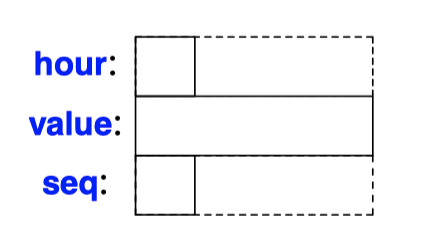
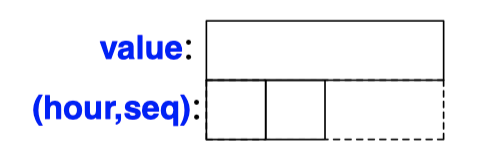

## Structure
- `struct` is an aggregate of elements of **arbitrary types**. On the other hand, array is an aggregate of elements of the same type.
- Objects of structure types can be assigned, passed as function arguments, and returned as the result from a function.
```C++
struct Address {
  const char* name;
  int number;
  const char* street;
  const char* town;
  char state[2];
  const char* zip;
};

void f()
{
  Address jd = {
      "Jim Dandy",
      61,
      "South St",
      "New Providence",
      {'N','J'},
      "07974"
  };
  jd.name = "Jim Dandy";
  jd.number = 61;
}
``` 
- Note the **terminating semicolon**.
- `struct` types can be initialized using the `{}` notation
- The individual members can be accessed using the `.` operator.
```C++
void print_addr(Address* p)
{
  cout << p−>name << '\n'
      << p−>number << ' ' << p−>street << '\n'
      << p−>town << '\n'
      << p−>state[0] << p−>state[1] << ' ' << p−>zip << '\n';
}

void print_addr2(const Address& r)
{
  cout << r.name << '\n'
      << r.number << ' ' << r.street << '\n'
      << r.town << '\n'
      << r.state[0] << r.state[1] << ' ' << r.zip << '\n';
}
``` 
- Structures accessed **through pointers** use the `−>` (`struct` pointer dereference) operator.
- When `p` is a pointer, `p−>m` is equivalent to `(*p).m`.
- `struct` can be passed **by reference** and accessed using the `.`.
***
- Layout
  ```C++
  struct Readout {
      char hour;
      int value;
      char seq;
  };
  ``` 
  
  - Members are allocated in memory in declaration order.
  - Since objects are properly **aligned**, the size of an object of a struct is not necessarily the sum of the sizes of its members. There are "hole" in the structures.
  - In this case, as on many machines, `sizeof(Readout)` is `12` rather than `6`.
  ```C++
  struct Readout {
    int value;
    char hour;
    char seq;
  };
  ``` 
  
  - **Minimize wasted space by simply ordering members by size** (largest member first).
  - This still leaves a 2-byte "hole" and `sizeof(Readout)==8`.
  - It is usually **best to order members for readability** and sort them by size **only if there is a demonstrated need to optimize.**
  - Use of multiple access specifiers (i.e., public, private, or protected) can affect layout.
***
- Names
  ```C++
  struct Link {
    Link* previous;  // OK
    Link* successor;
  };

  struct No_good {
    No_good member; // error: recursive definition
  };
  ``` 
  - The name of a type becomes available immediately after it has been encountered.
  - However, **it is not possible to declare new objects of a struct until its complete declaration** because the compiler is not able to determine the size.
  - Pointer doesn't need to know the size of a type.
  ```C++
  struct List; // struct name declaration: List to be defined later

  struct Link { 
    Link* pre;
    Link* suc;
    List* member_of;
    int data;
  };

  struct List {
    Link* head;
  };
  ``` 
  - To allow two structs to refer to each other, we can declare a name to be the name of a struct.
  ```C++
  struct S; // ‘‘S’’ is the name of some type

  extern S a;
  S f();
  void g(S);
  S* h(S*);

  void k(S* p)
  {
    S a;  // error: S not defined; size needed to allocate

    f(); // error: S not defined; size needed to return value
    g(a); // error: S not defined; size needed to pass argument
    p−>m = 7; // error: S not defined; member name not known
    
    S* q = h(p); // ok: pointers can be allocated and passed
    q−>m = 7; // error: S not defined; member name not known
  }
  ``` 
  - Until the completion of the declaration of a struct, that struct is an incomplete type,.
***
- Structures and Classes
  - A `struct` is simply a class where the members are public by default.
  - a `struct` can have **member functions and constructors** as well.
  ```C++
  struct Point { int x, y; };

  Point p0; // danger: uninitialized if in local scope
  Point p1 {}; // default construction: {{},{}}; that is {0.0} 
  Point p2 {1}; // the second member is default constructed: {1,{}}; that is {1,0}
  Point p3 {1,2}; // {1,2}
  ``` 
  - Default constructors initialize members in order.
  ```C++
  struct Address {
    string name;
    int number;
    string street;
    string town;
    char state[2];
    char zip[5];

    Address(const string n, int nu, const string& s, const string& t, const string& st, int z);
  };

  Address::Address(const string& n, int nu, const string& s, const string& t, const string& st, int z)
    :name{n},
    number{nu},
    street{s},
    town{t}
  {
    if (st.size()!=2)
      error("State abbreviation should be two characters") /
    state = {st[0],st[1]};

    ostringstream ost;
    ost << z;
    string zi {ost.str()};
    switch (zi.size()) {
      case 5:
        zip = {zi[0], zi[1], zi[2], zi[3], zi[4]};
        break;
      case 4: // star ts with ’0’
        zip = {'0', zi[0], zi[1], zi[2], zi[3]};
        break;
      default:
        error("unexpected ZIP code format"); }
    }
    // ...
  }
  ``` 
  - Constructors are needed if you need to reorder arguments, validate arguments, modify arguments, establish invariants, etc.
***
- Equivalence
  - Two `struct`s are different types even when they have the same members.
  - A struct is also a different type from a type used as a member.
  - Every struct must have a unique definition in a program.
***
- **Plain Old Data** (POD)
  - POD ("Plain Old Data") is an object that can be manipulated as ""just data" **without worrying about complications of class layouts or user-defined semantics for construction, copy, and move.**
  ```C++
  struct S0 { }; // a POD
  struct S1 { int a; };  // a POD 
  struct S2 { int a; S2(int aa) : a(aa) { } }; // not a POD (no default constructor)
  struct S3 { int a; S3(int aa) : a(aa) { } S3() {} }; // a POD (user-defined default constructor)
  struct S4 { int a; S4(int aa) : a(aa) { } S4() = default;}; // a POD
  struct S5 { virtual void f(); /* ... */ }; // not a POD (has a virtual function)

  struct S6 : S1 { }; // a POD
  struct S7 : S0 { int b; }; // a POD
  struct S8 : S1 { int b; };  // not a POD (data in both S1 and S8) 
  struct S9 : S0, S1 {};  // a POD
  ``` 
  - POD must 
    - Is *standard layout type*
      - A type has standard layout unless it
        - has a non-`static` member or a base that is not standard layout
        - has a `virtual` function
        - has a `virtual` base
        - has a member that is a reference
        - has multiple access specifiers for non-static data members
        - prevents important layout optimizations
          - by having non-static data members in more than one base class or in both the derived class and a base
          - by having a base class of the same type as the first non-static data member.
      - It is is in the union of what common C++ *Application Binary Interfaces (ABIs)* can handle.
    - have standard (not user-defined) copy semantics (*trivially copyable type*)
      - a copy operation is trivial if it can be implemented as a bitwise copy.
      - a copy, move, or destructor is nontrivial if
        - **It is user-defined**.
        - Its class has a `virtual` function.
        - Its class has a `virtual` base.
        - Its class has a base or a member that is not trivial.
    - have a trivial default constructor.
      - a default constructor is **trivial if it does not need to do any work** (use `=default` if you need to define one).
  ```C++
  template<typename T>
  void mycopy(T* to, const T* from, int count)
  {
    if (is_pod<T>::value
      memcpy(to,from,count*sizeof(T));
    else
      for (int i=0; i!=count; ++i)
        to[i]=from[i];
  }
  ``` 
  - The `is_pod` is a standard-library type property predicate defined in `<type_traits>`
***
- Fields
  - We can bundle several such **tiny variables** together as fields in a struct.
    - A field must be of **an integral or enumeration type**.
  - A field is often called a bit-field.
  - It is not possible to take the address of a field.
  - Using fields to pack several variables into a single byte does not necessarily save space.
  - It is typically much faster to access a char or an int than to access a field.
  - Fields are simply a convenient shorthand for using bitwise logical operators to extract information from and insert information into part of a word
  ```C++
  struct PPN { // R6000 Physical Page Number
    unsigned int PFN : 22; // Page Frame Number
    int : 3; // unused unsigned
    int CCA : 3; // Cache Coherency Algorithm 
    bool nonreachable : 1;
    bool dirty : 1;
    bool valid : 1;
    bool global : 1;
  };
  ``` 
  - A member is defined to be a field by specifying the number of **bits** it is to occupy.
  - Unnamed fields are allowed.

## Unions
- A `union` is a struct in which all members are allocated at the same address.
- A `union` can hold a value for **only one member at a time**.
- Unions are sometimes misused for "type conversion." If you need a conversion, use an explicit type conversion operator (`reinterpret_cast<T>`)
- Most programs don’t improve much from the use of `union`s and `union`s are rather error-prone. Thus, **avoid `union` when you can**.
```C++
enum Type { str, num };

struct Entry {
  char* name;
  Type t;
  char* s; // use s if t==str
  int i;  // use i if t==num
};
``` 
- The members `s` and `i` can never be used at the same time, so space is wasted
```C++
union Value {
  char* s;
  int i;
};

struct Entry {
  char* name;
  Type t;
  Value v; // use v.s if t==str; use v.i if t==num
};

void f(Entry* p) {
  if (p−>t == str)
      cout << p−>v.s;
  }
}
```
- The language doesn’t keep track of which kind of value is held by a `union`.
***
- Unions and Classes
  - Many nontrivial `union`s have a member that is much larger than the most frequently used members. This waste can often be eliminated by using a set of derived classes.
  - Many of the facilities provided for classes are not relevant for unions.
    - No virtual functions.
    - No members of reference type.
    - No base class.
    - Cannot be used as a base class.
    - If a union has **a member with** a user-defined constructor, a copy operation, a move operation, or a destructor, then that special function is deleted
    - At most one member of a union can have an **in-class initializer**.
  ```C++
  // won't compile
  union U {
    int m1;
    complex<double> m2; // complex has a constructor
    string m3; // string has a constructor
  };

  void f2(U x)
  {
    U u; // error : which default constructor?
    U u2 = x; // error : which copy constructor?
    u.m1 = 1; // assign to int member
    string s = u.m3; // disaster : read from string member
    
    return;
  }
  ``` 
  - A more complicated union would cause implementation difficulties or errors.
  - It’s illegal to write one member and then read another.
  ```c++
  union U2 {
    int a;
    const char* p {""};
  };

  U2 x1; // default initialized to x1.p == ""
  U2 x2 {7};  // x2.a == 7
  ``` 
  - It is possible to specify an in-class initializer for at most one member.
***
- Anonymous unions
  - When needed, a user can define **a class containing a union** that properly handles union members with constructors, destructors, and assignments
  ```C++
  class Entry2 { // two alternative representations represented as a union
  private:
    enum class Tag { number, text };
    Tag type; // discriminant

    union { // representation
      int i;
      string s; // string has default constructor, copy operations, and destructor
    };
  public:
    struct Bad_entry { }; // used for exceptions

    string name;

    ~Entry2();
    Entry2& operator=(const Entry2&); // necessary because of the string variant
    Entry2(const Entry2&); // ...

    int number() const;
    string text() const;

    void set_number(int n);
    void set_text(const string&); // ...
  };

  int Entry2::number() const {
    if (type!=Tag::number) throw Bad_entry{};
    return i;
  };

  string Entry2::text() const {
    if (type!=Tag::text) throw Bad_entry{};
    return s;
  };

  void Entry2::set_number(int n) {
    if (type==Tag::text) {
      s.~string(); // explicitly destroy string
      type = Tag::number;
    }
    i = n;
  }

  void Entry2::set_text(const string& ss) {
    if (type==Tag::text)
      s = ss;
    else {
      new(&s) string{ss}; // placement new: explicitly construct string 
      type = Tag::text;
    }
  }
  ``` 
  - Such a `union` is often called a *tagged union* or a *discriminated union*.
  - An anonymous union is an object, not a type, and its members can be accessed without mentioning an object name.
  ```C++
  Entry2& Entry2::operator=(const Entry2& e) // necessary because of the string variant
  {
    if (type==Tag::text && e.type==Tag::text) { // usual string assignment
      s = e.s;
      return *this;
    }

    if (type==Tag::text) s.~string(); // explicit destroy

    switch (e.type) {
    case Tag::number:
      i = e.i;
      break;
    case Tag::text:
      new(&s)(e.s); // placement new: explicit construct
      type = e.type;
    }

    return *this;
  }
  
  Entry2::~Entry2()
  {
    if (type==Tag::text)
      s.~string(); // explicit destroy (§11.2.4)
  }
  ``` 
  - `Entry2` has a member of a type with a user-defined assignment operator, string, so **`Entry2`’s assignment operator is deleted**.
  - If we want to assign `Entry2s`, we have to define `Entry2::operator=()`.
  - Constructors and a move assignment can be defined similarly as needed.

## Enumerations
- An enumeration is a type that can **hold a set of integer values** specified by the user
- Enumeration’s possible values are named and called *enumerators*.
- By default, enumerator values are assigned increasing from 0.
- There are two kinds of enumerations:
  - `enum class`: the enumerator names are local and their values do not implicitly convert to other types.
  - plain `enum`: the enumerator names are in the **same scope as the `enum`** and **their values implicitly convert to integers**
- In general, **prefer the `enum class`es** because they cause fewer surprises.
***
- `enum class`
  ```c++
  enum class Traffic_light { red, yellow, green };
  enum class Warning { green, yellow, orange, red };// fire alert levels

  Warning a1 = 7; // error : no int->Warning conversion  
  int a2 = green; // error : green not in scope
  int a3 = Warning::green; // error : no Warning->int conversion
  Warning a4 = Warning::green; // OK

  void f(Traffic_light x)
  {
    if (x == 9) { /* ... */ } // error : 9 is not a Traffic_light

    if (x == red) { /* ... */ } // error : no red in scope

    if (x == Warning::red) { /* ... */ } // error : x is not a Warning
    
    if (x == Traffic_light::red) { /* ... */ } // OK
  }
  ```
  - We call the type used to represent an enumeration its *underlying type.*
  - The underlying type must be **one of the signed or unsigned integer** types; the default is `int`.
  ```c++
  enum class Warning : int { green, yellow, orange, red }; // sizeof(Warning)==sizeof(int)
  enum class Warning : char { green, yellow, orange, red }; // sizeof(Warning)==1

  static_cast<int>(Warning::green)==0
  static_cast<int>(Warning::yellow)==1
  static_cast<int>(Warning::orange)==2
  static_cast<int>(Warning::red)==3
  ``` 
  - We could be explicitly declare underlying type.
  - we could use a char to save wasted space.
  - The sizeof an `enum class` is the sizeof of its underlying type.
  ```c++
  enum class Printer_flags {
    acknowledge=1, // 00001
    paper_empty=2, // 00010
    busy=4, // 00100
    out_of_black=8, // 01000
    out_of_color=16, // 10000
  };

  constexpr Printer_flags operator|(Printer_flags a, Printer_flags b)
  {
    return static_cast<Printer_flags>(
      static_cast<int>(a) | static_cast<int>(b)
    );
  }

  constexpr Printer_flags operator&(Printer_flags a, Printer_flags b)
  {
    return static_cast<Printer_flags>(
      static_cast<int>(a) & static_cast<int>(b)
    );
  }

  void try_to_print(Printer_flags x) {
    if (x&Printer_flags::acknowledge) {
      // ...
    }
    else if (x&Printer_flags::busy) {
      // ...
    }
    else if (x&(Printer_flags::out_of_black|Printer_flags::out_of_color)) {
      // either we are out of black or we are out of color
      // ...
    }
    // ...
  }
  ```
  - An enumerator can be initialized by a constant expression of integral type.
  - The explicit conversions are necessary because a `enum class` does not support implicit conversions.
  ```C++
  enum class Color_code : char;
  void foobar(Color_code* p);
  // ...
  enum class Color_code : char { red, yellow, green, blue };
  ``` 
  - It is possible to declare an `enum class` without defining it until later.
  ```C++
  enum class Flag : char{ x=1, y=2, z=4, e=8 };

  Flag f0 {}; // f0 gets the default value 0
  Flag f1 = 5; // type error: 5 is not of type Flag
  Flag f2 = Flag{5}; // error : no narrowing conversion to an enum class
  Flag f3 = static_cast<Flag>(5);  // brute force 
  Flag f4 = static_cast<Flag>(999); // error : 999 is not a char value (maybe not caught)
  ``` 
  - There is **no implicit conversion from an integer to an enumeration**.
***
- Plain `enum`
  ```C++
  enum Traffic_light { red, yellow, green };
  enum Warning { green, yellow, orange, red }; // fire alert levels

  // error: two definitions of yellow (to the same value)
  // error: two definitions of red (to different values)

  Warning a1 = 7; // error : no int->Warning conversion
  int a2 = green;  // OK: green is in scope and converts to int
  int a3 = Warning::green; // OK: Warning->int conversion
  Warning a4 = Warning::green; // OK
    

  void f(Traffic_light x)
  {
    if (x == 9) { /* ... */ } // OK (but Traffic_light doesn’t have a 9)
    if (x == red) { /* ... */ } // error : two reds in scope
    if (x == Warning::red) { /* ... */ } // OK (Ouch!)
    if (x == Traffic_light::red) { /* ... */ } // OK
  }
 
  ```
  - The enumerators of a plain enum are **exported into the enum’s scope**.
  - The enumerators implicitly convert to values of some integer type.
  - The injection of names into an enclosing scope is *namespace pollution* and can be a major problem in larger programs.
  ```c++
  enum Traffic_light : char { tl_red, tl_yellow, tl_green }; // underlying type is char

  enum Color_code : char; // declare 
  void foobar(Color_code* p); // use of declaration
  // ...
  enum Color_code : char { red, yellow, green, blue }; // definition
  ``` 
  - If you don’t specify the underlying type, you can’t declare the `enum` without defining it,.
  ```c++
  enum E1 { dark, light }; // range 0:1
  enum E2 { a = 3, b = 9 }; // range 0:15
  enum E3 { min = −10, max = 1000000 }; // range -1048576:1048575
  ``` 
  - The underlying type is determined by a relatively complicated algorithm
  - If the underlying type isn’t explicitly specified, it is some integral type that can hold its range and not larger than `sizeof(int)`,
  ```C++
  enum Flag { x=1, y=2, z=4, e=8 }; // range 0:15

  Flag f0 {}; // f0 gets the default value 0
  Flag f1 = 5; // type error: 5 is not of type Flag 
  Flag f2 = Flag{5};  // error : no explicit conversion from int to Flag
  Flag f2 = static_cast<Flag>(5); // OK: 5 is within the range of Flag 
  Flag f3 = static_cast<Flag>(z|e); // OK: 12 is within the range of Flag
  Flag f4 = static_cast<Flag>(99);  // undefined: 99 is not within the range of Flag
  ``` 
  - Explicit conversion of an integer to a plain enum is undefined like the `enum class`.
  - Because there is an implicit conversion from a plain `enum` to its underlying type, we don’t need to define `|` to make this example work
  ```c++
  enum { arrow_up=1, arrow_down, arrow_sideways };
  ```
  - A plain `enum` can be **unnamed**.
  - We use that when all we need is a set of integer constants.