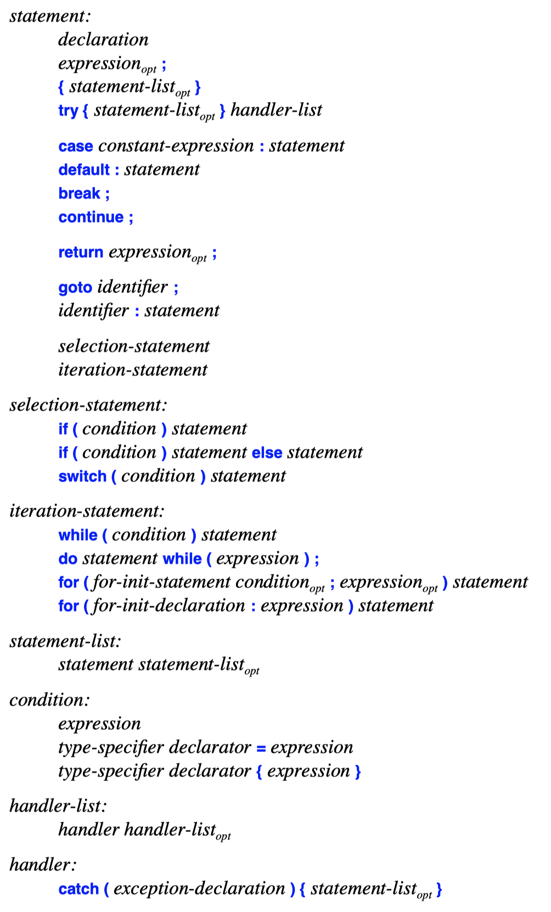

## Statement
- A declaration is a statement.
- A declaration has no assignment statement or procedure-call statement
- An expression becomes a statement when you add a semicolon at its end.
- **Assignments and function calls are expressions**.
- Unlike an expression, **a statement does not have a value**.
- A semicolon is by itself a statement, the *empty statement*.
```c++
a = b+c; // expression statement
if (a==7)  // if-statement
  b = 9; 
``` 
- Statements are used to specify the order of execution.
- A compiler may reorder code to improve performance.
 
- Statements within "curly braces" (i.e., `{` and `}`) is called a *block* or a *compound statement*.

## Declarations
```C++
void f(vector<string>& v, int i, const char* p)
{
  if (p==nullptr) return;
  if (i<0 || v.size()<=i)
    error("bad index");

  string s = v[i];

  if (s == p) {
    // ...
  }
  
  // ...
}
```
- Unless a variable is declared `static`, its initializer is executed whenever the thread of control passes through the declaration.
- **The ability to place declarations after executable code** is essential for many constants and for single-assignment styles of programming
```c++
void use() {
  string s1;
  s1 = "The best is the enemy of the good.";
  // ...
}
``` 
- This requests a default initialization to the empty string.
- This can be slower than a simple initialization to the desired value.
- For user-defined types, postponing the definition of a variable until a suitable initializer is available can also lead to better performance.

## Selection Statements
- A value can be tested by either an `if`-statement or a `switch`-statement
  - `if` `(` *condition* `)` *statement*
  - `if` `(` *condition* `)` *statement* `else` *statement*
  - `switch` `(` *condition* `)` *statement*
***
- `if` statements
  - In an `if`-statement, the first (or only) statement is executed if the condition is `true`.
  - If a condition evaluates to something different from a Boolean, it is – if possible – implicitly converted to a bool.
    - Enum class can't be implicitly converted to integer.
  - Any arithmetic or pointer expression can be used as a condition.
    - `if (x)` is equivalent to `if (x != 0)`
    - `if (ptr)` is equivalent to `if (ptr != nullptr)`
  ```C++
  if (p && 1 < p−>count) {

  }
  ```
  - The operators `&&` and `||` will not evaluate their second argument unless doing so is necessary.
  - This tests `1<p−>count` only if `p` is not `nullptr`.
  ```C++
  int max(int a, int b) { return (a>b)?a:b; }
  ``` 
  - For choosing between **two alternatives** each of which produces a value, a conditional expression is a more direct.
  ```C++
  void f1(int i) {
    if (i)
      int x = i+2; // error : declaration of if-statement branch
  }

  void f2(int i) {

    if (i) {
      int x = i+2;
      ++x;
      // ...
    }
    else {
      ++x;  // error: x is not in scope
    }
    ++x; // error: x is not in scope
  }
  ``` 
  - **If we need to introduce a name in a branch, it must be enclosed in a block**.
  - A name can only be used within the scope in which it is declared.
  ```c++
  if (double d = prim(true)) {
    left /= d;
    break;
  }
  ```
  - We can declare a variable or constant in a condition.
  - `d` is declared and initialized and the value is tested.
  - Had there been an `else`-branch to the `if`-statement, **`d` would be in scope on all branches**.
***
- `switch` statements
  - A `switch`-statement selects among a set of alternatives (`case`-labels).
  - Compared to `if`, `switch`-statement easier to read for nontrivial examples.
  ```C++
  void f(int i)
  {
    switch (i) {
    case 2.7: // error: floating point uses for case
      // ...
    case 2:
      // ...
    case 4−2: // error: 2 used twice in case labels
      // ...
    };
  }
  ``` 
  - case labels must be a **constant expression of integral or enumeration type**.
  - A value may not be used more than once for `case`-labels.
  ```C++
  switch (val) {
  case 1:
    cout << "case 1\n";
  case 2:
    cout << "case 2\n";
  default:
    cout << "default: case not found\n";
  }

  // with val == 1 output: 
  // case 1
  // case 2
  // default: case not found

  switch (action) { // handle (action,value) pair
  case do_and_print:
    act(value);
    // no break: fall through to print
  case print:
    print(value);
    break;
  // ...
  }
  ``` 
  - A case of a switch must be terminated somehow unless you want to carry on
  - It is a good idea to comment the (rare) cases in which a fall-through is intentional
  ```C++
  enum class Vessel { cup, glass, goblet, chalice };

  void problematic(Vessel v)
  {
    switch (v) {
    case Vessel::cup: /* ... */ break;
    case Vessel::glass: /* ... */ break;
    case Vessel::goblet /* ... */ break;
    }
  }
  ``` 
  - A mistake can easily occur when a new enumerator is added during maintenance.
  - If a switch is intended to have one case for **each enumerator** of an enumeration, **leaving out the default** gives the compiler a chance to warn.
  ```C++
  void f(int i)
  {
    switch (i) { 
    case 0:
      int x; // uninitialized 
      int y = 3; // error: declaration can be bypassed (explicitly initialized)
      string s; // error: declaration can be bypassed (implicitly initialized)
      
    case 1:
      ++x; // error: use of uninitialized object
      ++y;
      s = "nasty!";
    }
  }
  ```
  - It is possible to declare variables within the block of a `switch`-statement.
  - If `i==1`, the thread of execution would bypass the initializations of `y` and `s`.
  - `f()` will not compile.

## Iteration Statements
- A loop can be expressed as a `for`-, `while`-, or `do`-statement:
  - while ( *condition* ) statement
  - do *statement* while ( *expression* ) ;
  - for ( *for-init-statement*; *condition_opt*; *expression_opt*) statement
  - for ( *for-declaration* : *expression* ) statement
- The programmer breaks out of the loop some other way (such as a `break`, a `return`, a `throw`, or a `goto`).
***
- Range-`for` statements
  - Range-`for` loop is a deliberately simple construct. It can't touch two elements at the same time and can’t effectively traverse two ranges simultaneously. 
  ```C++
  int sum(vector<int>& v) {
    int s = 0;
    for (int x : v)
      s+=x;
    return s;
  }

  int sum2(vector<int>& v) {
    int s = 0;
    for (auto p = begin(v); p!=end(v); ++p)
      s+=*p;
    return s;
  }
  ``` 
  - The expression after the colon **must denote a sequence** for which we can call `v.begin()` and `v.end()` or `begin(v)` and `end(v)` to obtain an iterators.
  - The compiler uses `v` and `v+N` as `begin(v)` and `end(v)` for a built-in array `T v[N]`.
  ```c++
  void incr(vector<int>& v) {
    for (int& x : v)
      ++x;
  }
  ``` 
  - Range-`for` copy the value of an element of the array, which could be costly.
  - If you **need to modify** an element in a range-for loop, the element variable should be a **reference**
- `for` statements
  - `for`-statement allows greater control of the iteration.
  - The *loop variable*, the *termination condition*, and the *expression* that updates the loop variable are explicitly on a single line.
    ```C++
    for (;;) {
      // ...
    }
    ``` 
    - Loop variable, termination condition and expression can be omitted.
    - If the loop isn’t of the simple "introduce a loop variable, test the condition, update the loop variable" variety, it is often better expressed as a `while`-statement.
  ```C++
  void f(int v[], int max) {
    for (auto i = 0; i!=max; ++i)
      v[i] = i*i;
  }
  ``` 
  - If that initializer is a declaration, the variables exist(s) until the end of the `for`-statement.
  ```C++
  for (string s; cin>>s;)
    v.push_back(s);
  ``` 
  - The use of `for`, rather than `while`, allows us to limit the scope of the "current element," `s`, to the loop itself
***
- `while` statement
  ```C++
  template<class Iter, class Value>
  Iter find(Iter first, Iter last, Value val) {
    while (first!=last && *first!=val)
      ++first;
    return first;
  }
  ```
  - `while` executes its controlled statement until its condition becomes `false`.
  - Prefer `while`-statements over `for`-statements **when there isn’t an obvious loop variable** or where **the update of a loop variable naturally comes in the middle**.
- `do` statements
  ```C++
  void print_backwards(char a[], int i)
  {
      cout << '{';
      do { 
        out << a[−−i];
      } while (i);
      cout << '}';
  }
  ``` 
  - The body is always executed once before the condition is evaluated
  - It is all too easy to make a horrible mistake. For example, what if `s` was the empty string.
  - The `do`-statement is a source of errors and confusion.
  - Avoid `do`-statements.
***
- Loop Exit
  - The user can forcefully exit a loop by a `break`, `return`, `goto`, `throw`.
  - `break`
    ```C++
    void f(vector<string>& v, string terminator)
    {
      char c;
      string s;
      
      while (cin>>c) {
        // ...
        if (c == '\n') break;
        // ...
      }
    }
    ``` 
    - A `break` "breaks out of" the nearest enclosing `switch`-statement or *iteration-statement*.
    - We use a `break` when we need to **leave the loop body "in the middle."**
  - `continue`
    ```C++
    void find_prime(vector<string>& v) {
      for (int i = 0; i!=v.size(); ++i) {
        if (!prime(v[i]) continue;
        return v[i];
      }
    }
    ``` 
    - A `continue` skips the rest of the body of an *iteration-statement*.
  - `goto` statement
    - `goto` can be very useful when C++ **code is generated by a program** rather than written directly by a person.
      - `goto` *identifier* `;`
      - *identifier* : *statement*
    - The scope of a label is the function it is in. You can use goto to jump both into and out of blocks. 
    - You **cannot jump past an initializer or into an exception handler**.
    ```C++
    void do_something(int i, int j) 
    {
      for (i = 0; i!=n; ++i)
        for (j = 0; j!=m; ++j)
          if (nm[i][j] == a)
            goto found;

      // not found
      // ...
      
      found:
        // nm[i][j] == a
    }
    ``` 
    - One of the few sensible uses of goto in ordinary code is to **break out from a nested** loop or `switch`-statement.

## Comments and Indentation
- Most programs contain comments that are incomprehensible, ambiguous, and just plain wrong.
- Bad comments can be worse than no comments.
- Once something has been stated clearly in the language, it should not be mentioned in comments.
```C++
// tbl.c: Implementation of the symbol table.

/*
  Gaussian elimination with partial pivoting.
  See Ralston: "A first course ..." pg 411.
*/

// scan(p,n,c) requires that p points to an array of at least n elements

// sor t(p,q) sorts the elements of the sequence [p:q) using < for comparison.

// Revised to handle invalid dates. Bjarne Stroustrup, Feb 29 2013
``` 
- A good comment states what a piece of code is supposed to do.
  - A comment for **each source file** stating what the declarations in it have in common, references to manuals, the name of the programmer, general hints for maintenance, etc.
  - A comment for each **class, template, and namespace**.
  - A comment for each **nontrivial function** stating its purpose, the algorithm used (unless it is obvious), and maybe something about the assumptions it makes about its environment.
  - A comment for each global and namespace variable and constant.
  - A few comments where the **code is nonobvious and/or nonportable**.
 
- /* */ style comments do not nest.