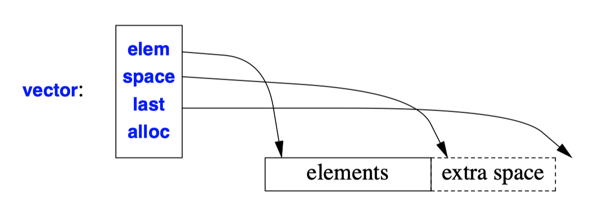

## Error Handling
- Error handling  remain a difficult task and that the exception-handling mechanism is still relatively unstructured compared with language features involving only local control flow.
- We should expect most large programs to `throw` and `catch` at least some exceptions in the course of a normal and successful run.
- The basic tools available for writing exception-safe code are:
  - The try-block.
  - The support for the "Resource Acquisition Is Initialization" technique.
```C++
void taskmaster()
{

  try {
    auto result = do_task(); // use result
  }
  catch (Some_error) {
    // failure to do_task: handle problem
  }
}

int do_task() {
  // ...
  if (/* could perform the task */)
    return result;
  else
    throw Some_error{};
  }
```
- An *exception* is provided to help get information from the point where an error is detected
- A function that cannot cope with a problem *throws* an *exception*.
- A function that wants to handle a kind of problem indicates that by *catching* the corresponding exception
- The mechanism is designed to handle **only synchronous exceptions**.
- Many systems offer mechanisms, such as signals, to deal with asynchrony.
```C++
void fnd(Tree* p, const string& s)
{
  if (s == p−>str) throw p; // found s
  if (p−>left) fnd(p−>left,s);
  if (p−>right) fnd(p−>right,s);
}

Tree* find(Tree* p, const string& s)
{
  try {
    fnd(p,s);
  } catch (Tree* q) { // q->str==s
    return q;
  }
  
  return 0;
}
``` 
- One might think of the exception-handling mechanisms as simply another control structure.
- **This should be avoided** because it is likely to cause confusion and inefficiencies.
```C++
struct Range_error {};

void f(int n)
{
  if (n<0 || max<n) throw Range_error {};
  // ... 
}
``` 
- An exception can be of any type that can be copied.
- The simplest way of defining an exception is to define a class specifically for a kind of error.
- The standard library defines a small hierarchy of exception classes
- In principle, exception handling **can be implemented so that there is no run-time overhead** when no exception is thrown.
```c++
void f() {
  string buf;
  cin>>buf;
  
  // ...

  g(1);
  h(buf);
}
``` 
```c++
bool g(int);
bool h(const char*);
char* read_long_string();

bool f()
{
  char* s = read_long_string();
  // ...
  if (g(1)) {
    if (h(s)) {
      free(s);
      return true;
    }
    else {
      free(s);
      return false; 
    }
  }
  else {
    free(s);
    return false; 
  }
}
```
- Traditional Error Handling
  1. Terminate the program
  2. Return an error value
      - At a minimum, we  have to return a pair of values.
      - This can easily double the size of a program
  3. Return a legal value and leave the program in an "error state."
      - Many standard C library functions set the nonlocal variable `errno` to indicate an error.
      - The use of nonlocal variables for recording error conditions doesn't work well in the presence of concurrency.
- When You Can't Use Exceptions
  - There are programs for which throwing an exception is not an option
    1. For a time-critical component, just don't do that: It is the caller's job to meet preconditions.
    2. In systems where complete and timely recovery from a precondition failure is considered infeasible, the only option is to terminate the program.
  - There are two popular techniques to handle this
    ```c++
    void f(int n)
    {
      my_vector<int> x(n);
      if (x.invalid()) {
        // ... deal with error ...
      }
      // ...
    }
    ```
    1. To mimic RAII, give every class with a constructor an `invalid()` operation that returns some `error_code`.
    ```c++
    void g(int n)
    {
      auto v = make_vector(n); // return a pair
      if (v.second) {
        // ... deal with error ...
      }
      auto val = v.first; // ...
    }
    ``` 
    - To mimic a function either returning a value or throwing an exception, a function can return a `pair<Value,Error_code>`.
- Hierarchical Error Handling
  - **Successful fault-tolerant systems are multilevel**. Each level copes with as many errors as it can without getting too contorted.
  - Not every function should be a firewall.
    - The amount of work needed to ensure "reliability" is too great to be done consistently.
    - **The overhead in time and space** is too great for the system to run acceptably.
    - Functions written in other languages won't obey the rules.
    - "Reliability" leads to complexities that actually become a burden to overall system reliability.
  - The aim is to have the program fragment appear to follow the general error-handling strategy.

## Resource Management
```c++
void acquire()
{
  // acquire resource 1
  // ...
  // acquire resource n

  // ... use resources ...

  // release resource n
  // ...
  // release resource 1
}
```
- Code becomes significantly more complex when several resources must be acquired and released.
- It is typically important that resources are released in the reverse order of their acquisition.
```c++
class File_ptr {
  FILE* p;
public:
  File_ptr(const char* n, const char* a)
    : p{fopen(n,a)} 
  {
    if (p==nullptr) throw runtime_error{"File_ptr: Can't open file"};
  }
  
  File_ptr(const string& n, const char* a)
    :File_ptr{n.c_str(),a}
  {} 

  explicit File_ptr(FILE* pp) // assume ownership of pp
    :p{pp}
  {
    if (p==nullptr) throw runtime_error("File_ptr: nullptr"};
  }
  
  // ... suitable move and copy operations ...

  ~File_ptr() { fclose(p); }

  operator FILE*() { return p; }
};
``` 
- We can handle such **resource acquisition and release problems using objects of classes with constructors and destructors**.
- `File_ptr` will be destroyed at the end of its scope and close the file.
- The destructor will be called independently of whether the function is exited normally.
- This technique for managing resources using local objects is usually referred to as "Resource Acquisition Is Initialization" (**RAII**)
```c++
class Locked_file_handle {
  File_ptr p;
  unique_lock<mutex> lck;
public:
  X(const char* file, mutex& m)
    : p{file,"rw"}, // acquire "file"
    lck{m} // acquire "m"
  {}
  // ...
};
``` 
- The acquisition of a resource is represented by the initialization of the local object.
- This acquisition might fail and throw an exception. Class `X`'s constructor must never complete having acquired the file but not the mutex.
***
- **Finally**
  ```c++
  template<typename F>
  struct Final_action {
    Final_action(F f): clean{f} {}
    ~Final_action() { clean(); }
    F clean; 
  };

  template<class F>
  Final_action<F> finally(F f)
  {
    return Final_action<F>(f);
  }

  void test()
    // handle undiciplined resource acquisition
    // demonstrate that arbitrary actions are possible 
  {
    int* p = new int{7};
    int* buf = (int*)malloc(100*sizeof(int));

    auto act1 = finally(
      [&]{ delete p;
        free(buf);
        cout<< "Goodby, Cruel world!\n";
      }
    );

    int var = 0;
    cout << "var = " << var << '\n';

    // nested block:
    {
      var = 1;
      auto act2 = finally([&]{ cout<< "finally!\n"; var=7; });
      cout << "var = " << var << '\n';
    } // act2 is invoked here

    cout << "var = " << var << '\n';
  } // act1 is invoked here
  ```
  - People have invented "finally" language constructs for writing arbitrary code to clean up after an exception.
  - Such techniques are generally **inferior to RAII**.
  - It is generally a good idea to place a guard close to the definition.

## Enforcing Invariants
- When we want to be neutral about the logical reason for the check, we typically use the word *assertion*, often abbreviated to an **assert**.
- An assertion is simply a **logical expression that is assumed to be true**.
- There are a variety of needs when it comes to expressing assertions:
  - Compile-time asserts or run-time asserts
  - For run-time asserts we need a choice of throw, terminate, or ignore.
  - No code should be generated unless some logical condition is true. Usually, the logical condition is something like a debug flag, a level of checking, or a mask to select.
  - Asserts should not be verbose or complicated to write.
- The standard offers two simple mechanisms
  - In `<cassert>`, the standard library provides the `assert(A)` macro. It checks if and only if the macro `NDEBUG` is not defined. 
  - The **language provides** `static_assert(A, message)` which unconditionally checks at compile time.
```c++
namespace Assert {

  enum class Mode { throw_, terminate_, ignore_ };
  constexpr Mode current_mode = CURRENT_MODE;
  constexpr int current_level = CURRENT_LEVEL;
  constexpr int default_level = 1;

  constexpr bool level(int n)
    { return n<=current_level; }

  struct Error : runtime_error {
    Error(const string& p) :runtime_error(p) {}
  };

  string compose(const char* file, int line, const string& message)
    // compose message including file name and line number
  {
    ostringstream os ("(");
    os << file << "," << line << "):" << message;
    return os.str();
  }

  template<bool condition =level(default_level), class Except = Error>
  void dynamic(bool assertion, const string& message ="Assert::dynamic failed")
  {
    if (assertion)
      return;
    if (current_mode == Assert_mode::throw_)
      throw Except{message};
    if (current_mode == Assert_mode::terminate_)
      std::terminate();
  }

  template<> void dynamic<false,Error>(bool, const string&) // do nothing
  {
  }

  void dynamic(bool b, const string& s) // default action
  {
    dynamic<true,Error>(b,s); 
  }

  void dynamic(bool b) // default message
  {
    dynamic<true,Error>(b);
  }

  void f(int n) // n should be in [1:max)
  {
    Assert::dynamic<Assert::level(2),Assert::Error>(
        (n<=0 || max<n), Assert::compose(__FILE__,__LINE__,"range problem")
    );
    // ...
  }
}
```
- `assert()` and `static_assert()` sometimes are insufficient.
- The idea is to test whenever an assertion has a "level" lower than or equal to current_level.
- `CURRENT_MODE` and `CURRENT_LEVEL` are set in the build environment for a program
- The `__FILE__` and `__LINE__` are macros that expand at their point of appearance in the source code.
- For **leaving at least some tests in the final version of a program**, level zero will always be checked.
  - We never find the last bug in a large program under continuous development and maintenance.
  - having a few "sanity checks" left to deal with hardware failures can be wise.

## Throwing and Catching Exception
```c++
class No_copy {
  No_copy(const No_copy&) = delete; // prohibit copying
};

class My_error { // ...

};

void f(int n)
{
  switch (n) {
  case 0: throw My_error{}; // OK 
  case 1: throw No_copy{}; // error : can't copy a No_copy
  case 2: throw My_error; // error : My_error is a type, rather than an object
  }
}
```
- We can throw an exception of **any type that can be copied or moved**.
- This temporary may be further copied several times before it is caught.
- Exceptions containing a few words are very common. The name of the type is sufficient to report the error.
- Objects of types with move semantics (e.g., `string`s) are not expensive to throw.
```c++
void f()
{
  string name {"Byron"};
  try {
    string s = "in";
    g();
  }
  catch (My_error) { 
    // ...
  }
}

void g()
{
  string s = "excess";
  {
    string s = "or";
    h();
  }
}

void h()
{
  string s = "not";
  throw My_error{};
  string s2 = "at all";
}
``` 
- **The type** of the exception is used to select a handler in the `catch`-clause of some `try`-block.
- The process of passing the exception "up the stack" from the point of throw to a handler is called *stack unwinding*.
- After the throw in `h()`, all the strings that were constructed are destroyed in the reverse order of their construction: `"not"`, `"or"`, `"excess"`, `"in"`
```c++
struct My_error2 : std::runtime_error {
  const char* what() const noexcept { return "My_error2"; }
};

void g(int n)
{
  if (n)
    throw std::runtime_error{"I give up!"};
  else
    throw My_error2{};
}

void f(int n) // see what exception g() throws
{ 
  try {
    void g(n);
  }
  catch (std::exception& e) {
    cerr << e.what() << '\n';
  }
}
```
- There is a small standard-library hierarchy of exception types based on `std::runtime_error`.
- The standard-library exception classes, such as `runtime_error` and `out_of_range`, **take a string argument as a constructor** argument and have a **virtual function `what()` that will regurgitate that string**.
- **When an exception is caught, the exact point where it was thrown is generally not known**. it might therefore be preferable not to catch exceptions from which the program isn't designed to recover.
- The guiding principles
  - Don't throw an exception while handling an exception.
  - Don't throw an exception that can't be caught.
***
- `noexcept` Functions
  ```c++
  double compute(double) noexcept; // may not throw an exception
  ```
  - we can declare such a function noexcept to declare they won't throw any errors.
  - Declaring a function noexcept can be most valuable for a programmer.
  - `noexcept` is not completely checked by the compiler and linker.
  ```c++
  double compute(double x) noexcept;
  {
    string s = "Courtney and Anya";
    vector<double> tmp(10); // could throw exception
    // ...
  }
  ```
  - If the programmer "lied" so that a noexcept function deliberately or accidentally threw an exception, the program terminates.
  ```C++
  template<typename T>
  void my_fct(T& x) noexcept(Is_pod<T>());
  ``` 
  - It is possible to declare a function to be **conditionally** `noexcept`.
  - The `noexcept(Is_pod<T>())` means that `My_fct` may not throw if the predicate `Is_pod<T>()` is true.
  - Plain noexcept means noexcept(true).
  ```c++
  template<typename T>
  void call_f(vector<T>& v) noexcept(noexcept(f(v[0]))
  {
    for (auto x : v) f(x);
  }

  template<class T, size_t N>
  void swap(T (&a)[N], T (&b)[N]) noexcept(noexcept(swap(*a, *b)));
  ``` 
  - The `noexcept()` operator takes an expression as its argument and returns `true` if the compiler "knows" that it cannot throw and `false` otherwise.
  - The operand of `noexcept()` is **not evaluated**, so in the example we **do not get a run-time error** if we pass `call_f()` with an empty vector.
***
- Exception Specifications
  - In **older C++** code, you may find exception specifications.
  - This feature has not been a success and **is deprecated. Don't use it.**
  ```c++
  void f(int) throw(Bad,Worse); // may only throw Bad or Worse exceptions
  void g(int) throw(); // may not throw
  ``` 
  - An empty exception specification `throw()` is defined to be equivalent to `noexcept`
  - If the function throws any exception that is not mentioned in the list, an unexpected handler is called.
***
- Catching Exceptions
  ```c++
  void f()
  {
    try {
      throw E{};
    }
    catch(H) {
      // when do we get here?
    }
  }

  void g()
  {
    int x1;
    try {
      int x2 = x1;
      // ...
    }
    catch (Error) {
      ++x1; // OK
      ++x2;  // error: x2 not in scope
      int x3 = 7;
      // ...
    }
    catch(...) {
      ++x3; // error: x3 not in scope
      // ...
    }

    ++x1; // OK 
    ++x2; // error: x2 not in scope 
    ++x3; // error: x3 not in scope
  }
  ```
  - The catch handler is invoked when
    - If `H` is the same type as `E`
    - If `H` is an unambiguous public base of `E`
    - If `H` and `E` are pointer types and [1] or [2] holds for the types to which they refer
    - If `H` is a reference and [1] or [2] holds for the type to which `H` refers
  - We can add `const` to the type used to catch an exception
  - If a name is to be used in both parts of a try-block or outside it, that name must be declared outside
  ```c++
  void m() {
    try {
      // ... something ...
    }
    catch (...) {
      // handle every exception
      // ... cleanup ...
      throw; 
    }
  }
  ``` 
  - In `<stdexcept>`, the standard library provides a small hierarchy of exception classes with a common base exception `std::exception`.
  - However, we often need to deal with every kind of exception.
  - `catch(...)` means "catch any exception."
  ```C++
  void f() {
    try {
      // ...
    }
    catch (std::ios_base::failure) {
      // ... handle any iostream error (§30.4.1.1) ...
    }
    catch (std::exception& e) {
      // ... handle any standard-librar y exception (§30.4.1.1) ...
    }
    catch (...) {
      // ... handle any other exception (§13.5.2.2) ...
    }
  }
  ``` 
  - A `try`-block may have multiple `catch`-clauses (handlers).
  - The handlers are **tried in order**.
***
- Rethrow
  ```c++
  void h()
  {
    try {
      // ... code that might throw an exception ...
    }
    catch (std::exception& err) {
      if (can_handle_it_completely) {
        // ... handle it ...
        return;
      }
      else {
        // ... do what can be done here ...
        throw; // rethrow the exception
      }
    }
  }
  ``` 
  - It is common for a handler to decide that it can't completely handle the error.
  - A rethrow is indicated by a `throw` **without an operand**.
  - If a rethrow is attempted when there is no exception to rethrow, `std::terminate()` will be called.
***
- Function `try`-Blocks
  ```c++
  int main()
  try {
    // ... do something ...
  }
  catch (...} {
    // ... handle exception ... 
  }
  ```
  - The body of a function can be a `try`-block.
  ```C++
  class X {
    vector<int> vi;
    vector<string> vs;
    // ...
  public:
    X(int,int);
    // ...
  };

  X::X(int sz1, int sz2)
  try
    :vi(sz1), // construct vi with sz1 ints
    vs(sz2), // construct vs with sz2 strings 
  {
    // ...
  }
  catch (std::exception& err) { // exceptions thrown for vi and vs are caught here
    // ...
  }
  ``` 
  - The `try`-block allows us to **deal with exceptions thrown by base-or-member initializers** in constructors
  - By default, if an exception is thrown in a base-or-member initializer, the exception is passed on to whatever invoked the constructor for the member's class.
  - The best we can do in a `catch`-clause of a function `try`-block **for a constructor or destructor is to throw an exception.**
***
- Termination
  - If you managed to have **two exceptions active at one time** (in the same thread, which you can't), the system would have no idea which of the exceptions to try to handle:
  - The specific rules for calling `terminate()` are
    - When **no suitable handler** was found for a thrown exception
    - When a **noexcept** function tries to exit with a throw
    - When a **destructor invoked during stack unwinding tries to exit with a throw**
    - When code invoked to propagate an exception (e.g., a copy constructor) tries to exit with a throw
    - When someone tries to **rethrow** when there is no current exception being handled
    - When a destructor for a **statically allocated or thread-local** object tries to exit with a throw
    - When an initializer for a statically allocated or thread-local object tries to exit with a throw
    - When a function invoked as an `atexit()` function tries to exit with a throw
  - **There is no way of catching exceptions thrown during initialization or destruction of namespace and thread-local variables. This is another reason to avoid global variables whenever possible.** 
  - It is implementation-defined whether destructors are invoked when a program is terminated because of an uncaught exception.
  - If you want to ensure cleanup when an otherwise uncaught exception happens, you can add a catch-all handler to `main()`.
  ```c++
  using terminate_handler = void(*)();  // from <exception> 

  [[noreturn]] void my_handler() // a terminate handler cannot return
  {
    // handle termination my way
  }

  void dangerous() // very!
  {
    terminate_handler old = set_terminate(my_handler);
    // ...
    set_terminate(old); // restore the old terminate handler
  }
  ``` 
  - By default, `terminate()` will call `abort()`. If that is not acceptable, the user can provide a **terminate handler function** by a call `std::set_terminate()` from `<exception>`.
  - A terminate handler cannot return to its caller. If it tries to,` terminate()` will call `abort()`
  ```c++
  try {
    // ... do the work ...
  }
  catch(...) {
    prom.set_exception(current_exception());
  }
  ``` 
  - If an exception is not caught on a thread, `std::terminate()` is called.
  - We can transfer an exception thrown on one thread to a handler on another thread using the standard-library function `current_exception()`

## Exception Guarantees
- To recover from an error, we need to know what can be assumed about the state of the program before and after the attempted recovery action.
- We call an operation *exception safe* if that operation **leaves the program in a valid state** when the operation is terminated by throwing an exception.
  - By *valid state* we mean that a constructor has completed and the destructor has not yet been entered
  - If two pieces of nonlocal data are assumed to have a specific relationship, we must consider that an invariant and our recovery action must preserve it.
  - Such a valid state may be one that doesn't suit the caller. For example, a `string` may be left as the empty string or a container may be left unsorted
- For complete recovery, an error handler may have to produce values that are more appropriate/desirable for the application
- The Standard library provides one of the following guarantees for every library operation:
  - *basic guarantee* for all operations: The **basic invariants** of all objects are maintained, and no resources, such as memory, are leaked.
  - *strong guarantee* for key operations: in addition to providing the basic guarantee, either the operation succeeds, or it has no effect.
  - *nothrow guarantee* for some operations: in addition to providing the basic guarantee, some operations are guaranteed not to throw an exception.
- Both the basic guarantee and the strong guarantee are provided on the condition that
  1. User-supplied operations do **not leave container elements in invalid states**.
  2. User-supplied operations do not leak resources
  3. **Destructors do not throw** exceptions
```C++
void f(int i)
{
  int* p = new int[10];
  // ...
  if (i<0) {
    delete[] p; // delete before the throw or leak
    throw Bad();
  }
  // ...
}
``` 
- An operation that throws an exception must not only leave its operands in well-defined states but must also ensure that every resource that it acquired is released.
- When analyzing code for potential errors, simple, highly structured, "stylized" code is the ideal

## vector Implementation
- The general principles to follow are to
  - Never let go of a piece of information before its replacement is ready for use.
  - **Always leave objects in valid states** when throwing or rethrowing an exception.
- When you are writing a library, the ideal is to aim at the strong exception-safety guarantee and always to provide the basic guarantee.
- The **changes in state** were done by carefully ordering the operations so that **if an exception is thrown, the vector remains unchanged or at least valid.**
***
- Simple
  ```c++
  template<class T, class A = allocator<T>>
  class vector {
  private:
    T* elem; // star t of allocation 
    T* space; // end of element sequence, star t of space allocated for possible expansion
    T* last; // end of allocated space
    A alloc; // allocator
  public:
    using size_type = unsigned int; // type used for vector sizes

    explicit vector(size_type n, const T& val = T(), const A& = A());

    vector(const vector& a); // copy constructor
    vector& operator=(const vector& a); // copy assignment
  
    vector(vector&& a); // move constructor
    vector& operator=(vector&& a); // move assignment

    ~vector();

    size_type size() const { return space−elem; }
    size_type capacity() const { return last−elem; }
    void reserve(size_type n); // increase capacity to n

    void resize(size_type n, const T& = {}); // increase size to n 
    void push_back(const T&); // add an element at the end
  }
  ``` 
  
  - It holds an **allocator** from which the vector can acquire memory for its elements.
  - The default allocator uses `new` and `delete` to acquire and release memory.
  ```c++
  template<class T, class A>
  vector<T,A>::vector(size_type n, const T& val, const A& a) // warning: naive implementation
    :alloc{a} // copy the allocator
  {

    elem = alloc.allocate(n); // get memory for elements
    space = last = elem+n;
    for (T* p = elem; p!=last; ++p)
      a.construct(p,val); // construct copy of val in *p
  }
  ``` 
  - There are two potential sources of exceptions here
    - `allocate()` may throw an exception if no memory is available.
    - `T`'s copy constructor may throw an exception if it can't copy `val`.
  - **In both cases of a throw, no vector object is created, so vector's destructor is not called**
    - When `allocate()` fails, the throw will exit before any resources are acquired, so all is well.
    - The copy constructor for `T` might throw an exception after correctly constructing a few elements but before constructing them all.
  ```c++
  template<class T, class A> vector<T,A>::vector(size_type n, const T& val, const A& a) // elaborate implementation
    :alloc{a} // copy the allocator
  {
    elem = alloc.allocate(n); // get memory for elements

    iterator p;

    try {
      iterator end = elem+n;
      for (p=elem; p!=end; ++p)
        alloc.construct(p,val); // construct element (§34.4)
      last = space = p;
    }
    catch (...) {
      for (iterator q = elem; q!=p; ++q)
        alloc.destroy(q); // destroy constructed elements
      alloc.deallocate(elem,n); // free memory
      throw; // rethrow
    }
  }
  ```
  - To handle this problem, we could keep track of which elements have been constructed and destroy those.
  - For implementations where entering a try-block incurs a cost, it may be worthwhile to add a test `if (n)` before the `try` to explicitly handle the empty `vector` case.
  ```c++
  template<class For, class T>
  void uninitialized_fill(For beg, For end, const T& x) {
    For p;
    try {
      for (p=beg; p!=end; ++p)
        ::new(static_cast<void*>(&*p)) T(x);  // construct copy of x in *p
    }
    catch (...) {
      for (For q = beg; q!=p; ++q)
        (&*q)−>~T(); // destroy element
      throw; // rethrow 
    }
  }
  ``` 
  - The main part of this constructor is a repeat of the implementation of `std::uninitialized_fill()`
  - **The curious construct `&*p` takes care of iterators that are not pointers**.
  - The calls to `alloc.construct()` in the vector constructors are simply syntactic sugar for this placement `new`. Similarly, `alloc.destroy() `call simply hides explicit destruction `(like (&*q)−>~T())`.
  ```c++
  template<class T, class A> vector<T,A>::vector(size_type n, const T& val, const A& a) 
    :alloc{a}x
  {
    elem = alloc.allocate(n); // get memory for elements
    try {
      uninitialized_fill(elem,elem+n,val); // copy elements
      space = last = elem+n;
    }
    catch (...) {
      alloc.deallocate(elem,n); // free memory 
      throw; // rethrow
    }
  }
  ``` 
  - Using `std::uninitialized_fill()`, we can simplify our constructor.
  - The standard library provides `uninitialized_fill()`, `uninitialized_fill_n()`, and `uninitialized_copy()`, which offer the strong guarantee.
  - **The constructor rethrows a caught exception**. The intent is to make vector transparent to exceptions so that the user can determine the exact cause of a problem.
  - **Exception transparency is often the best policy for templates** and other "thin" layers of software.
***
- Representing Memory Explicitly
  - By providing an auxiliary class to represent the notion of memory used by a vector, we can simplify the code and decrease the chances of accidentally forgetting to release it.
  ```c++
  template<class T, class A = allocator<T> >
  struct vector_base { // memory structure for vector
    A alloc; // allocator
    T* elem; // star t of allocation
    T* space; // end of element sequence, star t of space allocated for possible expansion
    T* last; // end of allocated space

    vector_base(const A& a, typename A::size_type n)
      : alloc{a}, elem{alloc.allocate(n)}, space{elem+n}, last{elem+n} { }
    ~vector_base() { alloc.deallocate(elem,last−elem); }

    vector_base(const vector_base&) = delete; // no copy operations
    vector_base& operator=(const vector_base&) = delete;

    vector_base(vector_base&&);
    vector_base& operator=(vector_base&&);
  };

  template<class T, class A>
  vector_base<T,A>::vector_base(vector_base&& a) : alloc{a.alloc}, elem{a.elem}, space{a.space}, last{a.space}
  {
    a.elem = a.space = a.last = nullptr; // no longer owns any memory
  }

  template<class T, class A>
  vector_base<T,A>::& vector_base<T,A>::operator=(vector_base&& a)
  {
    swap(*this,a);
    return *this;
  }
  ``` 
  - As long as `elem` and `last` are correct, `vector_base` can be destroyed.
  - The `vector_base` is designed exclusively to be part of the implementation of `vector`, so **we made sure that a `vector_base` can't be copied**
  - This definition of the move assignment uses `swap()` to transfer ownership of any memory allocated for elements.
  ```c++
  template<class T, class A = allocator<T>>
  class vector {
    vector_base<T,A> vb; // the data is here
    void destroy_elements();
  public:
    using size_type = unsigned int; // type used for vector sizes

    explicit vector(size_type n, const T& val = T(), const A& = A());

    vector(const vector& a); // copy constructor
    vector& operator=(const vector& a); // copy assignment
  
    vector(vector&& a); // move constructor
    vector& operator=(vector&& a); // move assignment

    ~vector() { destroy_elements(); }

    size_type size() const { return space−elem; }
    size_type capacity() const { return last−elem; }

    void reserve(size_type n); // increase capacity to n

    void resize(size_type n, const T& = {}); // increase size to n 
    void clear() { resize(0); } // make the vector empty
    void push_back(const T&); // add an element at the end
  }

  template<class T, class A>
  void vector<T,A>::destroy_elements()
  {
    for (T* p = vb.elem; p!=vb.space; ++p)
      p−>~T();
    vb.space=vb.elem;
  }

  template<class T, class A>
  vector<T,A>::vector(size_type n, const T& val, const A& a)
    :vb{a,n} // allocate space for n elements
  {
    uninitialized_fill(vb.elem,vb.elem+n,val); // make n copies of val
  }

  template<class T, class A> vector<T,A>::vector(vector&& a) // move constructor
    :vb{move(a.vb)} // transfer ownership
  {
  }

  template<class T, class A>
  vector<T,A>::& vector<T,A>::operator=(vector&& a)
  {
    clear(); // destroy elements
    swap(*this,a); // transfer ownership
  }
  ``` 
  - The vector destructor explicitly invokes the T destructor for every element. This implies that if an element destructor throws an exception, the vector destruction fails.
  - There is no really good way to protect against exceptions thrown from destructors, so **the library makes no guarantees if an element destructor throws**.
  - **The `clear()` is strictly speaking redundant** because I could assume that the **rvalue a would be destroyed immediately** after the assignment.
***
- Assignment
  - Assignment differs from construction in that an **old value must be taken care of**.
  ```C++
  template<class T, class A>
  vector<T,A>& vector<T,A>::operator=(const vector& a) // offers the strong guarantee 
    vector_base<T,A> b(alloc,a.size()); // get memory 
    uninitialized_copy(a.begin(),a.end(),b.elem); // copy elements
    destroy_elements(); // destroy old elements 
    swap(vb,b); // transfer ownership

    return *this; // implicitly destroy the old value
  }
  ``` 
  - This `vector` assignment provides the strong guarantee, but it repeats a lot of code from constructors and destructors.
  ```c++
  template<class T, class A>
  vector<T,A>& vector<T,A>::operator=(const vector& a) // offers the strong guarantee
  {
    vector temp {a}; // copy allocator 
    std::swap(*this,temp); // swap representations
    return *this;
  }
  ``` 
  - The old elements are destroyed by `temp`'s destructor
  - The performance of the two versions ought to be equivalent
  - In either case, two potentially significant optimizations are missing
    1. If the capacity of the vector assigned to is large enough to hold the assigned vector, we don't need to allocate new memory.
    2. An element assignment may be more efficient than an element destruction followed by an element construction.
  ```c++
  template<class T, class A>
  vector<T,A>& vector<T,A>::operator=(const vector& a) // optimized, basic guarantee only
  {
    if (capacity() < a.size()) { // allocate new vector representation:
      vector temp {a}; // copy allocator
      swap(*this,temp); // swap representations
      return *this; // implicitly destroy the old value
    }

    if (this == &a) return *this; // optimize self assignment

    size_type sz = size();
    size_type asz = a.size();
    vb.alloc = a.vb.alloc; // copy the allocator
    if (asz<=sz) {
      copy(a.begin(),a.begin()+asz,vb.elem);
      for (T* p = vb.elem+asz; p!=vb.space; ++p) // destroy sur plus elements
        p−>~T();
    }
    else {
      copy(a.begin(),a.begin()+sz,vb.elem);
      uninitialized_copy(a.begin()+sz,a.end(),vb.space); // construct extra elements
    }

    vb.space = vb.elem+asz;
    return *this;
  }
  ``` 
  - These optimizations are not free. Obviously, the complexity of the code is far higher.
  - The `copy()` algorithm d**oes not offer the strong exception-safety guarantee**.
  - It is also plausible that copying element threw an exception. However, the vector is still in a valid state – even if it wasn't the state we would have preferred.
  ```c++
  template<class T, class A>
  void safe_assign(vector<T,A>& a, const vector<T,A>& b) // simple a = b
  {
    vector<T,A> temp{b}; // copy the elements of b into a temporary
    swap(a, temp);
  }

  template<class T, class A>
  void safe_assign(vector<T,A>& a, vector<T,A> b) // b is passed by value)
  {
    swap(a,b);
  }
  ``` 
  - If you need an assignment that leaves the vector unchanged if an exception is thrown, you must either use a library implementation that provides the strong guarantee or provide your own assignment operation.
***
- Changing Size
  ```c++
  template<class T, class A>
  void vector<T,A>::reserve(size_type newalloc) // flawed first attempt 
  {
    if (newalloc<=capacity()) return; // never decrease allocation
  
    vector<T,A> v(capacity()); //  make a vector with the new capacity
    copy(elem,elem+size(),v.begin()) // copy elements
    swap(*this,v); // install new value
  } // implicitly release old value
  ``` 
  - `reserve()` increases the capacity() of a vector.
  - If the new allocation is larger than the old, reserve() needs to allocate new memory and move the elements into it.
  - However, **not all types have a default valu**e, so this implementation is flawed. Furthermore, looping over the elements twice, first to default construct and then to copy, is a bit odd.
  ```c++
  template<class T, class A>
  void vector<T,A>::reserve(size_type newalloc) // flawed first attempt 
  {
    if (newalloc<=capacity()) return; // never decrease allocation
  
    vector_base<T,A> b {vb.alloc, newalloc}; // get new space
    uninitialized_move(elem,elem+size(),b.elem); // move elements 
    swap(vb,b); // install new base
  } // implicitly release old value

  template<typename In, typename Out>
  Out uninitialized_move(In b, In e, Out oo) {
    for (; b!=e; ++b,++oo) {
      new(static_cast<void*>(&*oo)) T{move(*b)}; // move construct
      b−>~T(); // destroy
    }
    return b;
  }
  ``` 
  - The standard library doesn't offer `uninitialized_move()`.
  - A **move operation should not throw**. A throw from a move operation is rare, unexpected, and damaging to normal reasoning about code.
  - The standard-library `move_if_noexcept()` operations may be of help here
  ```c++
  template<class T, class A>
  void vector<T,A>::resize(size_type newsize, const T& val)
  {
    reserve(newsize);
    if (size()<newsize)
      uninitialized_fill(elem+size(),elem+newsize,val); // construct new elements: [size():newsize)
    else
      destroy(elem.size(),elem+newsize); // destroy surplus elements: [newsize:size())
      
    vb.space = vb.last = vb.elem+newsize;
  }

  template<typename In>
  void destroy(In b, In e)
  {
    for (; b!=e; ++b) // destroy [b:e)
      b−>~T();
  }
  ```
  - `resize()` changes the number of elements.
  - If the number of elements increases, we must construct the new elements. Conversely, if the number of elements decrease, we must destroy the surplus elements:
  - There is no standard `destroy()`.
  ```c++
  template< class T, class A>
  void vector<T,A>::push_back(const T& x) {
    if (capacity()==size()) // no more free space; relocate: 
      reserve(sz?2*sz:8); // grow or start with 8
    vb.alloc.construct(&vb.elem[size()],val);  // add val at end
    ++vb.space;  // increment size
  }
  ``` 
  - The copy constructor used to initialize `*space` might throw an exception. If that happens, the value of the vector remains unchanged
  - This definition of push_back() contains two "magic numbers" (`2` and `8`)
    - `8` is the size of the initial allocation
    - `2` is rate of growth. The factor two is larger than the mathematically optimal factor to minimize average memory use, so as to give better run-time performance.