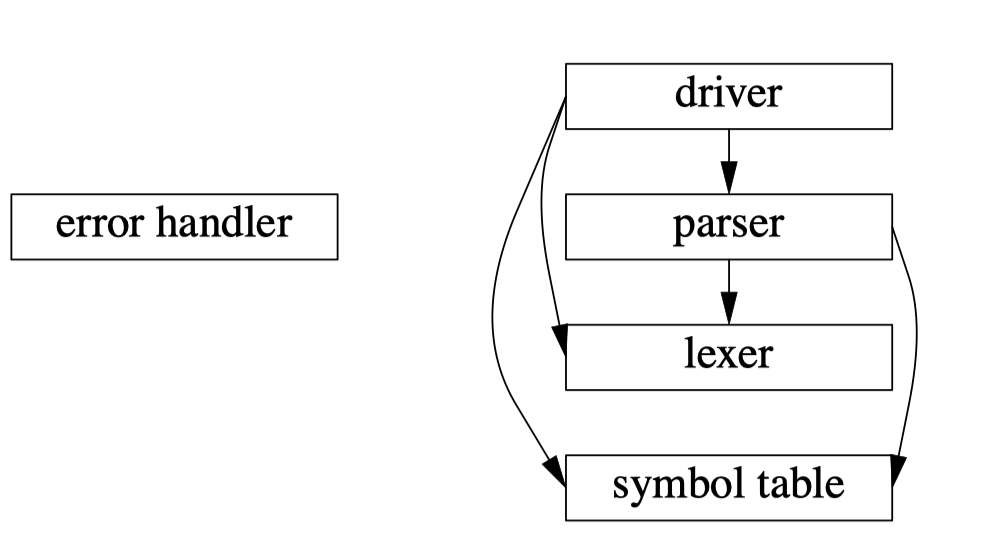
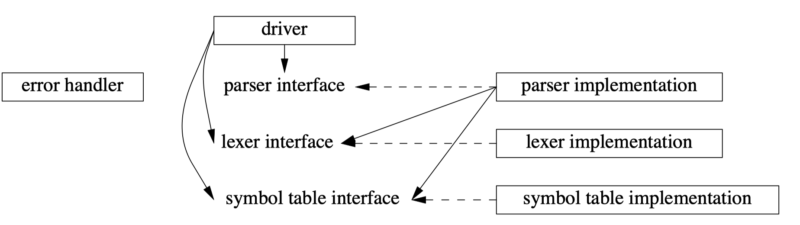

## Namespaces
- Any realistic program consists of a number of separate parts.
  - The logical ideal is *modularity*, that is, to keep separate things separate and to allow access to a *"module"* only through a well-specified interface.
  - In C++, modularity is expressed through combinations of other language facilities, such as functions, classes, and **namespaces**.
- The notion of a *namespace* is provided to directly represent the notion of a set of facilities that directly belong together.
- The members of a namespace are in the same scope and can refer to each other without special notation, whereas access from outside the namespace requires explicit notation.
- Ideally, a namespace should
  1. express a logically coherent set of features.
  2. not give users access to unrelated features.
  3. not impose a significant notational burden on users.
```c++
// Graph_lib:
class Shape { /* ... */ };
class Line : public Shape { /* ... */ };
class Poly_line: public Shape { /* ... */ }; // connected sequence of lines 
class Text : public Shape { /* ... */ }; // text label

Shape operator+(const Shape&, const Shape&); // compose

Graph_reader open(const charfi);  // open file of Shapes

// Text_lib:
class Glyph { /* ... */ };
class Word { /* ... */ }; // sequence of Glyphs 
class Line { /* ... */ }; // sequence of Words 
class Text { /* ... */ }; // sequence of Lines 

Filefi open(const charfi); // open text file 
Word operator+(const Line&, const Line&); // concatenate
``` 
```c++
namespace Graph_lib {
  class Shape { /* ... */ };
  class Line : public Shape { /* ... */ };
  class Poly_line: public Shape { /* ... */ }; // connected sequence of lines 
  class Text : public Shape { /* ... */ }; // text label

  Shape operator+(const Shape&, const Shape&); // compose

  Graph_reader open(const charfi);  // open file of Shapes
}

namespace Text_lib {
  class Glyph { /* ... */ };
  class Word { /* ... */ }; // sequence of Glyphs 
  class Line { /* ... */ }; // sequence of Words 
  class Text { /* ... */ }; // sequence of Lines 

  Filefi open(const charfi); // open text file 
  Word operator+(const Line&, const Line&); // concatenate
}
``` 
- Just `#include`ing those headers causes a slurry of error messages: `Line`, `Text`, and `open()` are defined twice in ways that a compiler cannot disambiguate.
- A namespace should express some logical structure: the declarations within a namespace should together provide facilities that unite them.

```c++
int f(); // global function

int g() {
  int f; // local variable; hides the global function
  f();  // error: we can’t call an int 
  ::f(); // OK: call the global function
}
``` 
- **The global scope is a namespace** and can be explicitly referred to using `::`.

***
- Explicit Qualification
  - A member can be declared within a namespace definition and defined later using the `namespacename::member-name` notation
  ```c++
  namespace Parser { // declaration
    double expr(bool);
    double term(bool);
    double prim(bool);
  }

  double val = Parser::expr();

  double Parser::expr(bool b) // definition
  {
    // ...
  }

  void Parser::logical(bool); // error : no logical() in Parser
  double Parser::trem(bool); // error : no trem() in Parser (misspelling) 
  double Parser::prim(int); // error : Parser ::prim() takes a bool argument (wrong type)
  ```
  - We **cannot declare a new member of a namespace outside** a namespace definition using the qualifier syntax.
***
- `using`-*Declarations*
  - When a name is frequently used outside its namespace, it can be a bother to repeatedly.
  - It is usually a good idea to keep local synonyms as local as possible to avoid confusion.
  - it is usually best to avoid `using`-directives **in header files**.
  ```c++
  #include<string>
  #include<vector>
  #include<sstream>

  std::vector<std::string> split(const std::string& s) // split s into its whitespace-separated substrings
  {
    std::vector<std::string> res;
    std::istringstream iss(s);
    for (std::string buf; iss>>buf;)
      res.push_back(buf);
    return res;
  }
  ``` 
  ```c++
  using std::string; // use "string" to mean "std::string"

  std::vector<string> split(const string& s) // split s into its whitespace-separated substrings
  {
    std::vector<string> res;
    std::istringstream iss(s);
    for (string buf; iss>>buf;)
      res.push_back(buf);
    return res;
  }
  ```
  - A `using`-*declaration* introduces a synonym into a scope.
  ```c++
  namespace N {
    void f(int);
    void f(string);
  };

  void g() {
    using N::f;
    f(789); // N::f(int)
    f("Bruce"); // N::f(string)
  }
  ``` 
  - When used for an overloaded name, a using-declaration applies to all the overloaded versions.
  
- `using`-*Directives*
  - We can use a `using`-*directive* to request that **every** name from a namespace be accessible
  - Care should be taken with global using-directives because overuse can lead to exactly the name clashes.
  - In particular, **don’t place a using-directive in the global scope in a header file** except in very specialized circumstances.
  ```c++
  using namespace std; // make every name from std accessible

  vector<string> split(const string& s) // split s into its whitespace-separated substrings
  {
    vector<string> res;
    istringstream iss(s);
    for (string buf; iss>>buf;)
      res.push_back(buf);
    return res;
  }
  ``` 
  - A `using`-directive makes names from a namespace available almost as if they had been declared outside their namespace.
***
- **Argument-Dependent Lookup**
  - If a function isn’t found in the context of its use, we **look in the namespaces of its arguments**.
  - This lookup rule (called *argument-dependent lookup* or simply **ADL**) doesn’t pollute the namespace the way a using-directive can.
  - It is especially useful for operator operands and template arguments, where explicit qualification can be quite cumbersome.
  - In the standard, the **rules** for argument-dependent lookup are phrased in terms of *associated namespaces*
    - If an argument is a class member, the associated namespaces are the class itself.
    - If an argument is a member of a namespace, the associated namespaces are the enclosing namespaces.
    - If an argument is a built-in type, there are no associated namespaces.
  ```c++
  namespace Chrono {
    class Date { /* ... */ };

    bool operator==(const Date&, const std::string&);

    std::string format(const Date&); // make string representation
    // ...
  }

  void f(Chrono::Date d, int i)
  {
    std::string s = format(d); // Chrono::format() 
    std::string t = format(i); // error : no format() in scope
  }

  void g(Chrono::Date d, std::string s) {
    if (d == s) {
      // ...
    }
    else if (d == "August 4, 1914") {
      // ...
    }
  }
  ``` 
  - We look for the function in the scope of the call (as ever) and in the namespaces of every argument and **do the usual overload resolution** of all functions we find.
  - For the call `d==s`, we look for `operator==` in the scope surrounding `f()`, in the std namespace (where `==` is defined for `string`), and in the Chrono namespace.
  ```c++
  namespace N {
    struct S { int i };
    void f(S);
    void g(S);
    void h(int);
  }

  struct Base {
    void f(N::S);
  };

  struct D : Base {
    void mf();

    void g(N::S x)
    {
      f(x); // call Base::f() 
      mf(x); // call D::mf()
      h(1); // error: no h(int) available
    }
  };
  ```
  - When a class member invokes a named function, other members of the same class and its base classes are preferred.
  ```c++
  namespace N {
    template<class T>
    void f(T, int); // N::f()
    class X { };
  }

  namespace N2 {
    N::X x;

    void f(N::X, unsigned);

    void g()
    {
      f(x,1); // calls N::f(X,int)
    }
  }
  ``` 
  - It may seem obvious to choose `N2::f()`, but that is not done. **Overload resolution is applied** and the best match is found: `N::f()` is the best match for f(x,1) because 1 is an `int` rather than an `unsigned`.
***
- Namespaces Are Open
  ```c++
  namespace A { int f(); }

  namespace A { int g(); }
  ``` 
  - **A namespace is open**; that is, you can add names to it **from several separate namespace** declarations.
  - The members of a namespace need not be placed contiguously in a single file.
  - Prefer to use many smaller namespaces rather than putting really major pieces of code into a single namespace.
  - we can distinguish parts of a namespace used as an **interface from its implementation.**

## Modularization and Interfaces
- Any realistic program consists of a number of separate parts. A distinct part is called a *module*.
- Ideally, **most of the details of a module are unknown to its users**.
- We make a distinction between a *module* and its *interface*.
  - **Specifying interfaces is a fundamental design activity**, a module can provide different interfaces to different users, and often an interface is designed long before the implementation

- Desk calculator can be viewed as composed of five parts:
  1. The parser, doing syntax analysis: `expr()`, `term()`, and `prim()`
  2. The lexer, composing tokens out of characters: `Kind`, `Token`, `Token_stream`, and `ts`
  3. The symbol table, holding (string,value) pairs: `table`
  4. The driver: `main()` and `calculate()`
  5. The error handler: `error()` and `number_of_errors`

- An arrow means "using."
 
- The parser directly relies on the lexer’s interface (only).
- The lexer simply implements the services advertised in its interface.
- A dashed line means "implements."
***
- Namespaces as Modules
  ```c++
  namespace Parser {
    double expr(bool);
    double prim(bool get) { /* ... */ }
    double term(bool get) { /* ... */ }
    double expr(bool get) { /* ... */ }
  }

  namespace Lexer {
    enum class Kind : char { /* ... */ };
    class Token { /* ... */ };
    class Token_stream { /* ... */ };

    Token_stream ts;
  }

  namespace Table {
    map<string,double> table;
  }

  namespace Driver {
    void calculate() { /* ... */ }
  }

  int main() { /* ... */ }

  namespace Error {
    int no_of_errors;
    double error(const string& s) { /* ... */ }
  }
  ```
  - The declarations of the parser from the desk calculator (§10.2.1) may be placed in a namespace `Parser`.
  - The driver cannot be completely put into a namespace because the language rules require `main()` **to be a global function**.
  - This use of namespaces **makes explicit what the lexer and the parser provide to a user**. Had I included the source code for the functions, this structure would have been obscured.
  ```c++
  double Parser::prim(bool get) { /* ... */ }
  double Parser::term(bool get) { /* ... */ }
  double Parser::expr(bool get) { /* ... */ }
  ``` 
  - `Parser` with the interface is separated from the implementation.
  - Users will see only the interface containing declarations. The implementation – in this case, the function bodies – will be placed "somewhere else".
***
- Implementations
  - For names in other namespaces, we have to choose among explicit qualification, using-declarations, and using-directives.
  ```c++
  double Parser::prim(bool get) // handle primaries
  {
    if (get) Lexer::ts.get(); // read next token

    switch (Lexer::ts.current().kind)
    {
      case Lexer::Kind::number: // floating-point constant
      {
        double v = Lexer::ts.current().number_value;
        Lexer::ts.get();
        return v;
      }
      case Lexer::Kind::name:
      {
        double& v = Table::table[Lexer::ts.current().string_value]; // find the corresponding 
        if (Lexer::ts.get().kind == Lexer::Kind::assign) v = expr(true); // ’=’ seen: assignment
        return v;
      }
      case Lexer::Kind::minus: // unary minus
        return −prim(true);
      case Lexer::Kind::lp:
      {
        auto e = expr(true);
        if (Lexer::ts.current().kind != Lexer::Kind::rp) return Error::error("')' expected");
        Lexer::ts.get(); // eat ’)’
        return e;
      }
      default:
        return Error::error("primary expected");
    }
  }
  ``` 
  - `Parser::prim()` provides a good test case for the use of namespaces because it uses each of the other namespaces.
  - There are 14 occurrences of `Lexer::`.
  - We didn’t use `Parser::` because that would be redundant within namespace ``.Parser
  ```c++
  using Lexer::ts; // saves eight occurrences of "Lexer::"
  using Lexer::Kind; // saves six occurrences of "Lexer::"
  using Error::error; // saves two occurrences of "Error ::" 
  using Table::table; // saves one occurrence of "Table::"

  double Parser::prim(bool get) // handle primaries
  {
    if (get) ts.get(); // read next token

    switch (ts.current().kind)
    {
      case Kind::number: // floating-point constant
      {
        double v = ts.current().number_value;
        ts.get();
        return v;
      }
      case Kind::name:
      {
        double& v = table[ts.current().string_value]; // find the corresponding 
        if (ts.get().kind == Kind::assign) v = expr(true); // ’=’ seen: assignment
        return v;
      }
      case Kind::minus: // unary minus
        return −prim(true);
      case Kind::lp:
      {
        auto e = expr(true);
        if (ts.current().kind != Kind::rp) return error("')' expected");
        ts.get(); // eat ’)’
        return e;
      }
      default:
        return error("primary expected");
    }
  }
  ``` 
  - The tradeoff among explicit qualification, `using`-declarations, and `using`-directives must be made on a case-by-case basis.
  - The rules of thumb are:
    - If some qualification is really common for **several** names, use a `using`-*directive* for that namespace.
    - If some qualification is common for a **particular** name from a namespace, use a `using`-*declaration* for that name.
    - If a qualification for a name is **uncommon, use explicit** qualification to make it clear from where the name comes.
    - **Don’t use explicit qualification for names in the same namespace** as the user.
***
- Interfaces and Implementations
  - In fact, `Parser` is not the ideal interface. Parser declares the set of declarations that is needed to write the individual parser functions conveniently.
  ```c++
  namespace Parser { // user interface
    double expr(bool);
  }
  ``` 
  - The `Parser`’s interface to its users should be far simpler.
  - The namespace `Parser` used to provide two things:
    1. The common environment for the functions implementing the parser
    2. The external interface offered by the parser to its users
  ```c++
  namespace Parser {// user interface double
    expr(bool);
  }

  namespace Parser_impl { // implementer interface
    using namespace Parser;

    double prim(bool);
    double term(bool);
    double expr(bool);

    using namespace Lexer; // use all facilities offered by Lexer
    using Error::error;
    using Table::table;
  }
  ``` 
  - It's not necessary to give interface and the implementation different names since namespaces are open.
  - For larger programs, we lean toward introducing `_impl` interfaces.

## Composition Using Namespaces
- Convenience vs. Safety
  ```c++
  int k;

  void f1()
  {
    int i = 0; 
    using namespace X; // make names from X accessible 
    i++; // local i
    j++; // X::j 
    k++; // error : X’s k or the global k?
    ::k++; // the global k 
    X::k++; // X’s k
  }

  void f2()
  {
    int i = 0;
    using X::i; // error: i declared twice in f2()
    using X::j;
    using X::k; // hides global k

    i++;
    j++; // X::j
    k++; // X::k
  }
  ```
  - A `using`-declaration adds a name to a local scope. **A `using`-directive does not; it simply renders names accessible** in the scope in which they were declared.
  - A locally declared name hides nonlocal declarations of the same name.
  - Global names are not given preference over names from namespaces made accessible in the global scope. (`k++` in `f1()`)
***
- Namespace Aliases
  ```c++
  namespace American_Telephone_and_Telegraph { // too long
    // ...
  }

  American_Telephone_and_Telegraph::String s3 = "Grieg";
  American_Telephone_and_Telegraph::String s4 = "Nielsen";
  ``` 
  - Long namespace names can be impractical in real code.
  ```c++
  namespace ATT = American_Telephone_and_Telegraph;

  ATT::String s3 = "Grieg";
  ATT::String s4 = "Nielsen";
  ``` 
  - This dilemma can be resolved by providing a short **alias** for a longer namespace name
  - This can immensely simplify the task of replacing one version of a library with another.
***
- **Namespace Composition**
  ```c++
  namespace His_string {
    class String { /* ... */ };
    String operator+(const String&, const String&);
    String operator+(const String&, const char*);
    void fill(char);
    // ...
  }

  namespace Her_vector {
    template<class T>
    class Vector { /* ... */ };
    // ...
  }

  namespace My_lib {
    using namespace His_string;
    using namespace Her_vector;
    void my_fct(String&);
  }

  void f() {
    My_lib::String s = "Byron"; // finds My_lib::His_string::String
    // ...
  }

  using namespace My_lib;
  void g(Vector<String>& vs) {
    // ...
    my_fct(vs[5]);
    // ... 
  }
  ```
  - If an explicitly qualified name (such as `My_lib::String`) isn’t declared in the namespace mentioned, **the compiler looks in namespaces mentioned in `using`-directives**
***
- Composition and Selection
  - Combining composition (by `using`-directives) with selection (by `using`-declarations) yields the flexibility needed for most real-world examples.
  ```c++
  namespace His_lib {
    class String { /* ... */ };

    template<class T>
    class Vector { /* ... */ };
    // ...
  }

  namespace Her_lib {
    template<class T>
    class Vector { /* ... */ };
    class String { /* ... */ };
    // ...
  }

  namespace My_lib {
    using namespace His_lib; // everything from His_lib 
    using namespace Her_lib; // everything from Her_lib

    using His_lib::String; // resolve potential clash in favor of His_lib
    using Her_lib::Vector; // resolve potential clash in favor of Her_lib

    template<class T>
    class List { /* ... */ };  // additional stuff
    // ...
  }
  ``` 
  - Names explicitly declared there take priority over names made accessible in another scope by a using-directive
  ```c++
  namespace Lib2 {
    using namespace His_lib; // everything from His_lib
    using namespace Her_lib; // everything from Her_lib

    using His_lib::String; // resolve potential clash in favor of His_lib
    using Her_lib::Vector; // resolve potential clash in favor of Her_lib

    using Her_string = Her_lib::String; // rename
    template<class T>
      using His_vec = His_lib::Vector<T>; // rename

    template<class T>
    class List { /* ... */ }; // additional stuff
    // ...
  }
  ``` 
  - Usually, we prefer to leave a name unchanged when including it into a new namespace.
  - Sometimes a new name is needed or simply nice to have.
***
- Namespaces and Overloading
  - Function overloading works across namespaces.
  ```c++
  namespace A {
    void f(int); // ...
  }

  namespace B {
    void f(char); // ...
  }
  ``` 
  ```c++
  #include "A.h"
  #include "B.h"

  using namespace A;
  using namespace B;

  void g()
  {
    f('a'); // calls the f() from B.h
  }
  ```
***
- **Versioning**
  - The toughest test for many kinds of interfaces is to cope with a sequence of new releases (versions).
  - There is a way of selecting between two versions that simply and obviously guarantees that a user sees exactly one particular version. This is called an *inline namespace*.
  ```c++
  namespace Popular {

    inline namespace V3_2 { // V3_2 provides the default meaning of Popular
      double f(double);
      int f(int);
      template<class T>
      class C { /* ... */ };
    }

    namespace V3_0 {
      // ...
    }

    namespace V2_4_2 {
      double f(double);
      template<class T>
      class C { /* ... */ };
    }
  }
  ``
  ```c++
  using namespace Popular;

  void f()
  {
    f(1); // Popular::V3_2::f(int) 
    V3_0::f(1); // Popular::V3_0::f(double)
    V2_4_2::f(1); // Popular::V2_4_2::f(double)
  }

  template<class T>
  Popular::C<T*> { /* ... */ };
  ```
  - Popular contains three subnamespaces, each defining a version.
  - The `inline` specifies that `V3_2` is the **default** meaning of `Popular`.
  - Naively using this way of handling versioning would **involve a lot of replication**.
  ```c++
  // file V3_common:
    // ... lots of declarations ...

  // file V3_2:
  namespace V3_2 { // V3_2 provides the default meaning of Popular
    double f(double);
    int f(int);
    template<class T>
    class C { /* ... */ };
    #include "V3_common"
  }

  // file V3_0.h:
  namespace V3_0 {
    #include "V3_common"
  }

  // file Popular.h:
  namespace Popular {
    inline 
    #include "V3_2.h"
    #include "V3_0.h"
    #include "V2_4_2.h"
  }
  ```
  - The replication can be minimized using `#include` tricks.
  - It's not recommended such intricate use of header files unless it is really necessary.
***
- Nested Namespaces
  - Nested namespaces are allowed.
  ```c++
  void h();

  namespace X {
    void g();
    // ...
    namespace Y {
      void f();
      void ff();
      // ... 
    }
  }

  void X::Y::ff()
  {
    f();
    g();
    h();
  }

  void X::g()
  {
    f();  // error: no f() in X 
    Y::f();  // OK
  }

  void h()
  {
    f(); // error: no global f() 
    Y::f(); // error: no global Y 
    X::f(); // error: no f() in X
    X::Y::f(); // OK
  }
  ``` 
  - The usual scope and qualification rules apply.
***
- Unnamed Namespaces
  - Sometimes a namespace is used simply protect against the possibility of name clashes. For this case, we can simply **leave the namespace without a name**.
  - Consequently, an unnamed namespace has an **implied using-directive**.
  ```c++
  #include "header.h"
  namespace {
    int a;
    void f() { /* ... */ }
    int g() { /* ... */ }
  }
  ``` 
***
- C Header
  - **We consider nonlocal using-directives primarily a transition tool**. We also use them for essential foundation libraries, such as the ISO C++ standard library.
  ```c++
  #include <stdio.h>

  int main()
  {
    printf("Hello, world!\n");
  }
  ```
  - It's the canonical first C program.
  - One way to provide the standard C I/O facilities in a namespace would be to **place the declarations from the C header `stdio.h` in a namespace `std`**.
  ```c++
  // cstdio:
  namespace std {
    int printf(const char* ... );
    // ...
  }
  ``` 
  ```c++
  // stdio.h:
  #include<cstdio>
  using namespace std;
  ```
  - This `<stdio.h>` makes the Hello, world! program compile.
  ```c++
  #include<vector> // carefully avoids polluting the global namespace 
  vector v1 // error: no "vector" in global scope 
  #include<stdio.h> // contains a "using namespace std;" 
  vector v2; // oops: this now works
  ``` 
  - Unfortunately, the using-directive makes every name from namespace std accessible in the global namespace.
  ```c++
  // stdio.h:
  #include<cstdio>
  using namespace std:printf;
  ``` 
  - Another advantage is that the `using`-declaration for `printf()` prevents a user from (accidentally or deliberately) defining a nonstandard `printf()` in the global scope.