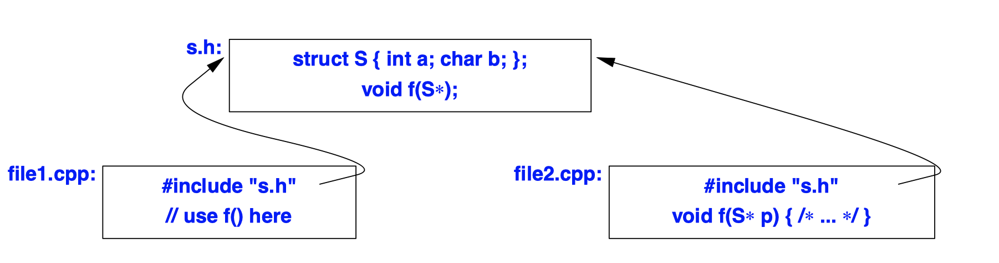
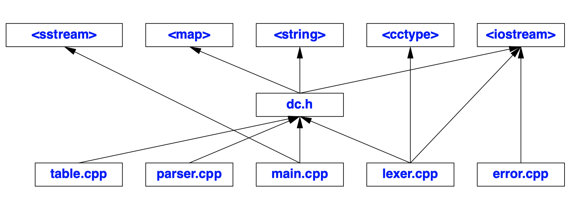
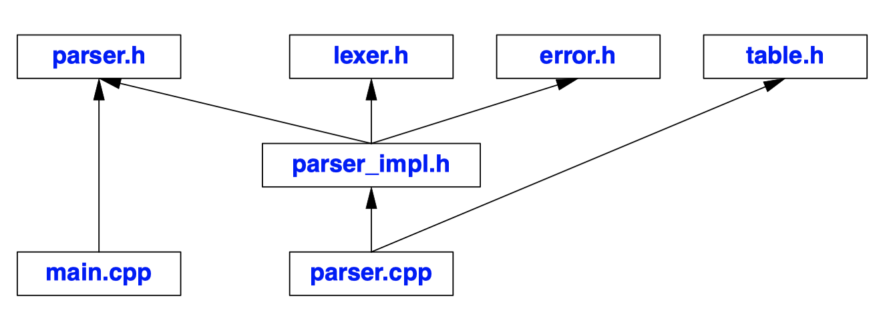
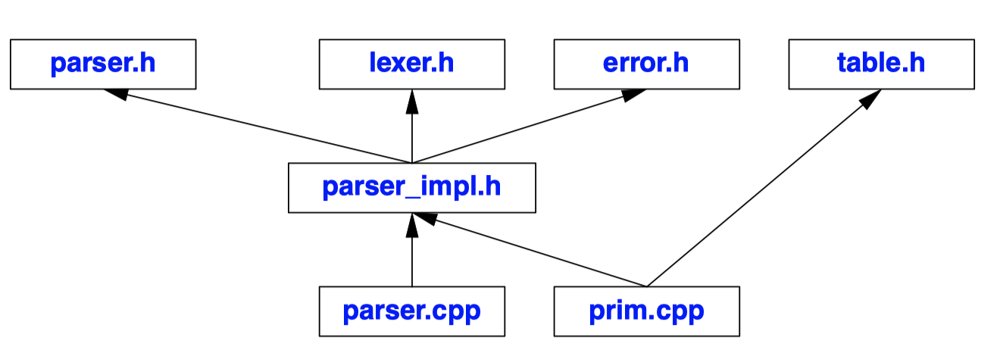

## Separate Compilation
- We can represent the program as a set of (source code) files where each file contains one or more logical components.
- The organization of a program into source files is commonly called the *physical structure*
- We aim for a clean separation of interfaces and implementations.
- **A file** is the traditional unit of storage and the traditional **unit of compilation**.
- The way a program is organized into files can help emphasize its logical structure, help a human reader understand the program, and help the compiler enforce that logical structure.
- **The amount of time spent recompiling can be significantly reduced by partitioning the program** into files of suitable size.
- To enable separate compilation, the programmer must supply declarations providing the type information needed to analyze a translation unit in isolation from the rest of the program
- Source code files --> preprocessor --> (translation unit) --> compiler --> (object file) --> **linker** / loader --> program
  - A user presents a source file to the compiler.
  - The file is then preprocessed; that is, macro processing is done and `#include` directives bring in headers.
  - The result of preprocessing is called a *translation unit*, which is unit is what the compiler proper works on.
  - The compiler that looks at only one file at a time.
  - The *linker* is the program that binds together the separately compiled parts.
    - A linker is sometimes called a loader.
  - Linking can be done completely before a program starts to run. Alternatively, new code can be added to the running program ("dynamically linked") later.
  - A program is a collection of separately compiled units combined by a linker.

## Linkage
- **Names across all translation unit** must be used consistently unless they are explicitly specified to be local.
- An object must be defined exactly once in a program. **It may be declared many times**, but the types must **agree exactly**.
- A variable defined without an initializer in the global or a namespace scope is initialized by default.
- Global variables are in general best avoided. It is hard to know where in a program they are used.
  - If you must use global variables, at least restrict their use to a single source file.
    1. Place declarations in an unnamed namespace.
    2. Declare an entity static.
  - An unnamed namespace can be used to make names local to a compilation unit.
  - `static` means "use internal linkage".
- To ensure consistency, place aliases, `consts`, `constexpr`s, and `inline`s in header files
- As a rule of thumb, a header may contain:
  
|                                     |                                                           |
|-------------------------------------|-----------------------------------------------------------|
| Named namespaces                    | namespace N { /* ... */ }                                 |
| `inline` namespaces                 | inline namespace N { /* ... */ }                          |
| Type definitions                     | struct Point { int x, y; };                               |
| Template declarations               | template<class T> class Z;                                |
| Template definitions                 | template<class T> class V { /* ... */ };                  |
| Function declarations               | extern int strlen(const char*);                           |
| `inline` function definitions        | inline char get(char* p) { /* ... */ }                    |
| `constexpr` function definitions     | constexpr int fac(int n) { return (n<2) ? 1 : fac(n−1); } |
| Data declarations                   | extern int a;                                             |
| `const` definitions                  | const float pi=3.141593;                                   |
| `constexpr` definitions              | constexpr float pi2=pi*pi;                                 |
| Enumerations                        | enum class Light { red, yellow, green };                  |
| Name declarations                   | class Matrix;                                             |
| Type aliases                        | using value_type = long;                                  |
| Compile-time assertion              | static_assert(4<=sizeof(int),"small ints");               |
| Include directives                  | #include<algorithm>                                       |
| Macro definitions                    | #define VERSION 12.03                                      |
| Conditional compilation  directives | #ifdef __cplusplus                                        |
| Comments                            | /* check for end of file */                                |

- Conversely, a header should never contain:

|                              |                                |
|------------------------------|--------------------------------|
| Ordinary function definitions | char get(char*p) {return*p++;} |
| Data definitions              | int a;                         |
| Aggregate definitions         | shorttbl[]={1,2,3};            |
| Unnamed namespaces           | namespace { /* ... */ }        |
| `using`-directives           | using namespace Foo;           |

- Header files are conventionally suffixed by `.h`, and files containing function or data definitions are suffixed by `.cpp`. Other conventions, such as `.c`, `.C`, `.cxx`, `.cc`, `.hh`, and `hpp` are also found.

```c++
// file1.cpp:
  int x = 1;
  int f() { /* do something */ }

// file2.cpp:
  extern int x;
  int f();
  void g() { x = f(); }
```
- The keyword `extern` indicates that **the declaration of `x` in `file2.cpp` is (just) a declaration and not a definition (no initial value provided here)**.
- Had `x` been initialized, extern would simply be ignored.
```c++
// file1.cpp:
  int x = 1;
  int b = 1;
  extern int c;

// file2.cpp:
  int x; // means "intx=0;"
  extern double b;
  extern int c;
```
- There are three errors here:
  - `x` is defined twice
  - `b` is declared twice with different types
  - `c` is declared twice but not defined
- These kinds of errors **(linkage errors) cannot be detected by a compiler**. Many, however, are detectable by the linker.
  - the double definition of `x` could be found.
  - inconsistent declarations o `b` are uncaught on popular implementations
  - missing definition of `c` is typically **only caught if `c` is used**.
```c++
static int x1 = 1; // internal linkage: not accessible from other translation units
const char x2 = 'a'; // internal linkage: not accessible from other translation units
```
```c++
int x1 = 1; // external linkage: accessible from other translation units
extern const char x2 = 'a'; // external linkage: accessible from other translation units
```
- A name that can be used in translation units different from the one in which it was defined is said to have *external linkage*.
  - A `const` can be given external linkage by an explicit declaration (`extern const`)
- A name that can be referred to only in the translation unit in which it is defined is said to have *internal linkage*.
  - The keyword `static` means "not accessible from other source files"
  - The keyword `const` implies default internal linkage,
  - By default, `const` objects, `constexpr` objects, type aliases, and anything declared `static`  in a namespace scope **have internal linkage.**
- **Names that a linker does not see**, such as local variables, are said to have *no linkage*.
```c++
// h.h:
  inline int next(int i) { return i+1; }

// file1.cpp:

  #include "h.h"
  int h(int i) { return next(i); } // fine

// file2.cpp:
  #include "h.h"
  // ...
```
- An `inline` function must be defined identically in every translation unit.
  - combination of external linkage and inlining is banned
  - We keep inline function definitions consistent by using header files
***
- Header Files
  - A given class, enumeration, and template, etc., must be defined exactly once in a program.
  - The rule is commonly referred to as *the one-definition rule* ("the ODR"). That is, two definitions of a `class`, `template`, or `inline` function are accepted as examples of the same unique definition if and only if
    1. they appear in different translation units.
    2. they are token-for-token identical.
    3. the meanings of those tokens are the same in both translation units.
  - The best defense against tis to **make headers as self-contained as possible**.
  ```c++
  // file1.cpp:
    struct S1 { int a; char b; };

    struct S1 { int a; char b; }; // error : double definition
  ```
  ```c++
  // file1.cpp:
    struct S1 { int a; char b; };
  // file2.cpp:
    struct S2 { int a; char bb; }; // error: classes that differ in a member name.
  ```
  ```c++
  // file1.cpp:
    typedef int X;
    struct S1 { X a; char b; };
  // file2.cpp:
    typedef char X;
    struct S2 { X a; char b; }; // error: meaning of the name X has sneakily been made to differ
  ```
  ```c++
  // file1.cpp:
    struct S { int a; char b; };
    void f(S*);

  // file2.cpp:
    struct S { int a; char b; };
    void f(S* p) { /* ... */ }
  ``` 
  - The ODR says that the final example is valid.
  - However, it is unwise to write out a definition twice like that.
  ```c++
  // s.h:
    struct S { int a; char b; };
    void f(S*);

  // file1.cpp:
    #include "s.h"
    // use f() here

  // file2.cpp:
    #include "s.h"
    void f(S* p) { /* ... */ }
  ```
   
  - The intent of the ODR is to allow **inclusion of a class definition in different translation units from a common source file.**
***
- Standard-Library Headers
  - No suffix is needed for standard-library headers. We use the `#include<...>` syntax rather than `#include"..."`.
  - For each **C** standard-library header `<X.h>`, there is a corresponding standard C++ header `<cX>.`
  ```c++
  #ifdef __cplusplus // for C++ compilers only
  namespace std { // the standard library is defined in namespace std
    extern "C" { // stdio functions have C linkage
  #endif
      /* ... */
      int printf(const char*, ...);
      /* ... */
  #ifdef __cplusplus
    }
  }
  // ...
  using std::printf; // make printf available in global namespace
  // ...
  #endif
  ``` 
  - `#include<cstdio>` provides what `#include<stdio.h>` does.
  - Linkage and namespace issues must be addressed to allow C and C++ to share a header.
***
- Linkage to Non-C++ Code
  - Typically, a C++ program contains parts written in other languages.
  - Different languages and different implementations of the same language may differ in their use of machine. To help, one can specify a *linkage convention* to be used in an extern declaration.
  ```c++
  extern "C" char* strcpy(char*, const char*);
  ``` 
  - This declares the C and C++ standard-library function `strcpy()` and specifies that it should be linked according to the C linkage conventions.
  - C in extern **"C" names a linkage convention and not a language**.
    - `extern "C"` is also used to link to Fortran
    - A function declared extern "C" still obeys the C++ type-checking and argument conversion rules
  ```c++
  extern "C" {
    char* strcpy(char*, const char*);
    int strcmp(const char*, const char*);
    int strlen(const char*);
    // ...
  }

  extern "C" {
    #include <string.h>
  }
  ``` 
  - There is a mechanism to specify linkage to a group of declarations.
  - This construct, commonly called a *linkage block*, can be used to enclose a complete C header to make a header suitable for C++ use
  - This technique is commonly used to produce a C++ header from a C header.
  ```c++
  extern "C" { // any declaration here, for example: 
    int g1; // definition
    extern int g2; // declaration, not definition
  }
  ```
  - Any declaration can appear within a linkage block.
  - `g1` is still a global variable.
  ```c++
  extern "C" int g3; // declaration, not definition
  extern "C" { int g4; } // definition
  ``` 
  - **To declare but not define** a variable, you must **apply the keyword `extern` directly** in the declaration.
***
- Linkage and Pointers to Functions
  ```c++
  typedef int (*FT)(const void*, const void*); // FT has C++ linkage

  extern "C" {
    typedef int (*CFT)(const void*, const void*); // CFT has C linkage
    void qsort(void* p, size_t n, size_t sz, CFT cmp); // cmp has C linkage
  }

  void isort(void* p, size_t n, size_t sz, FT cmp); // cmp has C++ linkage
  void xsort(void* p, size_t n, size_t sz, CFT cmp);  // cmp has C linkage
  extern "C" void ysort(void* p, size_t n, size_t sz, FT cmp); // cmp has C++ linkage

  int compare(const void*, const void*); // compare() has C++ linkage
  extern "C" int ccmp(const void*, const void*); // ccmp() has C linkage

  void f(char* v, int sz)
  {
    qsort(v,sz,1,&compare); // error
    qsort(v,sz,1,&ccmp); // OK

    isort(v,sz,1,&compare); // OK
    isort(v,sz,1,&ccmp); // error
  }
  ```  
  - If the two implementations of the two languages share linkage conventions and function call mechanisms, such commonality cannot in general be assumed.
  - `std::function` or lambdas with any form of **capture cannot cross the language barrier**.

## Using Header Files
- There are a few alternative ways of expressing the physical structure
  1. Single-Header Organization
  2. Multiple-Header Organization
- There are many factors to choose the number of headers.
  - If your IDE can't look at several files simultaneously, then using many headers becomes less attractive.
  - The choice between the two styles of organization occurs (repeatedly) for the parts that make up the program.
- If you partition the declarations of a large program into the logically minimal-size headers, you can easily get an unmanageable mess of hundreds of files.
- In a large projects, hundreds of files (not counting standard headers) are the norm. Tools, such as *dependency analysers*, can be of great help, but there is little they can do for compiler and linker performance
***
- Single-Header Organization
  - This method partitions a program to a suitable number of `.cpp` files and declares the types,functions, classes, etc **in a single `.h` file** that each `.cpp` file #includes.
  - This is initial organization especially for a simple program.
  - For the calculator program, we might use five `.cpp` files – `lexer.cpp`, `parser.cpp`, `table.cpp`, `error.cpp`, and `main.cpp` – to hold function and data definitions.
  ```c++
  // dc.h:
  #include <map>
  #include<string>
  #include<iostream>

  namespace Parser {
    double expr(bool);
    double term(bool);
    double prim(bool);
  }

  namespace Lexer {
    enum class Kind : char {
      name, number, end,
      plus='+', minus='−', mul='*', div='/', print=';', assign='=', lp='(', rp=')'
    };

    struct Token {
      Kind kind;
      string string_value;
      double number_value;
    };

    class Token_stream {
    public:
      Token(istream& s) : ip{&s}, owns(false), ct{Kind::end} { }
      Token(istream* p) : ip{p}, owns{true}, ct{Kind::end} { }

      ~Token() { close(); }

      Token get(); // read and return next token
      Token& current(); // most recently read token

      void set_input(istream& s) { close(); ip = &s; owns=false; }
      void set_input(istream* p) { close(); ip = p; owns = true; }
    private:
      void close() { if (owns) delete ip; }

      istream* ip; // pointer to an input stream
      bool owns; // does the Token_stream own the istream?
      Token ct {Kind::end}; // current_token
    };

    extern Token_stream ts;
  }

  namespace Table {
    extern map<string,double> table;
  }

  namespace Error { 
    extern int no_of_errors;
    double error(const string& s);
  }

  namespace Driver {
    void calculate();
  }
  ```
  - The keyword `extern` is used for every variable declaration to **ensure that multiple definitions do not occur**.
  - We added standard-library headers as needed for the declarations in dc.h
  ```c++
  // lexer.cpp:

  #include "dc.h"
  #include <cctype>
  #include <iostream> // redundant: in dc.h

  Lexer::Token_stream ts;

  Lexer::Token Lexer::Token_stream::get() { /* ... */ }
  Lexer::Token& Lexer::Token_stream::current() { /* ... */ }
  ``` 
  ```c++
  // parser.cpp:

  #include "dc.h"

  double Parser::prim(bool get) { /* ... */ }
  double Parser::term(bool get) { /* ... */ }
  double Parser::expr(bool get) { /* ... */ }
  ```
  ```C++
  // table.cpp:

  #include "dc.h"
  
  std::map<std::string,double> Table::table;
  ```
  ```c++
  // error.cpp:

  #include "dg.h" // any more #includes or declarations

  int Error::no_of_errors;
  double Error::error(const string& s) { /* ... */ }
  ```
  ```c++
  // main.cpp:

  #include "dc.h"
  #include <sstream>
  #include <iostream> // redundant: in dc.h
  
  void Driver::calculate() { /* ... */ }

  int main(int argc, char* argv[]) { /* ... */ }
  ```
  - I used explicit qualification, `Lexer::`, to **avoid the possibility of accidentally adding new members** to `Lexer`.
  - Using headers in this manner ensures that every declaration in a header will at be included in the file containing its definition.
    - This ensures that the compiler will detect any inconsistencies in the types specified for a name.
    - If a definition is missing, the linker will catch the problem. If a declaration is missing, some `.cpp` files will fail to compile.
  
  - For tiny programs, the structure can be simplified by moving all `#include` directives to the common header.
  - This single-header style of physical partitioning is most useful when the program is small and its parts are not intended to be used separately
  - **A change to the common header forces recompilation of the whole program.** Thus, the single-header-file approach is unworkable in a conventional file-based development environment.
***
- Multiple-Header Organization
  - This physical structure lets **each logical module have its own header** defining the facilities it provides.
    - Each `.cpp` file includes its own `.h` file and usually also other `.h` files that specify what it needs from other modules.
    - The interface for users is put into its `.h` file.
    - The interface for implementers is put into a file suffixed `_impl.h`.
    - The module's definitions of functions, variables, etc., are placed in `.cpp` files
  - The fundamental reason for using this type of organization is that it **provides a better localization of concerns**.
    - It's easier to focus on a relatively small chunk of code.
    - The organization makes it easy to determine exactly what the parser code depends on and to ignore the rest.
  - The multiple-header organization allows us to work successfully "from the inside out" with only a local perspective.
  ```c++
  // parser.h:

  namespace Parser { // interface for users
    double expr(bool get);
  }
  ``` 
  ```c++
  // parser_impl.h:

  #include "parser.h"
  #include "error.h"
  #include "lexer.h"

  using Error::error;
  using namespace Lexer;

  namespace Parser { // interface for implementers
    double prim(bool get);
    double term(bool get); 
    double expr(bool get);
  }
  ```
  ```c++
  // parser.cpp:

  #include "parser_impl.h"
  #include "table.h"

  using Table::table;

  double Parser::prim(bool get) { /* ... */ }
  double Parser::term(bool get) { /* ... */ }
  double Parser::expr(bool get) { /* ... */ }
  ```
  - The user's interface in header `parser.h` is `#included` in `parser_impl.h` to give the compiler a chance to check consistency.
   
  - In fact, `#include "table.h"` is used by just one function, `prim()`, so if we were really keen on minimizing dependencies we could place `prim()` in its own `.cpp` file
   
  - For realistically sized modules, it is common to `#include` extra files where needed for individual functions.
  - Furthermore, it is not uncommon to have more than one `_impl.h`.
  ```c++
  // error.h:
  #include<string>

  namespace Error {
    int Error::number_of_errors;
    double Error::error(const std::string&);
  }
  ```
  ```c++
  // error.cpp:
  #include "error.h"

  int Error::number_of_errors;
  double Error::error(const std::string&) { /* ... */ }
  ```
  ```c++
  // lexer.h:

  #include<string>
  #include<iostream>

  namespace Lexer {
    enum class Kind : char {/* ... */ };

    class Token { /* ... */ };
    class Token_stream { /* ... */ };

    extern Token_stream is;
  }
  ```
  ```c++
  // lexer.cpp:

  #include "lexer.h"
  #include "error.h"
  #include <iostream> // redundant: in lexer.h
  #include <cctype> 

  Lexer::Token_stream is; // defaults to "read from cin"

  Lexer::Token Lexer::Token_stream::get() { /* ... */ };
  Lexer::Token& Lexer::Token_stream::current() { /* ... */ };
  ```
  ```c++
  // table.h:

  #include <map>
  #include <string>

  namespace Table {
    extern std::map<std::string,double> table;
  }
  ```
  ```c++
  // table.cpp:

  #include "table.h"

  std::map<std::string,double> Table::table;
  ```
  ```c++
  // main.cpp:

  #include "parser.h"
  #include "lexer.h" // to be able to set ts
  #include "error.h"
  #include "table.h" // to be able to predefine names
  #include <sstream> // to be able to put main()'s arguments into a string stream

  namespace Driver {
    void calculate() { /* ... */ }
  }

  int main(int argc, char* argv[]) { /* ... */ }
  ```
  - The remaining calculator modules are so small that they don't require their own `_impl.h` files.
  - Because we assume that every header may be `#included` in several `.cpp` files, **we must separate the declaration of `table` from its definition**.
***
- Include Guards
  - Viewed from the program as a whole, many of the declarations needed to make each logical module complete are redundant
  - We have two choices
    1. reorganize our program to remove the redundancy. (The approach is tedious and impractical for realistically sized programs.)
    2. find a way to allow repeated inclusion of headers.
  ```c++
  // error.h:
  #ifndef CALC_ERROR_H
  #define CALC_ERROR_H

  namespace Error {
    // ...
  }

  #endif // CALC_ERROR_H
  ``` 
  - The traditional solution is to insert include guards in headers. 
  - This is a piece of macro hackery, but it works and it is pervasive in the C and C++ worlds.
  - It can cause unnecessarily long compile time, and it can bring lots of declarations and macros into scope. Remember that **headers should be included only when necessary**.

## Programs
- A program is a collection of separately compiled units combined by a linker.
- A program must contain exactly one function called `main()`. A program can only provide one of two alternatives `main()`.
  1. `int main() { /* ... */ }`
  2. `int main(int argc, char* argv[]) { /* ... */ }`
- A nonzero return value from `main()` indicates an error.
***
- Initialization of Nonlocal Variables
  ```c++
  double x = 2; // nonlocal variables
  double y;
  double sqx = sqrt(x+y);
  ```
  - In principle, **a variable defined outside any function is initialized before `main()` is invoked**.
    - Nonlocal variables in a translation unit are initialized in their definition order.
    - If such a variable has **no explicit initializer**, it is **initialized to the default for its type**.
    - The default initializer value for built-in types and enumerations is 0.
  - There is **no guaranteed order of initialization of global variables in different translation units**.
  - It is not possible to catch an exception thrown by the initializer of a global variable
  ```c++
  int& use_count()
  {
    static int uc = 0;
    return uc;
  }

  void f()
  {
    cout << ++use_count(); // read and increment
    // ...
  }
  ```
  - A function returning a reference to `static` is a good alternative to a global variable.
  - Like other uses of `static`, **this technique is not thread-safe**.
    - The initialization of a local static is thread-safe.
    - However, the ++ can lead to a data race.
  - *Constant expressions* cannot depend on other translation units and do not require run-time initialization. Such variables are therefore safe to use in all cases.
***
- Initialization and Concurrency
  ```c++
  int x = 3;
  int y = sqrt(++x);
  ``` 
  - `y`'s initializer is not a constant expression, so `y` is **not initialized until run time**.
  - The flaw in this argument is that if multiple threads are used
    - Each thread will do the run-time initialization.
    - `sqrt(++x)` in one thread may happen before or after the other thread manages to increment x. So, the value of y may be sqrt(4) or sqrt(5).
  - To avoid such problems
    - Minimize the use of statically allocated objects and keep their initialization as simple as possible.
    - Avoid dependencies on dynamically initialized objects in other translation units.
  - To avoid data races in initialization
    - Initialize using constant expressions
    - Initialize using expressions without side effects.
    - Initialize in a known single-threaded "startup phase" of computation.
    - Use some form of mutual exclusion
***
- Program Termination
  - A program can terminate in several ways
    1. By returning from `main()`
    2. By calling `exit()`
    3. By calling `abort()`
    4. By throwing an uncaught exception
    5. By violating `noexcept`
    6. By calling `quick_exit()`
  - The `exit()`, `abort()`, `quick_exit()`, `atexit()`, and `at_quick_exit()` functions are declared in <cstdlib>.
  - If a program is terminated using the standard-library function `void exit(int);`
    - **the destructors for constructed static objects are called**.
    - `exit()` does not terminate a program immediately.
    - Calling `exit()` in a destructor may cause an infinite recursion.
    - `exit()`'s argument is returned to "the system" as the value of the program. Zero indicates successful completion.
  - If the program is terminated using `abort()`, destructors are not called.
  ```c++
  void my_cleanup();
  
  void somewhere()
  {
    if (atexit(&my_cleanup)==0) {
      // my_cleanup will be called at normal termination
    }
    else {
      // oops: too many atexit functions
    }
  }
  ``` 
  - `atexit()` offers **the possibility** to have code executed at program termination.
    - An argument to atexit() cannot take arguments or return a result,
    - A nonzero value returned by atexit() indicates that the limit is reached.
  - The `quick_exit()` function is like `exit()` except that it does not invoke any destructors.
  - Register functions to be invoked by quick_exit() using at_quick_exit().