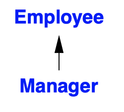
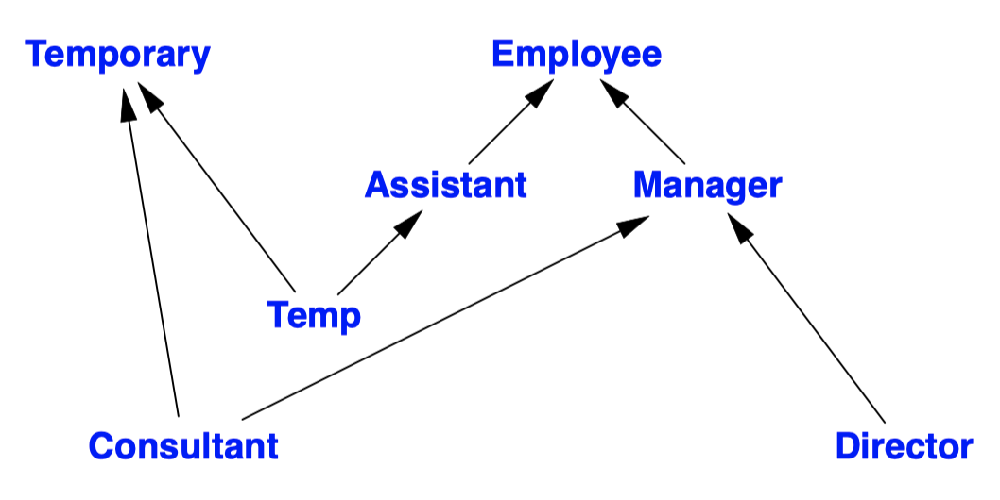
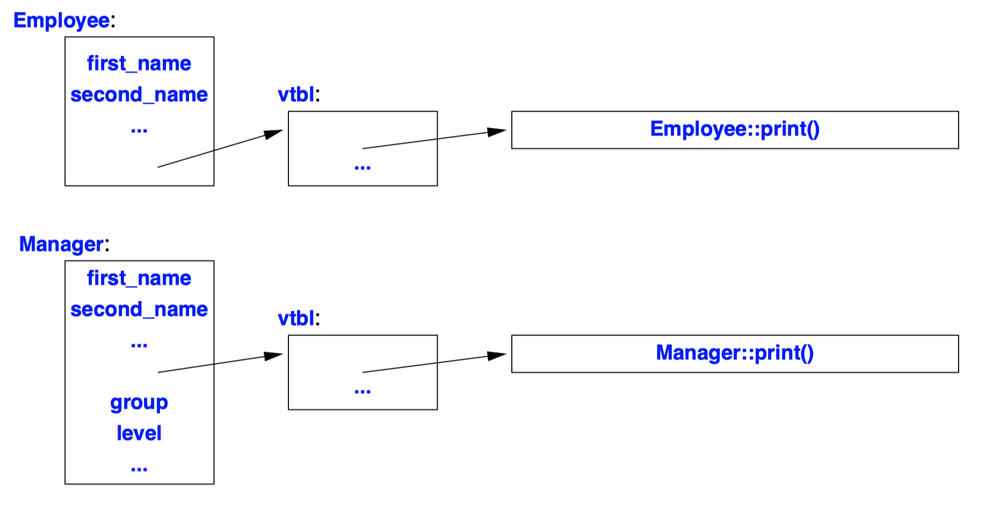
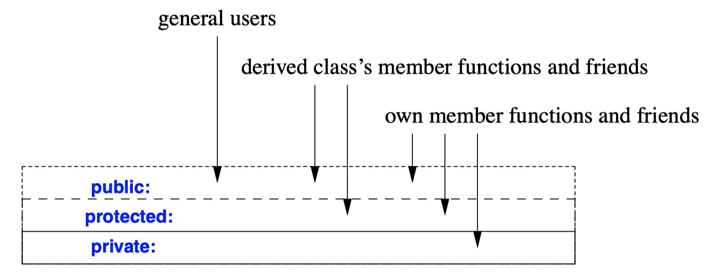
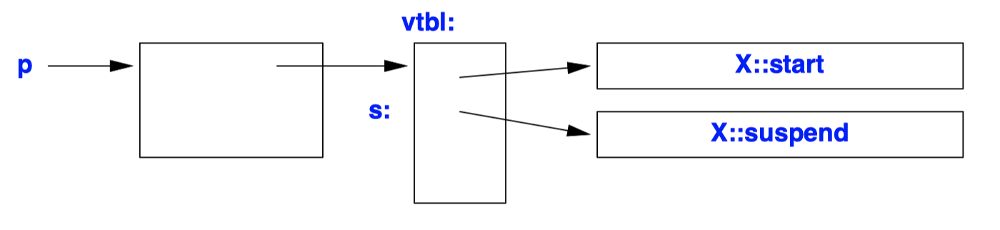

## Derived Classes
- The notion of a derived class is to express **commonality** between classes.
- *Interface inheritance* is often referred to as *run-time polymorphism* (or *dynamic polymorphism*)
  - Others are often referred to as *compile-time polymorphism* (or *static polymorphism*).
- No memory overhead is implied by deriving a class.
- If a class `Derived` has a public base class `Base`
  - A `Derived*` can be implicitly assigned to a variable of type `Base*`.
  - The opposite conversion, from `Base*` to `Derived*`, **must be explicit**.
- A class must be **defined** in order to be used as a base.
```c++
struct Employee {
  string first_name, family_name;
  char middle_initial;
  Date hiring_date;
  short department;
  // ...
};

struct Manager : public Employee {
  list<Employee*> group;
  short level;
  // ...
};

void f(Manager m1, Employee e1)
{
  list<Employee*> elist {&m1,&e1);
  // ...
}

void g(Manager mm, Employee ee)
{
  Employee* pe = &mm; // OK: every Manager is an Employee
  Manager* pm = &ee;  // error : not every Employee is a Manager
  pm−>level = 2;  // disaster : ee doesn't have a level 
  pm = static_cast<Manager*>(pe); // brute force: works because pe points
                                  // to the Manager mm 
  pm−>level = 2; // fine: pm points to the Manager mm that has a level
}
```


- The `Manager` is derived from `Employee`, and conversely, `Employee` is a *base class* for `Manager`.
  - `Manager` can be used wherever an `Employee` is acceptable.
  - However, an `Employee` is not necessarily a `Manager`, so an `Employee*` cannot be used as a `Manager*`.
- The class `Manager` has the members of class `Employee` in addition to its own members.
- A derived class is often said to inherit properties from its base, so the relationship is also called *inheritance*.
```c++
class Employee {
public:
  void print() const;
  string full_name() const { return first_name + ' ' + middle_initial + ' ' + family_name; }
  // ...
private:
  string first_name, family_name;
  char middle_initial;
  // ...
};

class Manager : public Employee {
public:
  void print() const;
  // ...
};

void Manager::print() const
{
  cout << "name is " << full_name() << '\n';
  cout << " name is " << family_name << '\n'; // error!
  Employee::print(); // print Employee information
  // ...
}
```
- A member of a derived class can use the public or protected members of a base.
- A derived class cannot access private members of a base class.
- `::` must be used because `print()` has been redefined in Manager.

## Class Hierarchies
```c++
class Employee { /* ... */ };
class Manager : public Employee { /* ... */ };
class Director : public Manager { /* ... */ };

class Temporary { /* ... */ };
class Assistant : public Employee { /* ... */ };
class Temp : public Temporary, public Assistant { /* ... */ };
class Consultant : public Temporary, public Manager { /* ... */ };
```

- Given a pointer of type Base*, to which derived type does the object pointed to really belong? There are four fundamental solutions:
  1. Ensure that only objects of a single type are pointed to.
  2. Place a type field in the base class for the functions to inspect.
  3. Use `dynamic_cast` (§22.2, §22.6).
  4. Use virtual functions
- Combinations of solutions [1] and [4] are particularly interesting and powerful.
```c++
struct Employee {
  enum Empl_type { man, empl };
  Empl_type type;

  Employee() : type{empl} { }

  string first_name, family_name;
  char middle_initial;

  Date hiring_date;
  short department;
  // ...
};

struct Manager : public Employee {
  Manager() { type = man; }

  list<Employee*> group; // people managed
  short level;
  // ...
};

void print_employee(const Employee* e)
{
  switch (e−>type) {
  case Employee::empl:
    cout << e−>family_name << '\t' << e−>department << '\n';
    // ...
    break;
  case Employee::man:
  {
    cout << e−>family_name << '\t' << e−>department << '\n';
    // ...
    const Manager* p = static_cast<const Manager*>(e);
    cout << " level " << p−>level << '\n';
    // ...
    break;
  }
  }
}
```
- This works fine, especially in a small program maintained by a single person.
- It has a fundamental weakness in that it depends on the programmer manipulating type.
  - Any addition of a new kind of `Employee` involves a change to all the key functions in a system.
  - Each function using a type field must know about the representation and other details of the implementation of every class.
```c++
class Employee {
public:
  Employee(const string& name, int dept);
  virtual void print() const;
  // ...
private:
  string first_name, family_name;
  short department;
  // ...
};

void Employee::print() const
{
  cout << family_name << '\t' << department << '\n';
  // ... 
}

class Manager : public Employee {
public:
  Manager(const string& name, int dept, int lvl);
  void print() const;
  // ...
private:
  list<Employee*> group;
  short level;
  // ...
};

void Manager::print() const
{
  Employee::print();
  cout << "\tlevel " << level << '\n';
  // ...
}
```
- The `print_employee()` is now unnecessary because the `print()` member functions have taken its place.
- The keyword `virtual` indicates that `print()` can act as an interface and `print()` functions defined in classes derived from it.
  - The argument types specified for a function in a derived class cannot differ.
  - Only very slight changes are allowed for the return type.
  - A function from a derived class with the same name as a virtual function in a base is said to *override* the virtual function.
  - A virtual function **must be defined for the class in which it is first declared**. (unless it is declared to be a *pure virtual function*)
- The compiler ensures that the right `print()` for the given `Employee` object is invoked in each case.
- A virtual member function is sometimes called a *method*.
- A type with virtual functions is called a *polymorphic type* or a *run-time polymorphic* type.
- We can, but not be recommended to, repeat `virtual` in a derived class. If you want **to be explicit**, use `override`.

 
- To implement polymorphism, the compiler must store some kind of type information.
  - In a typical implementation, the space taken is just enough to hold a point to a table of pointers to functions.
  - That table is usually called *the virtual function table* or simply the `vtbl`.
  - Each class with virtual functions has its own `vtbl` identifying its virtual functions.
- This virtual call mechanism can be made almost as efficient as the "normal function call" mechanism (within 25%).
- Its space overhead is one pointer in each object plus one `vtbl` for each such class.
- It is typically a bad idea to call a virtual function from a constructor or a destructor.

```c++
struct B0 {
  void f(int) const;
  virtual void g(double);
};

struct B1 : B0 { /* ... */ };
struct B2 : B1 { /* ... */ };
struct B3 : B2 { /* ... */ };
struct B4 : B3 { /* ... */ };
struct B5 : B4 { /* ... */ };

struct D : B5 {
  void f(int) const; // B0::f() is not virtual, so you can't override it,
  void g(int); // D::g() doesn't have the same argument type as B0::g(),
  virtual int h(); // There is no function called h() in B0
};
```
- For larger class hierarchies it can be difficult to be sure that you actually override the function you meant to override.
- For larger hierarchies more specific controls are useful:
  - `virtual`: The function **may be** overridden
  - `=0`: The function **must be** virtual and must be overridden
  - `override`: The function **is meant to** override a virtual function in a base class
  - `final`: The function is **not meant to** be overridden
***
- `override`
  ```c++
  struct D : B5 { 
    oid f(int) const override; // error : B0::f() is not virtual
    void g(int) override; // error : B0::f() takes a double argument
    virtual int h() override; // error : no function h() to override
  };
  ```
  - In a large or complicated class hierarchy with many virtual functions, it is best to use `override` on all functions intended as overriders.
  - The override specifier comes last in a declaration, after all other parts.
  - It's illogical that `virtual` is a prefix and `override` is a suffix.
  ```c++
  class Derived : public Base {
    void f() override; // OK if Base has a virtual f()
    void g() override; // OK if Base has a virtual g()
  };

  void Derived::f() override // error : override out of class
  {
    // ...
  }

  void g() // OK
  {
    // ...
  }
  ```
  - An `override` specifier is **not part of the type** of a function and **cannot be repeated** in an out-of-class definition. 
  - `override` is **not a keyword**; it is what is called a *contextual keyword*.
    - Contextual keyword can be used as an identifier elsewhere.
    - The other contextual keyword is `final`.
***
- `final`
  - When we declare a member function, we have a choice between `virtual` and not `virtual`. We base our choice on the meaning of our class:
    - Can we imagine the need for further derived classes?
    - Does a designer of a derived class need to redefine the function to achieve a plausible aim?
    - Is overriding a function error-prone?
  - Sometimes, we might want to close our design to modification from its users.
  ```c++
  struct Node {  // interface class
    virtual Type type() = 0; // ...
  };

  class If_statement : public Node {
  public:
    Type type() override final;// prevent further overriding
    // ...
  };

  class Modified_if_statement : public If_statement {
  public:
    Type type() override; // error : If_statement::type() is final
    // ...
  };
  ```
  - After using `final` for a member function, it can no longer be overridden and an attempt to do so is an error.
  ```c++
  class For_statement final : public Node {
  public:
    Type type() override;
    // ...
  };

  class Modified_for_statement : public For_statement { // error : For_statement is final
    Type type() override;
    // ...
  };
  ``` 
  - Add `final` after the class name making every virtual member function of a class `final`.
  - Adding `final` to the class not only prevents overriding, it also prevents further derivation from a class.
  - There are people who use `final` to try to gain performance (25%)
  ```c++
  class Derived : public Base {
    void f() final; // OK if Base has a virtual f()
    void g() final; // OK if Base has a virtual g()
    // ...
  };

  void Derived::f() final { // error: final out of class
    // ...
  }

  int final = 7;

  struct Dx : Base {
    int final;
    int f() final
    {
      return final + ::final;
    }
  };
  ``` 
  - A final specifier is not part of the type of a function and **cannot be repeated** in an out-of-class definition.
  - `final` is a *contextual keyword*.
***
- `using` Base Members
  - **Functions do not overload across scopes**.
  ```c++
  struct Base {
    void f(int);
  };

  struct Derived : Base {
    void f(double);
  };

  void use(Derived d)
  {
    d.f(1); // call Derived::f(double) 
    Base& br = d
    br.f(1); // call Base::f(int)
  }

  struct D2 : Base {
    using Base::f; // bring all fs from Base into D2
    void f(double);
  };

  void use2(D2 d)
  {
    d.f(1); // call D2::f(int), that is, Base::f(int)
    Base& br = d
    br.f(1); // call Base::f(int)
  }
  ``` 
  - `using`-declarations can be used to add a function to a scope.
  ```c++
  struct B1 {
    void f(int);
  };

  struct B2 {
    void f(double);
  };

  struct D : B1, B2 {
    using B1::f;
    using B2::f;
    void f(char);
  };

  void use(D d)
  {
    d.f(1); // call D::f(int), that is, B1::f(int)
    d.f('a'); // call D::f(char)
    d.f(1.0); // call D::f(double), that is, B2::f(double)
  }
  ``` 
  - Several `using`-declarations can bring in names from multiple base classes.
  ```c++
  template<class T>
  struct Vector : std::vector<T> {
    using vector<T>::vector; // inherit constructors

    T& operator=[](size_type i) { check(i); return this−>elem(i); }
    const T& operator=(size_type i) const { check(i); return this−>elem(i); }

    void check(size_type i) { if (this−>size()<i) throw Bad_index(i); }
  };

  Vector<int> v { 1, 2, 3, 5, 8 }; // OK: use initializer-list constructor from std::vector
  ``` 
  - We can bring constructors into a derived class scope.
  - Most often it is best to avoid being clever and restrict the use of inheriting constructors to the simple cases.
  - We cannot use `using`-directives to bring all members of a base class into a derived class.
***
- **Return Type Relaxation**
  - If the original return type was `B*`, then the return type of the overriding function may be `D*`, provided `B` is a public base of `D`. This is sometimes called the *covariant return* rule.
  - This relaxation applies **only to return types that are pointers or references**, and not to "smart pointers."
  ```c++
  class Expr { 
  public:
    Expr(); // default constructor
    Expr(const Expr&); // copy constructor
    virtual Expr* new_expr() =0;
    virtual Expr* clone() =0;
    // ...
  };

  class Cond : public Expr {
  public:
    Cond();
    Cond(const Cond&);
    Cond* new_expr() override { return new Cond(); }
    Cond* clone() override { return new Cond(*this); }
    // ...
  };

  void user(Expr* p)
  {
    Expr* p2 = p−>new_expr();
    // ...
  }

  void user2(Cond* pc, Addition* pa)
  {
    Cond* p1 = pc−>clone();
    Addition* p2 = pa−>clone();
    // ...
  }

  void user3(Cond* pc, Expr* pe)
  {
    Cond* p1 = pc−>clone();
    Cond* p2 = pe−>clone(); // error : Expr ::clone() returns an Expr*
    // ...
  }
  ``` 
  - The return type of `Cond::new_expr()` and `Cond::clone()` is `Cond*` rather than `Expr*`.
  - Because functions such as `new_expr()` and `clone()` are virtual and they (indirectly) construct objects, they are often called *virtual constructors*.

## Abstract Classes
- Some classes, such as a class `Shape`, represent abstract concepts for which objects cannot exist.
- A class with one or more *pure virtual* functions is an abstract class,
  - We declare the virtual functions to be pure virtual functions by "pseudo initializer" `= 0`
- **No objects of that abstract class can be created.**
- It is usually important for an abstract class to **have a virtual destructor**
- An abstract class **provides an interface** without exposing implementation details.
- The design style supported by abstract classes is called *interface inheritance* in contrast to the *implementation inheritance*.
```c++
class Shape { // abstract class
public:
  virtual void rotate(int) = 0; // pure virtual function
  virtual void draw() const = 0; // pure virtual function
  virtual bool is_closed() const = 0; // pure virtual function
  // ...
  virtual ~Shape();
};

Shape s; // error: variable of abstract class Shape

class Point { /* ... */ };

class Circle : public Shape {
public:
  void rotate(int) override { }
  void draw() const override;
  bool is_closed() const override { return true; }

  Circle(Point p, int r);
private:
  Point center;
  int radius;
};
``` 
- An abstract class can be used only as an interface to other classes.
```C++
class Polygon : public Shape { // abstract class
public:
  bool is_closed() const override { return true; }
  // ... draw and rotate not overridden ...
};

Polygon b {p1,p2,p3,p4}; // error : declaration of object of abstract class Polygon

class Irregular_polygon : public Polygon {
  list<Point> lp;
public:
  Irregular_polygon(initializer_list<Point>);
  void draw() const override;
  void rotate(int) override;
  // ...
};

Irregular_polygon poly {p1,p2,p3,p4}; // assume that p1 .. p4 are Points defined somewhere
``` 
- Polygon is still abstract because we did not override draw() and rotate().
- Only when that is done do we have a class from which we can create objects.

## Access Control
- A member of a class can be
  - `private`: its name can be used only by member functions and friends
  - `protected`: its name can be used only by member functions and friends and by member functions and friends of classes derived from this class
  - `public`: its name can be used by any function
 
- **In a class, members are by default `private`**; in a `struct`, members are by default `public`.
- Like a member, a base class can be declared. Consider a class `D` derived from a base class `B`:
  - `public`: makes the derived class a subtype of its base. `B`'s public members can be used by any function. In addition, its protected members can be used by members and friends of D and members and friends of classes derived from `D`. Any function can convert a `D*` to a `B*`.
  - `private`: is most useful when defining a class by restricting the interface to a base. B's public and protected members can be used only by member functions and friends of `D`. Only friends and members of `D` can convert a `D*` to a `B*`.
  - `protected`: is useful in class hierarchies in which further derivation is the norm. `B`'s public and protected members can be used only by member functions and friends of `D` and by member functions and friends of classes derived from `D`. Only friends and members of `D` and friends and members of classes derived from D can convert a `D*` to a `B*`.
- By default, **the base defaults to a `private` base for a class** and a `public` base for a `struct`.
  - The absence of an access specifier for a base is likely to be surprising for a class
```c++
template<class T>
class List {
public:
  void insert(T);
  T get();
  // ...
private:
  struct Link { T val; Link* next; };
  struct Chunk {
    enum { chunk_size = 15 };
    Link v[chunk_size];
    Chunk* next;
  };

  Chunk* allocated;
  Link* free;
  Link* get_free();
  Link* head;
};

template<class T> void List<T>::insert(T val)
{
  Link* lnk = get_free();
  lnk−>val = val;
  lnk−>next = head;
  head = lnk;
}

template<class T> T List<T>::get()
{
  if (head == 0) throw Underflow{}; // Underflow is my exception class

  Link* p= head;
  head = p−>next;
  p−>next = free;
  free = p;
  return p−>val;
}

template<typename T>
void would_be_meddler(List<T>* p)
{
  List<T>::Link* q = 0; // error : List<T>::Link is private 
  // ...
  q = p−>free; // error : List<T>::free is private
  // ...
  if (List<T>::Chunk::chunk_size > 31) { // error : List<T>::Chunk::chunk_size is private
    // ...
  }
}
```
- Nonmember functions (except friends) can't access private and protected members.
```c++
template<class T> auto List<T>::get_free() −> Link*
{
  // ...
}
```
```C++
template<class T>
typename List<T>::Link* List<T>::get_free()
{
  if (free == 0) {
    // ... allocate a new chunk and place its Links on the free list ...
  }

  Link* p = free;
  free = free−>next;
  return p;
}
``` 
- The return type of `get_free()` is mentioned before the name `List<T>::get_free()` is mentioned, the full name `List<T>::Link` must be used instead of the abbreviation `Link`.
- The alternative is to use the suffix notation for return types.

```c++
class Buffer {
public:
  char& operator[](int i); // checked access
  // ...
protected:
  char& access(int i); // unchecked access
  // ...
};

class Linked_buffer : public Buffer {
  // ...
};

class Circular_buffer : public Buffer {
public:
  void reallocate(char* p, int s); // change location and size
  // ...
  void f(Linked_buffer* p)
  {
    a[0] = 0; // OK: access to Circular_buffer's own protected member
    p−>a[0] = 0; // error: access to protected member of different type }
  }
};

void Circular_buffer::reallocate(char* p, int s) // change location and size
{
  // ...
  for (int i=0; i!=old_sz; ++i)
    p[i] = access(i); // no redundant checking
  // ...
}


void f(Buffer& b)
{
  b[3] = 'b'; // OK (checked) 
  b.access(3) = 'c'; // error: Buffer ::access() is protected
}
```
- `protected` provides functions designed to be used by implementers of derived classes but not by the general user.
- A derived class can access a base class's protected members only for objects of its own type.
- Members declared `protected` are far more open to abuse. In particular, declaring data members `protected` is usually a design error.
  - There have always been alternatives to placing significant amounts of information in a common base class for derived classes to use directly.
  - `protected` is a fine way of specifying operations for use in derived classes.
```C++
struct B {
  int m;
  static int sm;
  // ...
};

class D1 : public virtual B { /* ... */ };
class D2 : public virtual B { /* ... */ };
class D12 : public D1, private D2 { /* ... */ };

D12* pd = new D12;
B* pb = pd; // OK: accessible through D1 
int i1 = pd−>m; // OK: accessible through D1
``` 
- If the name of a base class can be reached through multiple paths, it is accessible if it is accessible through any path.
```c++
class X1 : public B { /* ... */ };
class X2 : public B { /* ... */ };
class XX : public X1, public X2 { /* ... */ };

XX* pxx = new XX; 
int i1 = pxx−>m; // error, ambiguous: XX::X1::B::m or XX::X2::B::m?
int i2 = pxx−>sm; // OK: there is only one B::sm in an XX (sm is a static member)
```
- If a single entity is reachable through several paths, we can still refer to it without ambiguity.
```c++
class B {
private:
  int a;
protected:
  int b;
public:
  int c;
};

class D : public B {
public:
  using B::a; // error: B::a is private
  using B::b; // make B::b publicly available through D
};

class BB : private B { // give access to B::b and B::c, but not B::a
public:
  using B::b;
  using B::c;
};
```
- A using-declaration cannot be used to gain access to additional information..
  - It is simply a mechanism for making accessible information more convenient to use.
  - Once access is available, it can be granted to other users.

## Pointers to Members
```c++
class Std_interface {
public:
  virtual void start() = 0;
  virtual void suspend() = 0;
  virtual void resume() = 0;
  virtual void quit() = 0;
  virtual void full_size() = 0;
  virtual void small() = 0;

  virtual ~Std_interface() {}
};

using Pstd_mem = void (Std_interface::*)(); // pointer-to-member type

void f(Std_interface* p)
{
  Pstd_mem s = &Std_interface::suspend; // pointer to suspend() 
  p−>suspend(); // direct call
  p−>*s(); // call through pointer to member
}
```
- A pointer to member can be obtained by applying `&` to a fully qualified class member name.
- the `X::*` declarator matches the traditional * declarator exactly.
- `p−>*m` binds `m` to the object pointed to by `p`, and `obj.*m` binds `m` to the object `obj`.

- **A pointer to member** is an offset-like construct that allows a programmer to indirectly refer to a member of a class.
- The operators `−>*` and `.*` are arguably the most specialized and least used C++ operators.
  - Using `−>*` we can access a member that has its name stored in a pointer to member.
  - A pointer to member cannot be assigned to a `void*` or any other ordinary pointer.
- A pointer to member isn't a pointer to a piece of memory.
- It is more like an offset into a structure or an index into an array. It is **more like an offset into a structure** or an index into an array.

- Because a pointer to a virtual member is a kind of offset, it does **not depend on an object's location in memory**.
  - It can therefore be passed between different address spaces.
  - We can safely assign a **pointer to a member of a base class to a pointer to a member of a derived class**, but not the other way around.
```c++
class Task {
  // ...
  static void schedule();
};

void (*p)() = &Task::schedule; // OK 
void (Task::* pm)() = &Task::schedule;  // error : ordinary pointer assigned
                                        // to pointer to member
``` 
- A `static` member isn't associated with a particular object, so a pointer to a `static` member is simply an ordinary pointer.
```c++
struct C {
  const char* val;
  int i;

  void print(int x) { cout << val << x << '\n'; }
  int f1(int);
  void f2();
  C(const char* v) { val = v; }
};

using Pmfi = void (C::*)(int); // pointer to member function of C taking an int
using Pm = const char* C::*; // pointer to char* data member of C

void f(C& z1, C& z2)
{
  C* p = &z2;
  Pmfi pf = &C::print;
  Pm pm = &C::val;

  z1.print(1); (z1.*pf)(2);
  z1.*pm = "nv1 ";
  p−>*pm = "nv2 ";
  z2.print(3); (p−>*pf)(4);

  pf = &C::f1; // error: return type mismatch
  pf = &C::f2; // error: argument type mismatch
  pm = &C::i; // error: type mismatch
  pm = pf; // error: type mismatch
}
```
- Naturally, the notion of pointer to member also applies to data members.
```c++
class Text : public Std_interface {
public:
  void start();
  void suspend();
  // ...
  virtual void print();
private:
  vector s;
};

void (Std_interface::* pmi)() = &Text::print; // error
void (Text::*pmt)() = &Std_interface::start; // OK
```
- We can safely assign a pointer to a member of a base class to a pointer to a member of a derived class, but not the other way around. This property is often called `contravariance`. 