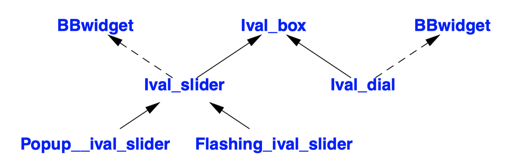

## Design of Class Hierarchies
- Consider a simple design problem: Provide a way for a program ("an application") to get an integer value from a user.

- The idea is to have a class `Ival_box` ("integer value input box"). A program can ask an `Ival_box` for its value and ask it to prompt the user if necessary. In addition, a program can ask an `Ival_box` if a user changed the value.
- We must assume that there will be many different kinds of `Ival_box`es, such as sliders, plain boxes in which a user can type a number, dials, and voice interaction.
- In addition to ignoring the topic of how to map user actions (events) to library calls, **we also ignore the need for locking** in a multi-threaded GUI system.

```c++
class Ival_box : public BBwidget {
protected:
  int val;
  int low, high;
  bool changed {false}; // changed by user using set_value()
public:
  Ival_box(int ll, int hh) :val{ll}, low{ll}, high{hh} { }

  virtual int get_value() { changed = false; return val; } // for application 
  virtual void set_value(int i) { changed = true; val = i; } // for user
  virtual void reset_value(int i) { changed = false; val = i; } // for application
  virtual void prompt() { }
  virtual bool was_changed() const { return changed; }

  virtual ~Ival_box() {};
};
```
```c++
void interact(Ival_box* pb)
{
  pb−>prompt(); // aler t user
  // ...
  int i = pb−>get_value();
  if (pb−>was_changed()) {
    // ... new value; do something ...
  }
  else {
    // ... do something else ...
  }
}

void some_fct()
{
  unique_ptr<Ival_box> p1 {new Ival_slider{0,5}}; // Ival_slider derived from Ival_box
  interact(p1.get());

  unique_ptr<Ival_box> p2 {new Ival_dial{1,12}};
  interact(p2.get());
}
```
```c++
class Ival_slider : public Ival_box {
private:
  // ... graphics stuff to define what the slider looks like, etc. ...
public:
  Ival_slider(int, int);
  int get_value() override; // get value from user and deposit it in val
  void prompt() override;
};

class Ival_dial : public Ival_box { /* ... */ };
class Flashing_ival_slider : public Ival_slider { /* ... */ };
class Popup_ival_slider : public Ival_slider { /* ... */ };
```
- Our first solution is a class hierarchy **using implementation inheritance**.
- Class `Ival_box` defines the basic interface to all `Ival_box`es and specifies a default implementation.
  - The data members of `Ival_box` were declared `protected` to allow access from derived classes.
- To simplify, we do not address issues of how a program waits for input.
- Most user-interface systems provide a class defining the basic GUI properties. Assume we use the system from "Big Bucks Inc.", called `BBwidget`.

- There are some awkward details that could lead us to look for alternative designs.
  1. The use of `BBwidget` isn't part of our basic notion of an `Ival_box`; it is **an implementation detail**.
      ```c++
      class Ival_box : public BBwidget { /* ... */ }; // BB version
      class Ival_box : public CWwidget { /* ... */ }; // CW version
      class Ival_box : public IBwidget { /* ... */ }; // IB version
      class Ival_box : public LSwindow { /* ... */ }; // LS version
      ``` 
      - If we also wanted to have implementations of our `Ival_box`es from other GUI classes, we have to maintain four distinct versions of our program.
  2. Every derived class shares the basic data declared in `Ival_box`. That data is an **implementation detail**.
     - From a practical point of view, it is also the wrong data in many cases.
     - `Ival_slider` doesn't need the value stored specifically. It can easily be calculated from the position
     - Also, experience shows that novice programmers tend to mess with protected data. **Data members are better kept private.**
     - In almost all cases, **a protected interface should contain only functions, types, and constants.**
  3. Changes to class `BBwidget` may force users to recompile or even rewrite their code to recover from such changes.
     - **A change in the size of a base class requires a recompilation of all derived classes.**

```c++
class Ival_box {
public:
  virtual int get_value() = 0;
  virtual void set_value(int i) = 0;
  virtual void reset_value(int i) = 0;
  virtual void prompt() = 0;
  virtual bool was_changed() const = 0;
  virtual ~Ival_box() { }
};

class Ival_slider : public Ival_box, protected BBwidget {
public:
  Ival_slider(int,int);
  ~Ival_slider() override;

  int get_value() override;
  void set_value(int i) override;
  // ...
protected:
  // ... functions overriding BBwidget virtual functions
  // e.g., BBwidget::draw(), BBwidget::mouse1hit() ...
private:
  // ... data needed for slider ...
};

class Ival_box { /* ... */ };
class Ival_slider
  : public Ival_box, protected BBwidget { /* ... */ };
class Ival_dial
  : public Ival_box, protected BBwidget { /* ... */ };
class Flashing_ival_slider
  : public Ival_slider { /* ... */ }; 
class Popup_ival_slider
  : public Ival_slider { /* ... */ };
```

- The new class hierarchy that solves the problems.
  - We specify class Ival_box as a pure interface.
  - We added a virtual destructor to ensure proper cleanup of the data that will be defined in the derived classes.
  - Since `BBwidget` is only an implementation aid, it is derived using `protected`.
  - `protected` derivation makes `BBwidget` available to classes derived from `Ival_slider`.
  - Making the `BBwidget` a member of `Ival_box` is not a solution because a class cannot override virtual functions of its members.
- Deriving directly from more than one class is usually called *multiple inheritance*.
- However, this implementation still **fails to solve the version control problem:**
```c++
class Ival_box { /* ... */ };
class BB_ival_slider
  : public Ival_box, protected BBwidget { /* ... */ };
class CW_ival_slider
  : public Ival_box, protected CWwidget { /* ... */ };
// ...
``` 

```C++
class Ival_box { /* ... */ };
class Ival_slider
  : public Ival_box { /* ... */ };
class BB_ival_slider
  : public Ival_slider, protected BBwidget { /* ... */ };
class CW_ival_slider
  : public Ival_slider, protected CWwidget { /* ... */ };
// ...
```
- We derive an abstract `Ival_slider` class from `Ival_box` and then derive the system-specific `Ival_sliders` from that.
```c++
class Ival_box { /* ... */ };
class Ival_slider
  : public Ival_box { /* ... */ };
class Ival_dial
  : public Ival_box { /* ... */ };
class Flashing_ival_slider
  : public Ival_slider { /* ... */ };
class Popup_ival_slider
  : public Ival_slider { /* ... */ };

class BB_ival_slider
  : public Ival_slider, protected BBslider { /* ... */ };
class BB_flashing_ival_slider
  : public Flashing_ival_slider, protected BBwidget_with_bells_and_whistles { /* ... */ };
class BB_popup_ival_slider
  : public Popup_ival_slider, protected BBslider { /* ... */ };
class CW_ival_slider
  : public Ival_slider, protected CWslider { /* ... */ };
``` 
- If the "Big Bucks Inc." system has a slider class, we can derive our `Ival_slider` directly from the `BBslider`.

- The creation of objects must be done using implementation-specific names such as `CW_ival_dial` and `BB_flashing_ival_slider`. We would like to **minimize the number of places where such specific names occur**, and object creation is hard to localize unless it is done systematically.
```C++
class Ival_maker {
public:
  virtual Ival_dial* dial(int, int) =0; // make dial 
  virtual Popup_ival_slider* popup_slider(int, int) =0; // make popup slider
  // ...
};

class BB_maker : public Ival_maker {  // make BB versions
public:
  Ival_dial* dial(int, int) override;
  Popup_ival_slider* popup_slider(int, int) override;
  // ...
};

class LS_maker : public Ival_maker { // make LS versions
public:
  Ival_dial* dial(int, int) override;
  Popup_ival_slider* popup_slider(int, int) override;
  // ...
};

Ival_dial* BB_maker::dial(int a, int b)
{
  return new BB_ival_dial(a,b);
}

Ival_dial* LS_maker::dial(int a, int b)
{
  return new LS_ival_dial(a,b);
}

void user(Ival_maker& im)
{
  unique_ptr<Ival_box> pb {im.dial(0,99)}; // create appropriate dial
  // ...
}

BB_maker BB_impl; // for BB users 
LS_maker LS_impl; // for LS users

void driver() {
  user(BB_impl); // use BB
  user(LS_impl); // use LS
}
``` 
- A simple one is to introduce **an abstract class to represent the set of creation operations**.
- Such a class is sometimes called a *factory*, and its functions are sometimes called *virtual constructors*.
- We cannot override the base class functions that represent the interface with different arguments in different derived classes.

## Multiple Inheritance
- In fact, any class **without mutable state** can be used as an interface in a multiple-inheritance lattice without significant complications and overhead.
```C++
class Satellite {
public:
  virtual Pos center() const = 0; // center of gravity
  // ...
};

class Displayed {
public:
  virtual void draw() = 0;
  // ...
};

class Comm_sat : public Satellite, public Displayed {
public:
  Pos center() const override; // override Satellite::center()
  void draw() override; // override Displayed::draw()
  // ...
};

void f(Comm_sat& s)
{
  s.draw(); // Displayed::draw()
  Pos p = s.center();  // Satellite::center()
  s.transmit(); // Comm_sat::transmit()
}

void highlight(Displayed*);
Pos center_of_gravity(const Satellite*);

void g(Comm_sat* p)
{
  highlight(p); // pass a pointer to the Displayed par t of the Comm_sat
  Pos x = center_of_gravity(p); // pass a pointer to the Satellite part of the Comm_sat
}
``` 
- A `Satellite` object would contain orbital, size, shape, albedo, density parameters, etc.
- We want to display the results of these simulations graphically. To hide the details of the actual graphics system, we will refer to the class providing graphical output `Display`.
- Why didn't I just keep the Satellite and Displayed parts of a Comm_sat completely separate?
  - I could have defined `Comm_sat` to have a `Satellite` member and a `Displayed` member.
  - The system that inspired this example was built on the idea of a `Satellite` class with virtual functions and a `Displayed` class with **virtual functions**.
- The use of multiple inheritance saves the programmer from writing a lot of **forwarding functions**.
- We generally **prefer to have a single implementation hierarchy** and (where needed) several abstract classes providing interfaces. This is typically more flexible and leads to systems that are easier to evolve.
```c++
class Satellite {
public:
  virtual Debug_info get_debug();
  // ...
};

class Displayed {
public:
  virtual Debug_info get_debug();
  // ...
};

void f(Comm_sat& cs)
{
  Debug_info di = cs.get_debug(); // error : ambiguous
  di = cs.Satellite::get_debug(); // OK
  di = cs.Displayed::get_debug(); // OK
}
``` 
- Two base classes may have member functions with the same name.
- When a Comm_sat is used, these functions **must be disambiguated** by qualifying a member name by its class name.
- However, explicit disambiguation is messy.
```c++
class Comm_sat : public Satellite, public Displayed {
public:
  Debug_info get_debug() // override Comm_sat::get_debug() and Displayed::get_debug()
  {
    Debug_info di1 = Satellite::get_debug();
    Debug_info di2 = Displayed::get_debug();
    return merge_info(di1,di2);
  }
  // ...
};

class Telstar : public Comm_sat {
public:
  void draw() {
    Comm_sat::draw(); // finds Displayed::draw
    // ... own stuff ...
  }
  // ...
};
``` 
- We resolve such problems by defining a new function in the derived class. A function declared in a derived class overrides all functions of the same name and type in its base classes.
- If **exactly one** match is found, that name will be used. Otherwise, Comm_sat::draw is either not found or is ambiguous.
- It is generally **better to refer to a direct base class** than to an indirect base class. I could have said `Comm_sat::Displayed::draw()`, but that would have been redundant.
```c++
class Satellite : public SimObj {
  // map SimObj facilities to something easier to use for Satellite simulation
public:
  virtual Debug_info get_debug(); // call SimObj::DBinf() and extract information
  // ...
};

class Displayed : public Widget {
  // map Widget facilities to something easier to use to display Satellite simulation results public:
  virtual Debug_info get_debug(); // read Widget data and compose Debug_info
  // ...
};
``` 
- Getting an exact match of names, return types, argument types, and semantics by accident is extremely unlikely.
- We might originally have been presented with two classes SimObj and Widget that we could not modify, didn't exactly provide what we needed.
- In that case, we might have designed Satellite and Displayed as our interface classes, providing **a "mapping layer" for our higher-level classes** to use.
- This is exactly the technique we would use to disambiguate in the unlikely case
```c++
class Window {
public:
  void draw(); // display image
  // ...
};

class Cowboy {
public:
  void draw(); // pull gun from holster
  // ...
};

// class Cowboy_window : public Cowboy, public Window {
//   // ...
// };

struct WWindow : Window {
  using Window::Window; // inherit constructors
  virtual void win_draw() = 0;  // force derived class to override
  void draw() override final { win_draw(); } // display image
};

struct CCowboy : Cowboy {
  using Cowboy::Cowboy; // inherit constructors
  virtual void cow_draw() = 0;  // force derived class to override
  void draw() override final { cow_draw(); } // pull gun from holster
};

class Cowboy_window : public CCowboy, public WWindow {
public:
  void cow_draw() override;
  void win_draw() override;
  // ...
};
``` 
- How do we override `Cowboy::draw()` and `Window::draw()`?
  - These two functions have radically different meanings but are identical in name and type.
  - We need to override them by two separate functions.
  - There is no direct language solution to this problem, but adding intermediate classes will do.
***
- When a class can have multiple base classes, a class can **appear multiple times in the resulting hierarchy**.
- When using an abstract class (without any shared data) as an interface, we have a choice:
  - Replicate the interface class
  - Make the interface class virtual to share a simple object among all classes in the hierarchy that mention it.
- Most often we don't get a choice because we have to conform to an existing design.
- When we do have a choice, **replicated base solution** tends to lead to slightly smaller objects and that we often get our interface objects from "virtual constructors" or "factory functions"
```c++
struct Storable { // persistent storage
  virtual string get_file() = 0;
  virtual void read() = 0;
  virtual void write() = 0;
  virtual ~Storable() { }
};

class Transmitter : public Storable {
public:
  void write() override;
  // ...
};

class Receiver : public Storable {
public:
  void write() override;
  // ...
};

class Radio : public Transmitter, public Receiver {
public:
  string get_file() override;
  void read() override;
  void write() override;
  // ...
};

void Radio::write() {
  Transmitter::write();
  Receiver::write();
  // ... write radio-specific information ...
}
``` 

- Unless you state otherwise, you get one copy for each time you mention a class as a base.
- A virtual function of a replicated base class can be overridden by a function.
- The `Radio` example **works because class `Storable` can be safely replicated.**
  - A Storable object holds no data of its own.
  - What if Storable did hold data and it was important that it should not be replicated?
```c++
class Storable {
public:
  Storable(const string& s); // store in file named s
  virtual void read() = 0;
  virtual void write() = 0;
  virtual ~Storable();
protected:
  string file_name;

  Storable(const Storable&) = delete;
  Storable& operator=(const Storable&) = delete;
};

class Transmitter : public virtual Storable {
public:
  void write() override;
  // ...
};

class Receiver : public virtual Storable {
public:
  void write() override;
  // ...
};

class Radio : public Transmitter, public Receiver {
public:
  void write() override;
  // ...
};
```

- We avoid replication by declaring a base **`virtual`**: every `virtual` base of a derived class is **represented by the same (shared) object**.
- If you don't need sharing, you can do without virtual bases, and your code is often better and typically simpler for it.
- Expect a **storage overhead** of one word for each virtual base.
```c++
struct V {
  V(int i);
  // ...
};

struct A {
  A(); // default constructor
  // ...
};

struct B : virtual V, virtual A {
  B() :V{1} { /* ... */ }; // default constructor ; must initialize base V
  // ...
};

class C : virtual V {
public:
  C(int i) : V{i} { /* ... */ }; // must initialize base V
  // ...
};

class D : virtual public B, virtual public C {
  // implicitly gets the virtual base V from B and C
  // implicitly gets virtual base A from B
public:
  D() { /* ... */ } // error : no default constructor for C or V
  D(int i) :C{i} { /* ... */ }; // error : no default constructor for V
  D(int i, int j) :V{i}, C{j} { /* ... */ } // OK
  // ..
``` 
- Using virtual bases you can create complicated lattices.
- The language ensures that a **constructor of a virtual base is called exactly once**, so does the destructor.
- Furthermore, the constructor of a base (whether virtual or not) is called before its derived classes.
- Note that `D` can and **must provide an initializer for `V`**
  - Knowledge of a virtual base and the obligation to initialize it "bubbles up" to the most derived class.
  - A virtual base is always considered a direct base of its most derived class.
```c++
class Window {
public:
  // basic stuff
  virtual void draw();
};

class Window_with_border : public virtual Window {
  // border stuff
protected:
  void own_draw(); // display the border
public:
  void draw() override;
};

class Window_with_menu : public virtual Window {
  // menu stuff
protected:
  void own_draw(); // display the menu
public:
  void draw() override;
};

class Clock : public Window_with_border, public Window_with_menu {
  // clock stuff
protected:
  void own_draw(); // display the clock face and hands
public:
  void draw() override;
};

void Window_with_border::draw()
{
  Window::draw();
  own_draw(); // display the border
}

void Window_with_menu::draw()
{
  Window::draw();
  own_draw(); // display the menu
}

void Clock::draw()
{
  Window::draw(); Window_with_border::own_draw();
  Window_with_menu::own_draw();
  own_draw(); // display the clock face and hands
}
```
- When defining the functions for a class with a virtual base, the programmer in general cannot know whether the base will be shared with other derived classes.
- Where needed, the programmer can simulate the scheme used for constructors by **calling a virtual base class function only from the most derived class**.
- The `draw()` functions can now be defined using the `own_draw()` functions, so that a caller of any `draw()` gets `Window::draw()` invoked exactly once.
```c++
class BB_ival_slider
  : public virtual Ival_slider, protected BBslider { /* ... */ };
class Popup_ival_slider
  : public virtual Ival_slider { /* ... */ };
class BB_popup_ival_slider
  : public virtual Popup_ival_slider, protected BB_ival_slider { /* ... */ };
``` 

```c++
class BB_ival_slider
  : public Ival_slider, protected BBslider { /* ... */ };
class Popup_ival_slider
  : public Ival_slider { /* ... */ };
class BB_popup_ival_slider
  : public Popup_ival_slider, protected BB_ival_slider { /* ... */ };

void f(Ival_slider* p);

void g(BB_popup_ival_slider* p) {
  f(p); // error: Popup_ival_slider::Ival_slider or BB_ival_slider::Ival_slider?
}
```

- There are no fundamental run-time or space advantages to one design over the other
- There are **logical differences**: in the replicated `Ival_slider` design, a `BB_popup_ival_slider` **can't be implicitly converted** to an `Ival_slider`
```c++
class Window {
  // ...
  virtual void set_color(Color) = 0; // set background color
  virtual void prompt() = 0;
};

class Window_with_border : public virtual Window {
  // ...
  void set_color(Color) override; // control background color
};

class Window_with_menu : public virtual Window {
  // ...
  void prompt() override; // control user interactions
};

class My_window : public Window_with_menu, public Window_with_border {
  // ...
  void prompt() override; // don't leave user interactions to base
};
``` 
- What if different derived classes override the same function?
  - This is allowed if and only if some overriding class is derived from every other class that overrides the function.
  - One function must override all others.
- If two classes override a base class function, but neither overrides the other, the class hierarchy is **an error**.
- A class that provides some of the implementation for a virtual base class is often called a *mixin*.