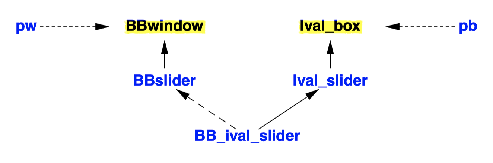
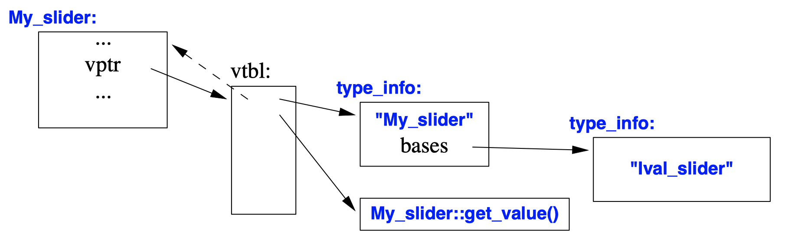
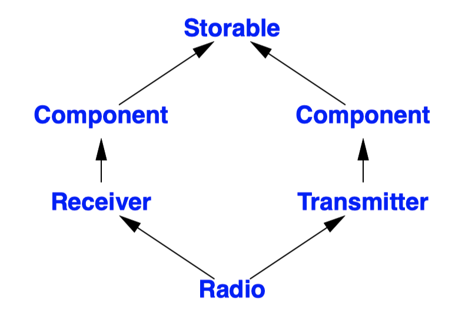
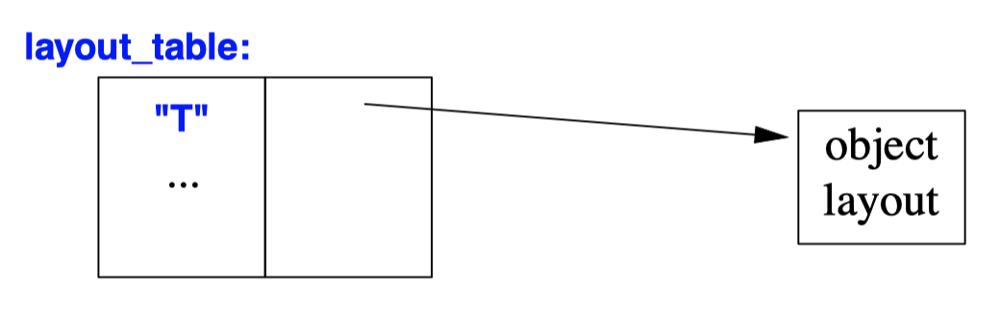
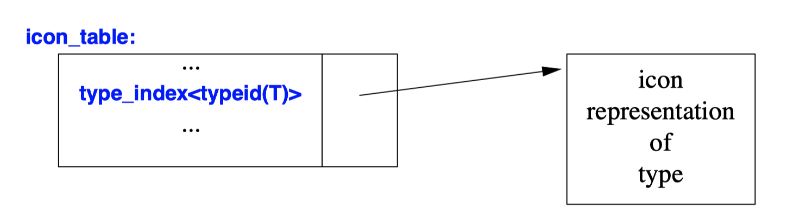

## Class Hierarchy Navigation
- *Class lattice* is often called a *class hierarchy*.
- Objects passed back and forth between the system and the application are commonly referred to as *widgets* or *controls*.
- **Recovering the "lost" type** of an object requires us to somehow ask the object to reveal its type.
- The use of type information at run time is conventionally referred to as *"run-time type information,"* often abbreviated to **RTTI**.
```c++
void my_event_handler(BBwindow* pw)
{
  if (auto pb = dynamic_cast<Ival_box*>(pw)) { // does pw point to an Ival_box?
    // ...
    int x = pb−>get_value(); // use the Ival_box
    // ...
  }
  else {
    // ... oops! cope with unexpected event ...
  }
}
``` 

- The `dynamic_cast` operator takes two operands: a type bracketed by `<` and `>`, and a pointer or reference bracketed by `( `and `)`.
- The `dynamic_cast` operator is a type conversion operation that returns a valid pointer if the object is of the expected type and `nullptr` if it isn’t.
- `dynamic_cast` translates from the *implementation-oriented language* of the user-interface system to *the language of the application*.
- `dynamic_cast<T*>(p)`: If `p` is of type `T*` or of a type `D*` where `T` is a base class of `D`, the result is exactly as if we had simply assigned p to a `T*`.

## dynamic_cast
```c++
class BB_ival_slider : public Ival_slider, protected BBslider { // ...

};

void f(BB_ival_slider* p)
{
  Ival_slider* pi1 = p; // OK
  Ival_slider* pi2 = dynamic_cast<Ival_slider*>(p); // OK

  BBslider* pbb1 = p; // error : BBslider is a protected base
  BBslider* pbb2 = dynamic_cast<BBslider*>(p); // OK: pbb2 becomes nullptr
}
``` 
- `dynamic_cast` **doesn’t** allow accidental violation of the protection of **private and protected** base classes.
- Since a `dynamic_cast` used as an **upcast** is exactly like a simple assignment, it implies no overhead.
- However, the purpose of `dynamic_cast` is to deal with the case in which the **correctness of the conversion cannot be determined by the compiler**.
```c++
class My_slider: public Ival_slider { // polymorphic base (Ival_slider has virtual functions)
  // ...
};

class My_date : public Date { // base not polymorphic (Date has no virtual functions)
  // ...
};

void g(Ival_box* pb, Date* pd) {
  My_slider* pd1 = dynamic_cast<My_slider*>(pb); // OK
  My_date* pd2 = dynamic_cast<My_date*>(pd); // error : Date not polymorphic
}
```
- A `dynamic_cast` requires a pointer or a reference to **a polymorphic type** in order to do a **downcast or a crosscast**.
- Requiring the pointer’s type to be polymorphic simplifies the implementation of `dynamic_cast`.
 
- The dashed arrow represents an offset.
- A typical implementation will attach a "type information object" to an object by placing a pointer to the type information in the virtual function table.
- If an object has no virtual functions, it cannot safely be manipulated without knowledge of its exact type.
```c++
class Io_obj { // base class for object I/O system
  virtual Io_obj* clone() = 0;
};

class Io_date : public Date, public Io_obj { };

void f(Io_obj* pio)
{
  Date* pd = dynamic_cast<Date*>(pio);
  // ...
}

void g(Ival_box* pb, Date* pd)
{
  void* pb2 = dynamic_cast<void*>(pb); // OK
  void* pd2 = dynamic_cast<void*>(pd); // error : Date not polymorphic
}
```
- **The target type of `dynamic_cast` need not be polymorphic.**
- This allows us to wrap a concrete type in a polymorphic type, say, for transmission through an object I/O system, and then "unwrap" the concrete type later.
- A `dynamic_cast` to `void*` can be used to **determine the address** of the beginning of an object
- However, There is no `dynamic_cast` from `void*`.
```c++
void fp(Ival_box* p)
{
  if (Ival_slider* is = dynamic_cast<Ival_slider*>(p)) { // does p point to an Ival_slider?
    // ... use is ...
  }
  else {
    // ... *p not a slider; handle alternatives ...
  }
}
``` 
```c++
void fr(Ival_box& r)
{
  Ival_slider& is = dynamic_cast<Ival_slider&>(r);  // r references an Ival_slider!
  // ... use is ...
}

void g(BB_ival_slider& slider, BB_ival_dial& dial)
{
  try {
    fp(&slider); // pointer to BB_ival_slider passed as Ival_box*
    fr(slider); // reference to BB_ival_slider passed as Ival_box&
    fp(&dial); // pointer to BB_ival_dial passed as Ival_box*
    fr(dial); // dial passed as Ival_box }
  catch (bad_cast) {
    // ...
  }
}
```
- When a `dynamic_cast` is used for a pointer type, a `nullptr` indicates failure.
- For a pointer `p`, `dynamic_cast<T*>(p)` can be seen as the question "Is the object pointed to by `p`, if any, of type `T`?"
- If the operand of a `dynamic_cast` to a **reference** isn’t of the expected type, a `bad_cast` exception is thrown.
- `dynamic_cast<T&>(r)` of a reference `r` is not a question but an **assertion**: "The object referred to by `r` is of type `T`.".
```c++
class Component
  : public virtual Storable { /* ... */ };
class Receiver
  : public Component { /* ... */ };
class Transmitter
  : public Component { /* ... */ };
class Radio
  : public Receiver, public Transmitter { /* ... */ };

void h1(Radio& r)
{
  Storable* ps = &r; // a Radio has a unique Storable
  // ...
  Component* pc = dynamic_cast<Component*>(ps); // pc = 0; a Radio has two Components
  // ...
}

void h2(Storable* ps) // ps might or might not point to a Component 
{
  if (Component* pc = dynamic_cast<Component*>(ps)) {
    // we have a component!
  }
  else {
    // it wasn’t a Component
  }
}
``` 

- If a class appears more than once in a hierarchy, we must be a bit careful.
- A `Radio` object has two subobjects of class `Component`. A `dynamic_cast` from `Storable` to `Component` within a `Radio` will be ambiguous and return a `0`.
- Typically, a programmer does not know the complete class lattice.
- For ordinary bases, there is always a unique subobject of a given cast (or none) when **downcasting**.
- The equivalent ambiguity for virtual bases occurs when **upcasting**, but such ambiguities are caught at compile time.

## static_cast
- A static_cast does not examine the object it casts from.
```c++
void g(Radio& r)
{
  Receiver* prec = &r; // Receiver is an ordinary base of Radio
  Radio* pr = static_cast<Radio*>(prec); // OK, unchecked
  pr = dynamic_cast<Radio*>(prec); // OK, run-time checked

  Storable* ps = &r; // Storable is a virtual base of Radio
  pr = static_cast<Radio*>(ps); // error : cannot cast from virtual base 
  pr = dynamic_cast<Radio*>(ps); // OK, run-time checked
}
``` 
- The `dynamic_cast` requires a polymorphic operand because there is no information stored in a nonpolymorphic object.
- There is a run-time cost associated with the use of a `dynamic_cast`. Where possible, use the **safer** `dynamic_cast`.
```c++
Radio* f1(void* p)
{
  Storable* ps = static_cast<Storable*>(p); // trust the programmer
  return dynamic_cast<Radio*>(ps);
}
```
- We can `static_cast` from `void*`.
```c++
class Users : private set<Person> { /* ... */ };

void f2(Users* pu, const Receiver* pcr)
{
  static_cast<set<Person>*>(pu); // error : access violation
  dynamic_cast<set<Person>*>(pu); // error : access violation

  static_cast<Receiver*>(pcr);  // error : can’t cast away const
  dynamic_cast<Receiver*>(pcr); // error : can’t cast away const

  Receiver* pr = const_cast<Receiver*>(pcr); // OK
  // ...
}
``` 
- Both `dynamic_cast` and `static_cast` respect const and access controls.
- It is not possible to cast to a private base class using `static_cast` or `reinterpret_cast`, and "casting away const" (or volatile) requires a `const_cast`.

## Recovering an Interface
```c++
void user() {
  // ... open file assumed to hold shapes, and attach ss as an istream for that file ...

  unique_ptr<Io_obj> p {get_obj(ss)}; // read object from stream

  if (auto sp = dynamic_cast<Shape*>(p.get())) {
    sp−>draw(); // use the Shape
    // ...
  }
  else {
    // oops: non-shape in Shape file
  }
}
```
- The use of `dynamic_cast` is essential because the object I/O system can deal with many other kinds of objects, and the user may accidentally have opened a file containing perfectly good objects of classes that the user has never heard of.
```c++
class Io_obj {
public:
  virtual Io_obj* clone() const =0; // polymorphic
  virtual ~Io_obj() {}
};

using Pf = Io_obj*(istream&); // pointer to function returning an Io_obj*

map<string,Pf> io_map; // maps strings to creation functions

string get_word(istream& is); // read a word from is; throw Read_error if the read failed

Io_obj* get_obj(istream& is)
{
  string str = get_word(is); // read initial word
  if (auto f = io_map[str])  // look up str to get function 
    return f(is); // call function
  throw Unknown_class{}; // no match for str
}
``` 
- The critical function in the object I/O system is `get_obj()`, which reads data from an istream and creates class objects based on that data.
- The map called io_map holds pairs of name strings and functions that can construct objects of the class with that name.
```c++
class Shape : public Io_obj {
  // ...
};
```
```c++
struct Io_circle : Circle, Io_obj {
  Io_circle(istream&); // initialize from input stream
  Io_circle* clone() const { return new Io_circle{*this}; } // use copy constructor
  static Io_obj* new_circle(istream& is) { return new Io_circle{is}; } // for io_map
};

io_map["Io_circle"]=&Io_circle::new_circle;

class Io_triangle : public Triangle, public Io_obj {
  // ...
};

io_map["Io_triangle"]=&Io_circle::new_triangle;
``` 
- We could derive class `Shape` from `Io_obj`, **but** in many cases it is **more realistic to use an already defined `Shape` unchanged**.
- The `new_circle()` function is the one put into the io_map
```c++
template<class T>
struct Io : T, Io_obj {
public:
  Io(istream&); // initialize from input stream
  Io* clone() const override { return new Io{*this}; }
  static Io* new_io(istream& is) { return new Io{is}; } // for io_map
};

using Io_circle = Io<Circle>;
``` 
- If the provision of the object I/O scaffolding becomes tedious, a template might help.
- We still need to define `Io<Circle>::Io(istream&)` explicitly.
- Unfortunately, deriving from the template argument precludes using Io for a built-in type: `using Io_int = Io<int>;`
```c++
template<class T>
struct Io :Io_obj { 
  T val;

  Io(istream&); // initialize from input stream
  Io* clone() const override { return new Io{*this}; } 
  static Io* new_io(istream& is) { return new Io{is}; } // for io_map
};

template<typename T>
T* get_val<T>(Io_obj* p)
{
  if (auto pp = dynamic_cast<Io<T>*>(p)) 
    return &pp−>val;
  return nullptr;
}

void user() {
  // ... open file assumed to hold shapes, and attach ss as an istream for that file ...

  unique_ptr<Io_obj> p {get_obj(ss)}; // read object from stream

  if (auto sp = get_val<Shape>(p.get())) {
    sp−>draw(); // use the Shape
    // ...
  }
  else {
    // ... oops: cope with non-shape in Shape file ...
  }

}
```
- This problem can be handled by making the user’s object a **member** of `Io_obj`.
- Having made the value a member rather than a base, we can no longer directly cast an `Io_obj<X>`, so we provide a function to do that.

## Double Dispatch and Visitors
- C++ can do this **run-time lookup** (also called a *dynamic dispatch*) for one type at a time.
- Not being able to select a function based on two dynamic types can be a serious limitation.
```c++
void do_someting(Shape& s1, Shape& s2) {
  if (s1.intersect(s2)) {
    // the two shapes overlap
  }
  // ...
}
``` 
- We would like this to work for any two classes in the class hierarchy rooted in `Shape`.
- The basic strategy is to do a virtual function call to select the right function for `s1` and then do a second call to select the right function for `s2`.
```c++
class Circle; class Triangle;

class Shape {
public:
  virtual bool intersect(const Shape&) const =0;
  virtual bool intersect(const Circle&) const =0;
  virtual bool intersect(const Triangle&) const =0;
};

class Circle : public Shape {
public:
  bool intersect(const Shape&) const override;
  virtual bool intersect(const Circle&) const override;
  virtual bool intersect(const Triangle&) const override
};

class Triangle : public Shape {
public:
  bool intersect(const Shape&) const override;
  virtual bool intersect(const Circle&) const override;
  virtual bool intersect(const Triangle&) const override;
};

bool Circle::intersect(const Shape& s) const { return s.intersect(*this); }
bool Circle::intersect(const Circle&) const { cout <<"intersect(circle,circle)\n"; return true; }
bool Circle::intersect(const Triangle&) const { cout <<"intersect(circle,triangle)\n"; return true; }

bool Triangle::intersect(const Shape& s) const { return s.intersect(*this); }
bool Triangle::intersect(const Circle&) const { cout <<"intersect(triangle,circle)\n"; return true; }
bool Triangle::intersect(const Triangle&) const { cout <<"intersect(triangle,triangle)\n"; return true; }

void test(Triangle& t, Circle& c)
{
  vector<pair<Shape*,Shape*>> vs { {&t,&t}, {&t,&c}, {&c,&t}, {&c,&c} };
  for (auto p : vs)
    p.first−>intersect(*p.second);
}
``` 
- Each class can handle all possible classes in the `Shape` hierarchy.
- The interesting functions here are `Circle::intersect(const Shape&)` and `Triangle::intersect(const Shape&)`.
  - These need to handle a `Shape&` argument because that argument must refer to a derived class.
  - The trick/technique is to simply do a virtual call with the arguments **in the reverse order**.
- As the class hierarchy grows, the need for virtual functions **grows exponentially**. That is not acceptable in most cases.
- This double-dispatch technique is highly intrusive.
```c++
class Shape {
public:
  virtual Rectangle box() const = 0; // the rectangle encloses the shape
  // ...
};

class Circle : public Shape {
public:
  Rectangle box() const override;
  // ...
};

class Triangle : public Shape {
public:
  Rectangle box() const override;
  // ...
};

bool intersect(const Rectangle&, const Rectangle&);

bool intersect(const Shape& s1, const Shape& s2
{
  return intersect(s1.box(),s2.box());
}
``` 
- For many applications, people have found it sufficient to define a "bounding box" for each shape and then calculate intersections on bounding boxes.
```c++
bool intersect(const Shape& s1, const Shape& s2)
{
  auto i = index(type_id(s1),type_id(s2));
  return intersect_tbl[i](s1,s2);
}
``` 
- Another technique is to precompute a lookup table for combinations of types.
- Variations of this idea are widely used. Many variants **use precomputed values stored in objects to speed up type identification**.
```c++
class Visitor;

class Node {
public:
  virtual void accept(Visitor&) = 0;
};

class Expr : public Node {
public:
  void accept(Visitor&) override;
};

class Stmt : public Node {
public:
  void accept(Visitor&) override;
};

void Expr::accept(Visitor& v) { v.accept(*this); }
void Stmt::accept(Visitor& v) { v.accept(*this); }

class Visitor {
public:
  virtual void accept(Expr&) = 0;
  virtual void accept(Stmt&) = 0;
};

class Do1_visitor : public Visitor {
  void accept(Expr&) { cout << "do1 to Expr\n"; }
  void accept(Stmt&) { cout << "do1 to Stmt\n"; }
};

class Do2_visitor : public Visitor {
  void accept(Expr&) { cout << "do2 to Expr\n"; }
  void accept(Stmt&) { cout << "do2 to Stmt\n"; }
};

void test(Expr& e, Stmt& s) {
  vector<pair<Node*,Visitor*>> vn {&e,&do1}, {&s,&do1}, {&e,&do2}, {&s,&do2}};
  for (auto p : vn)
    p.first−>accept(*p.second);
}
``` 
- The *visitor pattern* is a partial solution to the exponential growth of virtual functions and overriders and the unpleasant intrusiveness.
- Basically, we will do a double dispatch for a hierarchy of nodes and a hierarchy of **operations to select the correct operation for the correct node**. The operations are called *visitors*.
- The nodes are a hierarchy of classes with a virtual function `accept()` that takes `Visitor&`s
- We don't use `void accept(const Visitor&)` because in general an operation from a Visitor may update either the Node "visited" or the Visitor itself.
- We define sets of operations by deriving from `Visitor` and overriding its `accept()` functions.
- As opposed to the simple double dispatch, the visitor pattern is heavily used in real-world programming.
- However, many operations on class hierarchies **are hard to express as visitors**.

## Construction and Destruction
- A class object is built from "raw memory" by its constructors, and it reverts to "raw memory" as its destructors are executed.
- It is unwise to try to access base and member objects early or out of order through "clever" pointer manipulation.
- It is unwise to rely on details of the order of construction and destruction, but you can observe that order by calling virtual functions, `dynamic_cast`, or `typeid` at a point where the object isn’t complete.

## Type Identification
- The `dynamic_cast` operator serves most needs for information about the type of an object at run time.
- However, it is occasionally essential to know the exact type of an object. The `typeid` operator serves this purpose
- `typeid()` returns a reference to a standard-library type called `type_info` defined in `<typeinfo>`
  - Given the name of a type as its operand, `typeid(type_name)` returns a reference to a `type_info` that represents the `type_name`.
  - Given an expression as its operand, `typeid(expr)` returns a reference to a `type_info` that represents the type of the object denoted by the `expr`. If the value of expr is nullptr, typeid(expr) throws a `std::bad_typeid`.
```c++
void f(Shape& r, Shape* p)
{
  typeid(r); // type of the object referred to by r
  typeid(*p); // type of the object pointed to by p
  typeid(p); // type of the pointer, that is, Shape* (uncommon, except as a mistake)
}

struct Poly { // polymorphic base class virtual void f(); // ...

};

struct Non_poly { /* ... */ }; // no virtual functions

struct D1
  : Poly { /* ... */ };
struct D2
  : Non_poly { /* ... */ };

void f(Non_poly& npr, Poly& pr)
{
  cout << typeid(npr).name() << '\n'; // writes something like "Non_poly"
  cout << typeid(pr).name() << '\n'; // name of Poly or a class derived from Poly
}

void g()
{
  D1 d1;
  D2 d2;
  f(d2,d1); // writes "Non_poly D1
  f(*static_cast<Poly*>(nullptr),*static_cast<Null_poly*>(nullptr)) // oops!
}
```
- If the operand of `typeid()` has a **nonpolymorphic type** or is not an lvalue, the result is determined at compile time.
- If the object denoted by a dereferenced pointer or a reference to a **polymorphic** type, the `type_info` returned is that of the most derived class for the object.
```c++
class type_info {
  // data
public:
  virtual ~type_info(); // is polymorphic

  bool operator==(const type_info&) const noexcept; // can be compared
  bool operator!=(const type_info&) const noexcept;

  bool before(const type_info&) const noexcept; // ordering
  size_t hash_code() const noexcept; // for use by unordered_map and the like
  const char* name() const noexcept; // name of type

  type_info(const type_info&) = delete; // prevent copying
  type_info& operator=(const type_info&) = delete; // prevent copying
};
``` 
- The `before()` function allows type_infos to be sorted.
- The `hash_code()` function allows type_ids be used as keys for hash tables.
- It is not guaranteed that there is only one `type_info` object for each type in the system. Consequently, we should use `==` on `type_info` objects to test equality.
- A `type_info` object **contains only minimal information**. Therefore, finding the exact type of an object is often just the first step to acquiring and using more detailed information about that type.
```c++
#include <typeinfo>

map<string, Layout> layout_table;

void f(B* p)
{
  Layout& x = layout_table[typeid(*p).name()]; // find the Layout based on *p’s name
  // ... use x ...
}
```

- We can put these descriptors into a map to allow user code to find the layout information.
```c++
unordered_map<type_index,Icon> icon_table;

void g(B* p)
{
  Icon& i = icon_table[type_index{typeid(*p)}];
  // ... use i ...
}
```

- The `type_index` is a standard-library type for comparing and hashing `type_info` objects
- Associating `typeid`s with information without modifying system headers allows several people or tools to associate different information with types independently of each other.

## Uses and Misuses of RTTI
- We should use explicit run-time type information **only when necessary**.
- Static (compile-time) checking is safer, implies less overhead.
- However, programmers sometimes overlook these alternatives and use RTTI where it is unsuitable.
```c++
// misuse of run-time type information

void rotate(const Shape& r)
{
  if (typeid(r) == typeid(Circle)) {
    // do nothing
  }
  else if (typeid(r) == typeid(Triangle)) {
    // ... rotate triangle ...
  }
  else if (typeid(r) == typeid(Square)) {
    // ... rotate square ...
  }
  // ...
}
```
- Using `dynamic_cast` rather than `typeid` would improve this code only marginally.
- Use virtual functions rather than RTTI to handle most cases when run-time discrimination based on type is needed.
- Many examples of proper use of RTTI arise when **some service code is expressed in terms of one class and a user wants to add functionality** through derivation.
```c++
// misuse of run-time type information:

class Object { // polymorphic
  // ...
};

class Container : public Object {
public:
  void put(Object*);
  Object* get();
  // ...
};

class Ship : public Object { /* ... */ };

Ship* f(Ship* ps, Container* c)
{

  c−>put(ps); // put the Ship into the container
  // ...
  Object* p = c−>get(); // retrieve an Object from the container 
  if (Ship* q = dynamic_cast<Ship*>(p)) // run-time check that the Object is a Ship
  {
    return q;
  }
  else {
    // ... do something else (typically, error handling) ...
  }
}
``` 
```c++
Ship* f(Ship* ps, vector<Ship*>& c)
{
  c.push_back(ps); // put the Ship into the container
  // ...
  return c.pop_back();  // retrieve a Ship from the container
}
```
- For people with a background in Smalltalk, pre-generics Java, or Lisp, it is tempting to use RTTI in conjunction with **overly general types**.
- Here, class `Object` is an unnecessary implementation artifact. It is overly general because it does not correspond to an abstraction in the application domain.
- Problems of this kind are often better solved by using container templates that hold only a single kind of pointer: