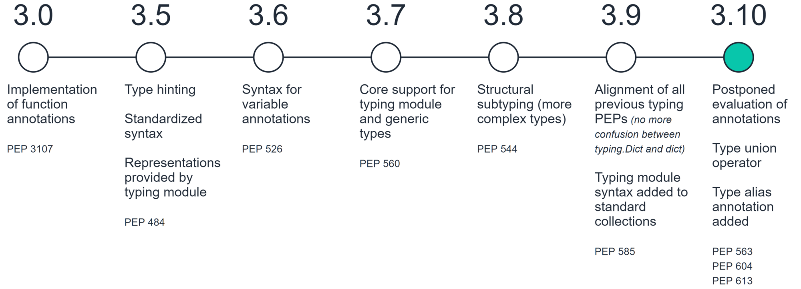

https://realpython.com/python-type-checking/
https://docs.python.org/3/library/typing.html

# Intro

**Annotations** were introduced in *Python 3.0*, originally without any specific purpose. They were simply a way to associate arbitrary expressions to function arguments and return values.



- Type annotations — also known as type signatures — are used to indicate the datatypes of variables and input/outputs of functions and methods.

```python
hello: str = "hello world!"

def add(x: int, y: int) -> int:
    return x + y

new_val: int = add(7, 4)
```

# Annotation

- Annotations of variables are stored in the module level `__annotations__` dictionary.

## Function Annotation
```python
def func(arg: arg_type, optarg: arg_type = default) -> return_type:
  pass
```

- For arguments the syntax is `argument: annotation`
- The return type is annotated using `->` annotation.

## Variable Annotation

```python
pi: float = 3.142

def circumference(radius: float) -> float:
    return 2 * pi * radius
```

# Type
## Simple Type
```python
name: str = "Guido"
pi: float = 3.142
centered: bool = False
```

## Composite

```python
names: list[str] = ["Guido", "Jukka", "Ivan"]
version: tuple[int, int, int] = (3, 7, 1)
options: dict[str, bool] = {"centered": False, "capitalize": True}
```

## Alias
A type alias is defined by assigning the type to the alias. 

```python
Vector = list[float]

def scale(scalar: float, vector: Vector) -> Vector:
    return [scalar * num for num in vector]

# typechecks; a list of floats qualifies as a Vector.
new_vector = scale(2.0, [1.0, -4.2, 5.4])
```

## NewType

- We can use the `NewType` helper class to create distinct types. The static type checker will treat the new type as if it were a subclass of the original type.

```python
from typing import NewType

UserId = NewType('UserId', int)
some_id = UserId(524313)

def get_user_name(user_id: UserId) -> str:
    pass

# typechecks
user_a = get_user_name(UserId(42351))

# does not typecheck; an int is not a UserId
user_b = get_user_name(-1)
```

- The expression `NewType('Derived', Base)` does not create a new class or introduce much overhead beyond that of a regular function call.
- However, it is possible to create a NewType based on a ‘derived’ NewType.

```python
from typing import NewType

UserId = NewType('UserId', int)

ProUserId = NewType('ProUserId', UserId)

# Fails at runtime and does not typecheck
class AdminUserId(UserId): pass
```

## Optional

When we define a function with optional parameters, we can specify this using the `Optional` type.

```python
from typing import Optional
def add(x: int, y: int, op: Optional[str]) -> int:
    ...
```

## Literal

A type that can be used to indicate to type checkers that the corresponding variable or function parameter has a value equivalent to the provided literal.

```python
def validate_simple(data: Any) -> Literal[True]:  # always returns True
    ...

MODE = Literal['r', 'rb', 'w', 'wb']
def open_helper(file: str, mode: MODE) -> str:
    ...

open_helper('/some/path', 'r')  # Passes type check
open_helper('/other/path', 'typo')  # Error in type checker
```

## Final

A special typing construct to indicate to type checkers that a name cannot be re-assigned or overridden.

```python
MAX_SIZE: Final = 9000
MAX_SIZE += 1  # Error reported by type checker

class Connection:
    TIMEOUT: Final[int] = 10

class FastConnector(Connection):
    TIMEOUT = 1  # Error reported by type checker
```

## Any

A static type checker will treat every type as being compatible with `Any` and `Any` as being compatible with every type.

```python
from typing import Any

a = None    # type: Any
a = []      # OK
a = 2       # OK

s = ''      # type: str
s = a       # OK

def foo(item: Any):
    # Typechecks; 'item' could be any type,
    # and that type might have a 'bar' method
    item.bar()
    ...
```

- No typechecking is performed when assigning a value of type `Any` to a more precise type.
- All functions without a return type or parameter types will implicitly default to using Any:

```python
from typing import Any

def hash_a(item: object) -> int:
    # Fails; an object does not have a 'magic' method.
    item.magic()
    ...

def hash_b(item: Any) -> int:
    # Typechecks
    item.magic()
    ...

# Typechecks, since ints and strs are subclasses of object
hash_a(42)
hash_a("foo")

# Typechecks, since Any is compatible with all types
hash_b(42)
hash_b("foo")
```
- Similar to `Any`, every type is a subtype of `object`. However, unlike `Any`, the reverse is not true: `object` is not a subtype of every other type.

# Callable
Functions are first-class objects in Python. This means that you can use functions as arguments to other functions.

- Functions, as well as lambdas, methods and classes, are represented by `typing.Callable`.
  - `Callable[[A1, A2, A3], Rt]` represents a function with three arguments with types `A1`, `A2`, and `A3`, respectively. The return type of the function is `Rt`.

```python
from typing import Callable

def do_twice(func: Callable[[str], str], argument: str) -> None:
    print(func(argument))
    print(func(argument))

def create_greeting(name: str) -> str:
    return f"Hello {name}"

do_twice(create_greeting, "Jekyll")
```

# Union type

In some cases, we may want to allow a set of different types for a single assignment. To allow multiple datatypes, we can use type union operators.

```python
from typing import Union
def add(x: Union[int, float], y: Union[int, float]) -> Union[int, float]:
    return x + y
```

- With Python 3.10, we can `replace` Union with `|`

```python
def add(x: int | float, y: int | float) -> int | float:
    return x + y
```

# TypeGuard

TypeGuard aims to benefit type narrowing – a technique used by static type checkers to determine a more precise type of an expression within a program’s code flow.

```python
def is_str_list(val: List[object]) -> TypeGuard[List[str]]:
    '''Determines whether all objects in the list are strings'''
    return all(isinstance(x, str) for x in val)

def func1(val: List[object]):
    if is_str_list(val):
        # Type of ``val`` is narrowed to ``List[str]``.
        print(" ".join(val))
    else:
        # Type of ``val`` remains as ``List[object]``.
        print("Not a list of strings!")
```

- Using `-> TypeGuard` tells the static type checker that for a given function
  - The return value is a boolean.
  - If the return value is True, the type of its argument is the type inside `TypeGuard`.

# Generic
